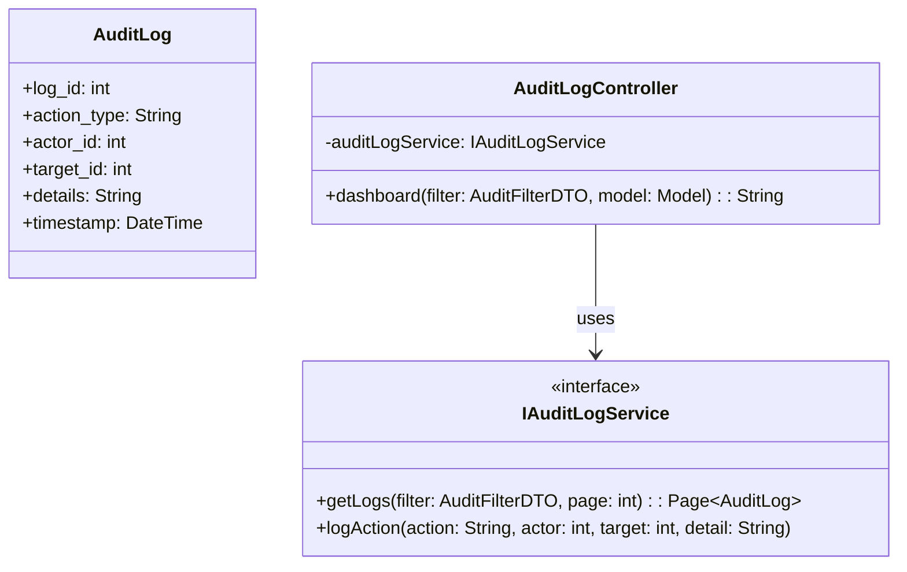
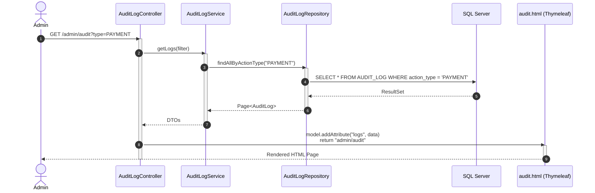
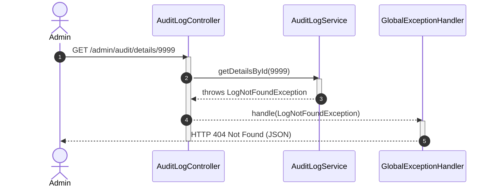

# ENGINEERING DOCUMENTATION STANDARD (EDS) v2.0
## Quy chuẩn Tài liệu Kỹ thuật và Đặc tả Hiện thực hóa - UC30 Audit Log Management

| Field | Value |
| :--- | :--- |
| **Document ID** | `XOAI-MOD5-IMP-030` |
| **Version** | 1.0 |
| **Date** | 2026-06-26 |
| **Status** | Draft |
| **Document Owner** | System Security Team |
| **Author** | Phùng Giang Hải |
| **Reviewed by** | [Tên Tech Lead] |
| **DPO Sign-off** | [ ] Pending / [ ] Approved — 2026-06-26 — [Tên DPO] *(Module xử lý Sensitive-PII và lưu vết giao dịch)* |
| **Approved by** | [Principal Architect] |
| **Last Review** | 2026-06-26 |
| **Based on EDS** | v2.0 |

---

## CHANGELOG

> [!IMPORTANT]
> **Policy 4.4 — Immutable History**: Không bao giờ xóa thông tin cũ. Mọi thay đổi phải ghi vào bảng này.

| Ngày | Người thực hiện | Nội dung thay đổi |
| :--- | :--- | :--- |
| 2026-06-26 | Phùng Giang Hải | Tạo tài liệu lần đầu, thiết kế UC30 Audit Log (Spring Boot MVC). Áp dụng chiến lược Append-only. |

---

## MỤC LỤC
1. [Tổng quan Module](#1-tổng-quan-module)
2. [Ma trận Truy vết (Traceability Matrix)](#2-ma-trận-truy-vết-traceability-matrix)
3. [Architecture Decision Records (ADR)](#3-architecture-decision-records-adr)
4. [Non-Functional Requirements & SLA](#4-non-functional-requirements--sla)
5. [Static Modeling (Mô hình Tĩnh)](#5-static-modeling-mô-hình-tĩnh)
6. [Dynamic Modeling (Mô hình Hướng Động)](#6-dynamic-modeling-mô-hình-hướng-động)
7. [Domain Event Catalog](#7-domain-event-catalog)
8. [Interface Specification (Đặc tả Giao diện)](#8-interface-specification-đặc-tả-giao-diện)
9. [API Specification](#9-api-specification)
10. [Bảng mã lỗi (Error Codes)](#10-bảng-mã-lỗi-error-codes)
11. [Quy trình Triển khai (Step-by-Step)](#11-quy-trình-triển-khai-step-by-step)
12. [Rollback & Incident Runbook](#12-rollback--incident-runbook)
13. [Kịch bản Kiểm thử Chi tiết](#13-kịch-bản-kiểm-thử-chi-tiết)
14. [Phương pháp Xác minh](#14-phương-pháp-xác-minh)
15. [Mẫu thử thực tế (API Verification Samples)](#15-mẫu-thử-thực-tế-api-verification-samples)
16. [Bảng tổng hợp phân quyền (Authorization Matrix)](#16-bảng-tổng-hợp-phân-quyền-authorization-matrix)

---

## 1. Tổng quan Module

> [!NOTE]
> Module theo dõi và lưu vết (Audit Log) các hoạt động nhạy cảm trong hệ thống như Thanh toán, Night Audit, Xóa dữ liệu. Dashboard hiển thị giao diện Spring MVC Thymeleaf dành cho Admin.

| Field | Value |
| :--- | :--- |
| **Module Name** | System Audit Log |
| **Bounded Context** | Security & Auditing |
| **Data Classification** | Sensitive-PII / Confidential (Financial records, User details) |
| **Compliance Scope** | PDPA, PCI-DSS (Lưu vết tài chính) |
| **Upstream Dependencies** | Toàn bộ các module trong hệ thống (Auth, Payment, Booking) |
| **Downstream Consumers** | Dashboard UI |

---

## 2. Ma trận Truy vết (Traceability Matrix)

| Requirement ID | Loại (BR/ADR/US) | Mô tả yêu cầu | Thành phần Code | Compliance Target | ADR liên quan |
| :--- | :--- | :--- | :--- | :--- | :--- |
| BR-AUD-001 | Business Rule | Mọi thay đổi tài chính và PII phải được ghi log (Append-only). Không ai được xóa. | `AuditLogService.save()` | PCI-DSS / PDPA | ADR-001 |
| BR-AUD-002 | Business Rule | Cột Actor ID và Target ID là Deep Link để chuyển sang trang User Profile và Invoice. | `audit.html` (Thymeleaf `<a th:href="...">`) | UX Standard | ADR-002 |
| BR-AUD-003 | Business Rule | Xem chi tiết JSON data của sự kiện mà không chuyển trang. | `audit.html` (Modal Popup JavaScript) | UX Standard | ADR-002 |

---

## 3. Architecture Decision Records (ADR)

### `ADR-001` — [Chiến lược Append-only tuyệt đối cho Audit Log]

| Field | Value |
| :--- | :--- |
| **Status** | Accepted |
| **Deciders** | Phùng Giang Hải |
| **Date** | 2026-06-26 |

#### Bối cảnh (Context)
Log hệ thống là bằng chứng pháp lý (Forensic evidence). Nếu có quyền sửa hoặc xóa, Log sẽ vô giá trị.

#### Các phương án đã xem xét (Options Considered)
| Phương án | Mô tả | Ưu điểm | Nhược điểm |
| :--- | :--- | :--- | :--- |
| A. Soft Delete / Archive | Cho phép Admin ẩn log cũ. | Dễ dùng. | Vi phạm nguyên tắc bảo mật. |
| B. Append-only (Chỉ thêm) | Không có hàm Delete/Update trong Repository. Database cấm trigger UPDATE/DELETE. | An toàn tuyệt đối, Compliance 100%. | Dung lượng DB tăng theo thời gian. |

#### Quyết định (Decision)
Chọn Phương án **[B]**.

#### Hệ quả (Consequences)
**Tích cực**: Bằng chứng an toàn 100%.
**Tiêu cực / Trade-offs**: Cần cơ chế dọn dẹp Log cũ (Cold Archiving) sau 6 tháng để tránh phình DB.

---

### `ADR-002` — [Giải pháp UI Modal cho JSON Details]

| Field | Value |
| :--- | :--- |
| **Status** | Accepted |
| **Deciders** | Phùng Giang Hải |
| **Date** | 2026-06-26 |

#### Bối cảnh (Context)
Dữ liệu thay đổi `Details` thường lưu dưới dạng chuỗi JSON dài. Không thể nhét hết vào 1 cột của bảng.

#### Quyết định (Decision)
Sử dụng Fragment của Thymeleaf kết hợp với JavaScript Fetch API để hiển thị Modal Popup khi người dùng click "View Details", tránh tạo một Use Case chuyển trang mới.

---

## 4. Non-Functional Requirements & SLA

### 4.1. Performance & Availability
| Category | Requirement | Target SLA | Measurement Method | Compliance Basis |
| :--- | :--- | :--- | :--- | :--- |
| Throughput | Khả năng ghi log đồng thời | 500 req/s | Load test | — |

### 4.2. Data Integrity & Retention
| Category | Requirement | Target | Verification Method | Compliance Basis |
| :--- | :--- | :--- | :--- | :--- |
| Durability | Zero record loss (Ghi log fail thì Action chính cũng phải fail) | RPO = 0 | Transaction log | GDPR Art. 5.1(f) |
| Retention | Giữ log | 6 tháng | DB Archiving Policy | PCI-DSS |

### 4.3. Security
| Category | Requirement | Target | Verification Method | Compliance Basis |
| :--- | :--- | :--- | :--- | :--- |
| Encryption | Encryption at rest cho cột `Details` | AES-256 | DB Encryption Check | GDPR Art. 32 |

---

## 5. Static Modeling (Mô hình Tĩnh)

### 5.1. Class Diagram (PlantUML)



### 5.2. Data Structure (SQL Schema)

> [!WARNING]
> Lưu ý: Bảng AUDIT_LOG hiện tại là đạt chuẩn Append-only.

```sql
-- === AUDIT_LOG SCHEMA ===
CREATE TABLE AUDIT_LOG (
    log_id INT IDENTITY(1,1) PRIMARY KEY,
    action_type VARCHAR(50) NOT NULL,
    actor_id INT NOT NULL,
    target_id INT,
    details NVARCHAR(MAX),
    timestamp DATETIME DEFAULT GETDATE(),
    CONSTRAINT FK_AUDIT_ACTOR FOREIGN KEY (actor_id) REFERENCES [USER](user_id)
);
-- KHÔNG có cờ is_delete. Cấm lệnh DELETE trên bảng này.
```

---

## 6. Dynamic Modeling (Mô hình Hướng Động)

### 6.1. Sequence Diagram — Happy Path (PlantUML)



### 6.2. Sequence Diagram — Error Path (PlantUML)



### 6.3. State Machine
**N/A** - Trạng thái của một dòng Log là bất biến (Immutable), không bao giờ có sự chuyển đổi trạng thái từ PENDING sang ACTIVE hay DELETED.

---

## 7. Domain Event Catalog

### 7.1. Events Published (Phát ra)
**N/A** - Màn hình Dashboard là UI truy vấn. Việc sinh ra Log là do các Module khác publish event.

### 7.2. Events Consumed (Tiêu thụ)
| Event Name | Source | Handler | Action thực hiện |
| :--- | :--- | :--- | :--- |
| `SystemActionExecuted` | Các Services khác (Payment, Checkout) | `AuditLogListener` | Ghi xuống bảng `AUDIT_LOG` |

---

## 8. Interface Specification (Đặc tả Giao diện)

### 8.1. Service Interface

```java
// IAuditLogService.java
// @version 1.0

public interface IAuditLogService {
    /**
     * Truy vấn log kèm bộ lọc và phân trang
     */
    Page<AuditLogDTO> getLogs(String actionType, Integer actorId, int page, int size);

    /**
     * Method dùng nội bộ (System call) để ghi log
     */
    void logAction(String actionType, Integer actorId, Integer targetId, String details);
}
```

### 8.2. Repository Interface

```java
// IAuditLogRepository.java
export interface IAuditLogRepository extends JpaRepository<AuditLog, Integer> {
    // Chỉ có các hàm Read.
    // TUYỆT ĐỐI KHÔNG KHAI BÁO: delete(), deleteAll(), update()
}
```

---

## 9. API Specification (Spring MVC Controllers)

### 9.1. Endpoints Table

| Method | Path | Auth Level | Required Roles | Rate Limit | Returns |
| :--- | :--- | :--- | :--- | :--- | :--- |
| GET | `/admin/audit` | Session | `ADMIN` | 60/min | `admin/audit.html` |
| GET | `/admin/audit/details/{id}` | Session | `ADMIN` | 120/min | JSON (Dùng cho Modal Popup) |

### 9.2. Request / Response (Controller Level)

**Controller Method (Trang chính)**:
```java
@GetMapping("/admin/audit")
public String dashboard(@RequestParam(required = false) String type, 
                        @RequestParam(defaultValue = "1") int page, 
                        Model model) {
    Page<AuditLogDTO> logs = auditLogService.getLogs(type, null, page, 20);
    model.addAttribute("logs", logs);
    return "admin/audit"; // Trả về Thymeleaf view
}
```

**Controller Method (API phụ cho Modal Popup)**:
```java
@GetMapping("/admin/audit/details/{id}")
@ResponseBody
public ResponseEntity<String> getLogDetails(@PathVariable int id) {
    String detailsJson = auditLogService.getDetailsById(id);
    return ResponseEntity.ok(detailsJson);
}
```

---

## 10. Bảng mã lỗi (Error Codes)

| Code | HTTP Status | Message (EN) | Message (VI) | Trigger Condition |
| :--- | :--- | :--- | :--- | :--- |
| `AUD-001` | 403 | Insufficient permissions | Không đủ quyền | Truy cập bằng tài khoản không phải Admin |
| `AUD-002` | 404 | Log not found | Không tìm thấy Log | Gọi API chi tiết Modal với ID sai |

---

## 11. Quy trình Triển khai (Step-by-Step)

### 11.1. Prerequisites
- [x] Thymeleaf templates đã chuẩn bị CSS.
- [x] Module Spring Security đã cấu hình chặn đường dẫn `/admin/audit/**`.
- [x] DPO đã xác nhận phê duyệt mã hóa (nếu có).

### 11.3. Implementation Steps
1. Xây dựng `@Entity` cho `AUDIT_LOG`.
2. Tạo Spring Data JPA Repository (Chỉ cấp quyền đọc và Insert).
3. Code Controller `GET /admin/audit` với các Filter (Action Type, Date Range).
4. Viết Javascript Fetch API trong view Thymeleaf để gọi `/admin/audit/details/{id}` và đổ data vào Bootstrap/Tailwind Modal.
5. Cấu hình thẻ `<a th:href="@{/admin/users/{id}(id=${log.actorId})}">` để thực hiện Deep Link.

---

## 12. Rollback & Incident Runbook

### 12.1. Điều kiện kích hoạt Rollback (Trigger Conditions)
| Điều kiện | Ngưỡng | Người quyết định |
| :--- | :--- | :--- |
| Bảng Audit Log bị tràn dung lượng (Disk full) | > 90% DB storage | DBA & Tech Lead |

### 12.2. Rollback Procedure
**N/A** - Dữ liệu Log không được rollback. Nếu đầy đĩa ổ cứng, quy trình xử lý sự cố là mở rộng dung lượng đĩa (Scale-up) hoặc chạy Job Archive Data (Backup và làm rỗng bảng, giữ lại 6 tháng gần nhất).

---

## 13. Kịch bản Kiểm thử Chi tiết

### 13.1. E2E / Security Tests

#### `TC-E2E-AUD-001` — Chống xóa dữ liệu (Append-only Enforcement)
- **Feature**: `Audit Log Integrity`
- **Background**:
  - **Given** test data classification: `SYNTHETIC`
- **Scenario**: Cố tình xóa log sẽ bị văng exception
  - **Given** User là ADMIN.
  - **When** Developer viết thử một hàm `auditLogRepository.deleteById(1)`.
  - **Then** RuntimeException `UnsupportedOperationException` được ném ra.
  - **And** Database record ID=1 vẫn tồn tại.

---

## 14. Phương pháp Xác minh

### 14.1. Database Inspection
- *Verify append-only (không có UPDATE/DELETE)*: Đảm bảo Hibernate không bao giờ sinh ra câu lệnh `DELETE FROM audit_log` bằng cách bật `spring.jpa.show-sql=true` và chạy Test toàn bộ module.

### 14.2. Log / Audit Verification
- *Kiểm tra không có PII dạng raw trong ứng dụng*: Check table `AUDIT_LOG` để đảm bảo mật khẩu hoặc thẻ tín dụng không bị lọt vào cột `details`.

---

## 15. Mẫu thử thực tế (API Verification Samples)

**Kiểm thử API Modal (Dành cho chức năng View Details):**
```bash
curl -X GET -b "JSESSIONID=[TOKEN]" https://[host]/admin/audit/details/1
```
*Expected Response (200)*:
```json
{
  "before": { "status": "PENDING" },
  "after": { "status": "PAID", "amount": 45000000 }
}
```

---

## 16. Bảng tổng hợp phân quyền (Authorization Matrix)

| Endpoint | GUEST | RECEPTIONIST | MANAGER | ADMIN |
| :--- | :---: | :---: | :---: | :---: |
| GET `/admin/audit` | ❌ | ❌ | ❌ | ✅ |
| GET `/admin/audit/details/{id}` | ❌ | ❌ | ❌ | ✅ |

---
*End of Document - XOAI-MOD5-IMP-030*
