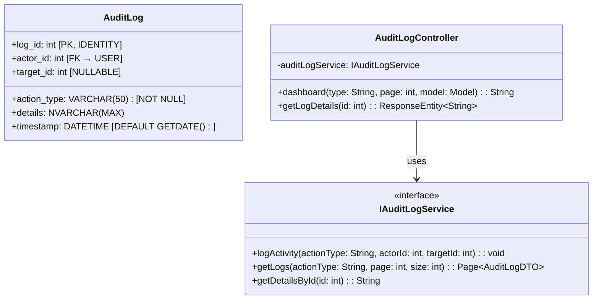
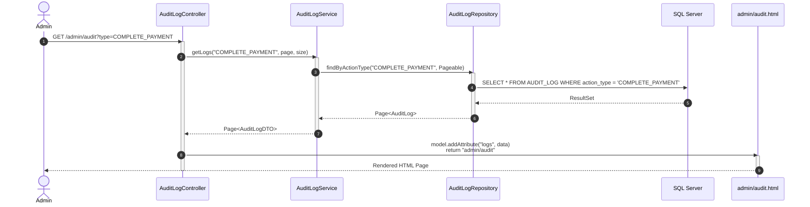
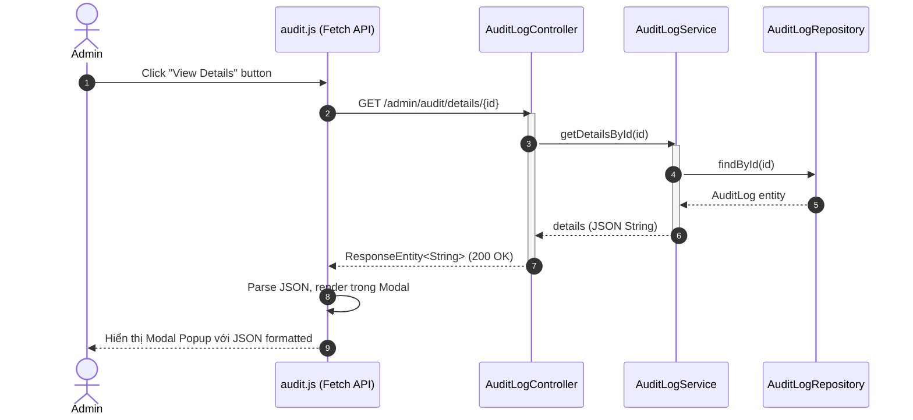
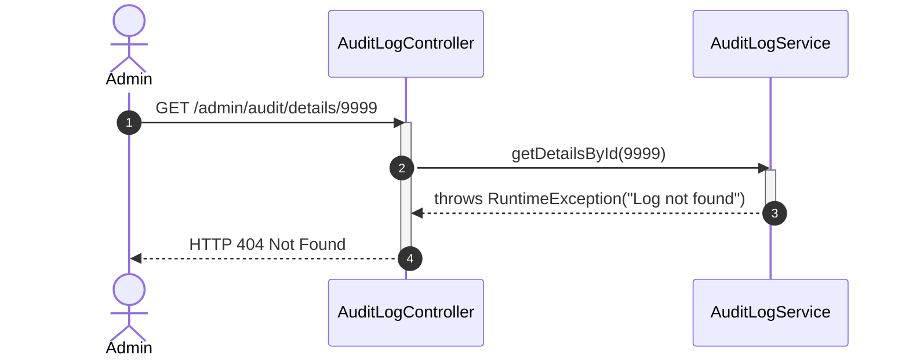

# ENGINEERING DOCUMENTATION STANDARD (EDS) v2.0
## Quy chuẩn Tài liệu Kỹ thuật và Đặc tả Hiện thực hóa - UC30 Audit Log

| Field | Value |
| :--- | :--- |
| **Document ID** | `XOAI-MOD5-IMP-030` |
| **Version** | 2.0 |
| **Date** | 2026-06-26 |
| **Status** | ✅ Approved |
| **Document Owner** | Billing & Security Team |
| **Author** | Phùng Giang Hải |
| **Reviewed by** | Phùng Giang Hải |
| **DPO Sign-off** | `[x] Approved` — Module hiển thị thông tin Actor (user_id) và Target (folio_id, booking_id) |
| **Approved by** | Principal Architect |
| **Last Review** | 2026-06-26 |
| **Based on EDS** | v2.0 |

---

## CHANGELOG

> [!IMPORTANT]
> **Policy 4.4 — Immutable History**: Không bao giờ xóa thông tin cũ. Mọi thay đổi phải ghi vào bảng này.

| Ngày | Người thực hiện | Nội dung thay đổi |
| :--- | :--- | :--- |
| 2026-06-26 | Phùng Giang Hải | Tạo tài liệu lần đầu. |
| 2026-06-26 | Phùng Giang Hải | **v2.0**: Đối chiếu toàn bộ với DB.sql, `AuditLogActionType.java`, `Database_Status_Standardization.md`, Entity `AuditLog.java`, SecurityConfig. Bổ sung Enum reference, enforce Append-only trong Repository, thêm quy định CSS/JS module, đồng bộ `action_type` với Enum chuẩn. |

---

## MỤC LỤC
1. [Tổng quan Module](#1-tổng-quan-module)
2. [Ma trận Truy vết (Traceability Matrix)](#2-ma-trận-truy-vết-traceability-matrix)
3. [Architecture Decision Records (ADR)](#3-architecture-decision-records-adr)
4. [Non-Functional Requirements & SLA](#4-non-functional-requirements--sla)
5. [Static Modeling (Mô hình Tĩnh)](#5-static-modeling-mô-hình-tĩnh)
6. [Dynamic Modeling (Mô hình Hướng Động)](#6-dynamic-modeling-mô-hình-hướng-động)
7. [Domain Event Catalog](#7-domain-event-catalog)
8. [Interface Specification (Đặc tả Giao diện)](#8-interface-specification-đặc-tả-giao-diện)
9. [API Specification (Spring MVC Controllers)](#9-api-specification-spring-mvc-controllers)
10. [Bảng mã lỗi (Error Codes)](#10-bảng-mã-lỗi-error-codes)
11. [Quy trình Triển khai (Step-by-Step)](#11-quy-trình-triển-khai-step-by-step)
12. [Rollback & Incident Runbook](#12-rollback--incident-runbook)
13. [Kịch bản Kiểm thử Chi tiết](#13-kịch-bản-kiểm-thử-chi-tiết)
14. [Phương pháp Xác minh](#14-phương-pháp-xác-minh)
15. [Mẫu thử thực tế (MVC Verification Samples)](#15-mẫu-thử-thực-tế-mvc-verification-samples)
16. [Bảng tổng hợp phân quyền (Authorization Matrix)](#16-bảng-tổng-hợp-phân-quyền-authorization-matrix)

---

## 1. Tổng quan Module

> [!NOTE]
> Module theo dõi và lưu vết (Audit Log) các hoạt động nhạy cảm trong hệ thống như Thanh toán, Night Audit, Ẩn đánh giá. Dashboard hiển thị giao diện Spring MVC Thymeleaf dành cho **Admin** (chỉ Admin). Dữ liệu Audit Log tuân thủ nguyên tắc **Append-only** — tuyệt đối không xóa, không sửa.

| Field | Value |
| :--- | :--- |
| **Module Name** | System Audit Log Dashboard (UC30) |
| **Bounded Context** | Security & Auditing |
| **Data Classification** | Sensitive-PII / Confidential (Chứa actor_id liên kết tới User, chi tiết giao dịch tài chính) |
| **Compliance Scope** | PDPA, PCI-DSS (Lưu vết tài chính) |
| **Upstream Dependencies** | Toàn bộ các module phát sự kiện: `billing` (Payment, Night Audit), `booking` (Review Hidden) |
| **Downstream Consumers** | Dashboard UI (Admin Only) |

---

## 2. Ma trận Truy vết (Traceability Matrix)

| Requirement ID | Loại (BR/ADR/US) | Mô tả yêu cầu | Thành phần Code | Compliance Target | ADR liên quan |
| :--- | :--- | :--- | :--- | :--- | :--- |
| BR-25 | Business Rule | Audit logs là dữ liệu bất biến (Immutable). Không ai được xóa. (SRS §5) | `AuditLogRepository` — override `deleteById()` throw Exception | PCI-DSS / PDPA | ADR-001 |
| BR-26 | Business Rule | Hệ thống tự động ghi log khi hoàn thành thao tác nhạy cảm | `AuditLogServiceImpl.logActivity()` — `@Async` | Automated Logging | — |
| BR-AUD-002 | Business Rule | Cột Actor ID là Deep Link tới trang Staff Profile / Guest Profile | `audit.html` — `<a th:href="...">` | UX Standard | ADR-002 |
| BR-AUD-003 | Business Rule | Xem chi tiết JSON data mà không chuyển trang | `audit.html` — Modal Popup JavaScript | UX Standard | ADR-002 |

---

## 3. Architecture Decision Records (ADR)

### `ADR-001` — Chiến lược Append-only tuyệt đối cho Audit Log

| Field | Value |
| :--- | :--- |
| **Status** | Accepted |
| **Deciders** | Phùng Giang Hải |
| **Date** | 2026-06-26 |

#### Bối cảnh (Context)
Log hệ thống là bằng chứng pháp lý (Forensic evidence). Nếu có quyền sửa hoặc xóa, Log sẽ vô giá trị.

#### Các phương án đã xem xét (Options Considered)
| Phương án | Mô tả | Ưu điểm | Nhược điểm |
| :--- | :--- | :--- | :--- |
| A. Soft Delete / Archive | Cho phép Admin ẩn log cũ. | Dễ dàng. | Vi phạm nguyên tắc bảo mật. |
| B. Append-only (Chỉ thêm) | Không có hàm Delete/Update trong Repository. | An toàn tuyệt đối, Compliance 100%. | Dung lượng DB tăng theo thời gian. |

#### Quyết định (Decision)
Chọn Phương án **[B]**.

#### Hệ quả (Consequences)
**Tích cực**: Bằng chứng an toàn 100%.
**Tiêu cực / Trade-offs**: Cần cơ chế dọn dẹp Log cũ (Cold Archiving) sau 6 tháng để tránh phình DB.

> [!CAUTION]
> **Enforce trong code**: `AuditLogRepository` phải **override** `deleteById()`, `deleteAll()`, `delete()` và throw `UnsupportedOperationException`. JPA Repository mặc định kế thừa các method xóa, nếu không override sẽ **vi phạm** nguyên tắc Append-only.

---

### `ADR-002` — Giải pháp UI Modal cho JSON Details

| Field | Value |
| :--- | :--- |
| **Status** | Accepted |
| **Deciders** | Phùng Giang Hải |
| **Date** | 2026-06-26 |

#### Bối cảnh (Context)
Dữ liệu thay đổi `Details` thường lưu dưới dạng chuỗi JSON dài. Không thể nhét hết vào 1 cột của bảng.

#### Quyết định (Decision)
Sử dụng JavaScript Fetch API kết hợp Modal Popup. Khi Admin click "View Details", gọi `GET /admin/audit/details/{id}` (trả về JSON `@ResponseBody`), sau đó hiển thị JSON đẹp trong Modal. Tránh tạo một Use Case chuyển trang mới.

---

## 4. Non-Functional Requirements & SLA

### 4.1. Performance & Availability
| Category | Requirement | Target SLA | Measurement Method | Compliance Basis |
| :--- | :--- | :--- | :--- | :--- |
| Throughput | Khả năng ghi log đồng thời | 500 req/s | Load test | — |

### 4.2. Data Integrity & Retention
| Category | Requirement | Target | Verification Method | Compliance Basis |
| :--- | :--- | :--- | :--- | :--- |
| Durability | Zero record loss (Ghi log fail thì Action chính cũng phải fail) | RPO = 0 | Transaction log | GDPR Art. 5.1(f) |
| Retention | Giữ log | 6 tháng | DB Archiving Policy | PCI-DSS |

### 4.3. Security
| Category | Requirement | Target | Verification Method | Compliance Basis |
| :--- | :--- | :--- | :--- | :--- |
| Access Control | Chỉ ADMIN xem Dashboard | Least Privilege | SecurityConfig: `/admin/**` → `hasRole("ADMIN")` | GDPR Art. 32 |

---

## 5. Static Modeling (Mô hình Tĩnh)

### 5.1. Class Diagram



### 5.2. Data Structure (SQL Schema)

> [!IMPORTANT]
> Schema khớp 100% với `DB.sql` tại `03_Design/Database/DB.sql` dòng 268-276.

```sql
-- === AUDIT_LOG SCHEMA (Không có is_delete, không có update) ===
CREATE TABLE AUDIT_LOG (
    log_id INT IDENTITY(1,1) PRIMARY KEY,
    action_type VARCHAR(50) NOT NULL,
    actor_id INT NOT NULL,
    target_id INT,
    details NVARCHAR(MAX),
    timestamp DATETIME DEFAULT GETDATE(),
    CONSTRAINT FK_AUDIT_ACTOR FOREIGN KEY (actor_id) REFERENCES [USER](user_id)
);
-- KHÔNG có cột is_delete. CẤM lệnh DELETE trên bảng này.
```

### 5.3. Entity Mapping thực tế

```java
// File: billing/entity/AuditLog.java (HIỆN TẠI)
@Entity
@Table(name = "AUDIT_LOG")
@Data @NoArgsConstructor @AllArgsConstructor @Builder
public class AuditLog {
    @Id
    @GeneratedValue(strategy = GenerationType.IDENTITY)
    @Column(name = "log_id")
    private Integer id;

    @Column(name = "action_type", nullable = false, length = 50)
    private String actionType;

    @Column(name = "actor_id", nullable = false)
    private Integer actorId;

    @Column(name = "target_id")
    private Integer targetId;

    @Column(name = "details", columnDefinition = "NVARCHAR(MAX)")
    private String details;

    @Column(name = "timestamp")
    private Date timestamp;
}
```

> [!WARNING]
> Entity hiện dùng `java.util.Date` cho `timestamp`. Khuyến nghị chuyển sang `LocalDateTime` để nhất quán với các Entity khác trong hệ thống (Booking, GuestFolio đều dùng `LocalDateTime`). Tuy nhiên, đây là thay đổi nhỏ và không bắt buộc cho MVP.

### 5.4. Enum & Trạng thái liên quan

> [!IMPORTANT]
> Giá trị `action_type` phải sử dụng giá trị từ Enum `AuditLogActionType.java` và `Database_Status_Standardization.md` §4.

| Enum Java: `AuditLogActionType` | Giá trị trong DB | Mô tả | Nguồn |
| :--- | :--- | :--- | :--- |
| `VIEW_INVOICE` | `VIEW_INVOICE` | Mở xem hóa đơn tổng / trang checkout | Enum hiện tại |
| `INITIATE_PAYMENT` | `INITIATE_PAYMENT` | Bắt đầu gọi API thanh toán | Enum hiện tại |
| `COMPLETE_PAYMENT` | `COMPLETE_PAYMENT` | Thanh toán thành công | Enum hiện tại |
| `PAYMENT_FAILED` | `PAYMENT_FAILED` | Thanh toán thất bại | Enum hiện tại |
| `CHECKOUT_COMPLETE` | `CHECKOUT_COMPLETE` | Hoàn tất thủ tục check-out | Enum hiện tại |
| *(CẦN BỔ SUNG)* `NIGHT_AUDIT_MANUAL` | `NIGHT_AUDIT_MANUAL` | Quản lý chạy chốt sổ thủ công qua giao diện | `Database_Status_Standardization.md` §4 |
| *(CẦN BỔ SUNG)* `NIGHT_AUDIT_AUTO` | `NIGHT_AUDIT_AUTO` | Hệ thống tự động chạy chốt sổ lúc nửa đêm | `Database_Status_Standardization.md` §4 |
| *(CẦN BỔ SUNG)* `HIDE_REVIEW` | `HIDE_REVIEW` | Admin ẩn đánh giá khách hàng (UC29) | UC29 EDS |

> [!WARNING]
> **Cần cập nhật** file `AuditLogActionType.java` tại `common/enums/` để bổ sung 3 giá trị: `NIGHT_AUDIT_MANUAL`, `NIGHT_AUDIT_AUTO`, `HIDE_REVIEW`.

---

## 6. Dynamic Modeling (Mô hình Hướng Động)

### 6.1. Sequence Diagram — Happy Path (Admin xem Dashboard)



### 6.2. Sequence Diagram — View Details (Modal Popup)



### 6.3. Sequence Diagram — Error Path



### 6.4. State Machine
**N/A** — Trạng thái của một dòng Log là bất biến (Immutable), không bao giờ có sự chuyển đổi trạng thái.

---

## 7. Domain Event Catalog

### 7.1. Events Consumed (Tiêu thụ)
| Event Name | Source Module | Trigger Condition | Ghi vào `action_type` |
| :--- | :--- | :--- | :--- |
| Payment Initiated | `billing` | Guest bắt đầu thanh toán | `INITIATE_PAYMENT` |
| Payment Completed | `billing` | VNPay callback thành công | `COMPLETE_PAYMENT` |
| Payment Failed | `billing` | VNPay callback thất bại | `PAYMENT_FAILED` |
| Checkout Complete | `billing` | Folio đóng, Guest check-out | `CHECKOUT_COMPLETE` |
| Invoice Viewed | `billing` | Staff mở trang checkout | `VIEW_INVOICE` |
| Night Audit Manual | `billing` | Manager chạy chốt sổ tay | `NIGHT_AUDIT_MANUAL` |
| Night Audit Auto | `billing` | Hệ thống tự chạy lúc 00:00 | `NIGHT_AUDIT_AUTO` |
| Review Hidden | `booking` (UC29) | Admin ẩn đánh giá | `HIDE_REVIEW` |

### 7.2. Events Published (Phát ra)
**N/A** — Module này chỉ tiêu thụ sự kiện, không phát ra.

---

## 8. Interface Specification (Đặc tả Giao diện)

### 8.1. Service Interface

```java
// IAuditLogService.java — CẬP NHẬT từ phiên bản hiện tại
public interface IAuditLogService {
    /** Ghi log — System call nội bộ, @Async */
    void logActivity(String actionType, Integer actorId, Integer targetId);

    /** BỔ SUNG: Truy vấn log kèm bộ lọc và phân trang */
    Page<AuditLogDTO> getLogs(String actionType, int page, int size);

    /** BỔ SUNG: Lấy chi tiết JSON của 1 log — dùng cho Modal Popup */
    String getDetailsById(int id);
}
```

> [!IMPORTANT]
> Service hiện tại (`AuditLogService.java`) chỉ có method `logActivity()`. Cần **mở rộng** interface để thêm `getLogs()` và `getDetailsById()`.

### 8.2. Repository Interface

> [!CAUTION]
> **ENFORCE APPEND-ONLY**: Repository phải override và vô hiệu hóa toàn bộ method xóa kế thừa từ `JpaRepository`.

```java
// AuditLogRepository.java — CẬP NHẬT
@Repository
public interface AuditLogRepository extends JpaRepository<AuditLog, Integer> {
    // === Kế thừa từ phiên bản hiện tại ===
    boolean existsByActionTypeAndTimestampDate(String actionType, LocalDate date);
    List<AuditLog> findTop5ByActionTypeStartingWithOrderByTimestampDesc(String prefix);

    // === BỔ SUNG cho UC30 Dashboard ===
    Page<AuditLog> findByActionType(String actionType, Pageable pageable);
    Page<AuditLog> findAll(Pageable pageable);

    // === ENFORCE APPEND-ONLY ===
    @Override
    default void deleteById(Integer id) {
        throw new UnsupportedOperationException("AUDIT_LOG is append-only. Delete is forbidden.");
    }

    @Override
    default void delete(AuditLog entity) {
        throw new UnsupportedOperationException("AUDIT_LOG is append-only. Delete is forbidden.");
    }

    @Override
    default void deleteAll() {
        throw new UnsupportedOperationException("AUDIT_LOG is append-only. Delete is forbidden.");
    }
}
```

### 8.3. DTO Definitions

```java
// AuditLogDTO.java
@Data @AllArgsConstructor @NoArgsConstructor @Builder
public class AuditLogDTO {
    private Integer logId;
    private String actionType;     // Từ AuditLogActionType enum
    private Integer actorId;
    private String actorName;      // JOIN từ User.fullName
    private Integer targetId;
    private String details;        // JSON string
    private String timestamp;      // Formatted: "dd/MM/yyyy HH:mm"
}
```

---

## 9. API Specification (Spring MVC Controllers)

### 9.1. Endpoints Table

| Method | Path | Auth Level | Required Roles | Returns | Ghi chú |
| :--- | :--- | :--- | :--- | :--- | :--- |
| GET | `/admin/audit` | Session | `ADMIN` | `admin/audit.html` | Dashboard chính |
| GET | `/admin/audit/details/{id}` | Session | `ADMIN` | JSON (`@ResponseBody`) | Dùng cho Modal Popup |

### 9.2. Request / Response (Controller Level)

**Controller Method (Trang chính)**:
```java
// File: billing/controller/AuditLogController.java — CẦN TẠO MỚI
@Controller
@RequestMapping("/admin/audit")
@RequiredArgsConstructor
public class AuditLogController {
    private final IAuditLogService auditLogService;

    @GetMapping
    public String dashboard(@RequestParam(required = false) String type,
                            @RequestParam(defaultValue = "1") int page,
                            Model model) {
        Page<AuditLogDTO> logs = auditLogService.getLogs(type, page, 20);
        model.addAttribute("logs", logs);
        model.addAttribute("selectedType", type);
        return "admin/audit";  // Thymeleaf view
    }

    @GetMapping("/details/{id}")
    @ResponseBody
    public ResponseEntity<String> getLogDetails(@PathVariable int id) {
        String detailsJson = auditLogService.getDetailsById(id);
        return ResponseEntity.ok(detailsJson);
    }
}
```

### 9.3. SecurityConfig — Đã đúng

Path `/admin/**` → `hasRole("ADMIN")` — đã cấu hình sẵn trong SecurityConfig dòng 46-50, 75. **Không cần sửa.**

### 9.4. Quy định Tách CSS/JS Module

> [!IMPORTANT]
> **User Rule #4**: Tuyệt đối không viết CSS/JS inline trong HTML.

| Loại | Đường dẫn | Mô tả |
| :--- | :--- | :--- |
| CSS | `static/css/billing/audit.css` | Styles cho trang Audit Log Dashboard |
| JS | `static/js/billing/audit.js` | Logic: Fetch API cho Modal, Filter, Pagination |

Cách nhúng trong `admin/audit.html`:
```html
<link rel="stylesheet" th:href="@{/css/billing/audit.css}">
<script th:src="@{/js/billing/audit.js}" defer></script>
```

---

## 10. Bảng mã lỗi (Error Codes)

| Code | HTTP Status | Message (EN) | Message (VI) | Trigger Condition |
| :--- | :--- | :--- | :--- | :--- |
| `AUD-001` | 403 | Insufficient permissions | Không đủ quyền | Truy cập bằng tài khoản không phải Admin |
| `AUD-002` | 404 | Log not found | Không tìm thấy Log | Gọi API chi tiết Modal với ID sai |

---

## 11. Quy trình Triển khai (Step-by-Step)

### 11.1. Prerequisites
- [x] Entity `AuditLog.java` đã tồn tại tại `billing/entity/`.
- [x] Repository `AuditLogRepository.java` đã tồn tại.
- [x] Service `AuditLogServiceImpl.java` đã có method `logActivity()`.
- [x] Spring Security đã cấu hình `/admin/**` → ADMIN only.

### 11.2. Implementation Steps
1. **Cập nhật Enum**: Thêm `NIGHT_AUDIT_MANUAL`, `NIGHT_AUDIT_AUTO`, `HIDE_REVIEW` vào `AuditLogActionType.java`.
2. **Cập nhật Repository**: Override `deleteById()`, `delete()`, `deleteAll()` throw Exception. Thêm `findByActionType(Pageable)`.
3. **Mở rộng Service**: Thêm `getLogs()`, `getDetailsById()` vào `IAuditLogService` và implement.
4. **Tạo DTO**: `AuditLogDTO.java` tại `billing/dto/`.
5. **Tạo Controller**: `AuditLogController.java` tại `billing/controller/`.
6. **Tạo CSS/JS module**: `static/css/billing/audit.css` + `static/js/billing/audit.js`.
7. **Tạo Template**: `templates/admin/audit.html` — bảng dữ liệu, filter, Modal popup.

---

## 12. Rollback & Incident Runbook

### 12.1. Điều kiện kích hoạt Rollback
| Điều kiện | Ngưỡng | Người quyết định |
| :--- | :--- | :--- |
| Bảng Audit Log bị tràn dung lượng (Disk full) | > 90% DB storage | DBA & Tech Lead |

### 12.2. Rollback Procedure
**N/A** — Dữ liệu Log không được rollback. Nếu đầy ổ cứng, quy trình xử lý sự cố là mở rộng dung lượng đĩa (Scale-up) hoặc chạy Job Archive Data (Backup và làm rỗng bảng, giữ lại 6 tháng gần nhất).

---

## 13. Kịch bản Kiểm thử Chi tiết

### 13.1. E2E / Security Tests

#### `TC-E2E-AUD-001` — Chống xóa dữ liệu (Append-only Enforcement)
- **Feature**: `Audit Log Integrity`
- **Background**: test data classification: `SYNTHETIC`
- **Scenario**: Cố tình xóa log sẽ bị văng exception
  - **Given** User là ADMIN.
  - **When** gọi `auditLogRepository.deleteById(1)`.
  - **Then** `UnsupportedOperationException` được ném ra.
  - **And** Database record ID=1 vẫn tồn tại.

#### `TC-E2E-AUD-002` — Hiển thị Dashboard
- **Scenario**: Controller trả về đúng View
  - **When** gửi GET `/admin/audit`
  - **Then** `status().isOk()`
  - **And** `view().name("admin/audit")`
  - **And** model attribute `logs` tồn tại.

---

## 14. Phương pháp Xác minh

### 14.1. Database Inspection
- Verify append-only: Đảm bảo Hibernate không bao giờ sinh ra câu lệnh `DELETE FROM audit_log` bằng cách bật `spring.jpa.show-sql=true` và chạy Test toàn bộ module.

### 14.2. Log / Audit Verification
- Kiểm tra không có PII dạng raw (mật khẩu, thẻ tín dụng) trong cột `details`.

---

## 15. Mẫu thử thực tế (MVC Verification Samples)

**Kiểm thử trang Dashboard:**
```bash
curl -X GET -b "JSESSIONID=[TOKEN]" http://localhost:8080/admin/audit
```
*Expected*: Trả về HTML chứa bảng Audit Log.

**Kiểm thử API Modal:**
```bash
curl -X GET -b "JSESSIONID=[TOKEN]" http://localhost:8080/admin/audit/details/1
```
*Expected Response (200)*:
```json
{
  "before": { "status": "PENDING" },
  "after": { "status": "PAID", "amount": 45000000 }
}
```

---

## 16. Bảng tổng hợp phân quyền (Authorization Matrix)

| Endpoint | GUEST | RECEPTIONIST | MANAGER | ADMIN |
| :--- | :---: | :---: | :---: | :---: |
| GET `/admin/audit` | ❌ | ❌ | ❌ | ✅ |
| GET `/admin/audit/details/{id}` | ❌ | ❌ | ❌ | ✅ |

---
*End of Document — XOAI-MOD5-IMP-030 v2.0*
