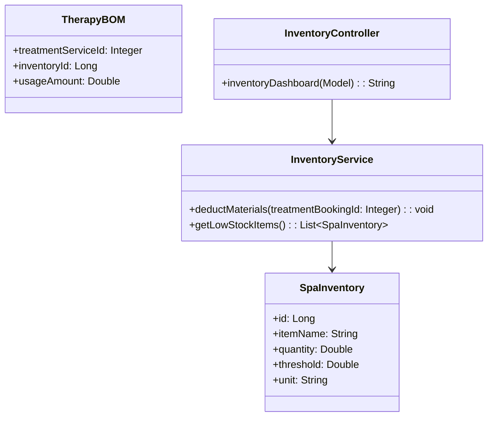
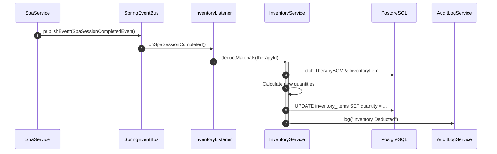
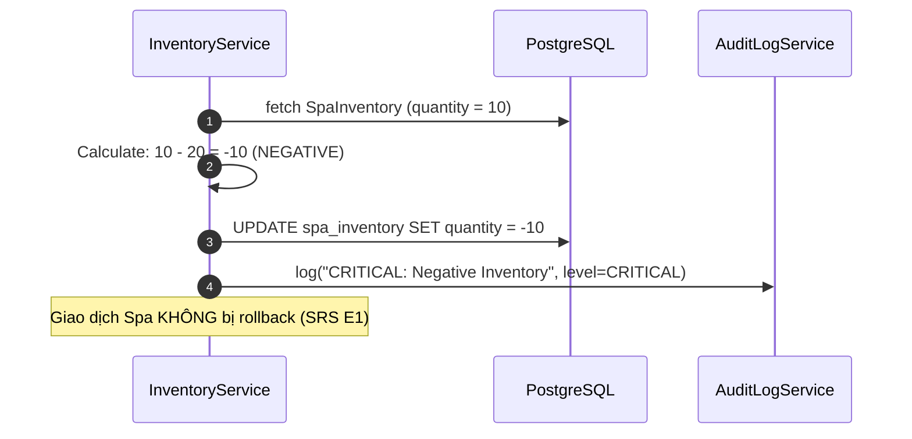

# ENGINEERING DOCUMENTATION STANDARD (EDS) v2.0
## Quy chuẩn Tài liệu Kỹ thuật và Đặc tả Hiện thực hóa

| Field | Value |
| :--- | :--- |
| **Document ID** | `AM-MOD5-IMP-031` |
| **Version** | 1.0 |
| **Date** | 2026-06-27 |
| **Status** | Draft |
| **Document Owner** | Tech Lead |
| **Author** | Phùng Giang Hải |
| **Reviewed by** | Tech Lead |
| **DPO Sign-off** | [x] N/A — Không xử lý PII |
| **Approved by** | Principal Architect |
| **Last Review** | 2026-06-27 |
| **Based on EDS** | v2.0 |

---

## CHANGELOG

> [!IMPORTANT]
> **Policy 4.4 — Immutable History**: Không bao giờ xóa thông tin cũ. Mọi thay đổi phải ghi vào bảng này.

| Ngày | Người thực hiện | Nội dung thay đổi |
| :--- | :--- | :--- |
| 2026-06-27 | Phùng Giang Hải | Tạo tài liệu lần đầu theo chuẩn EDS v2.0 cho UC31 (Spa Inventory) |
| 2026-06-27 | Phùng Giang Hải | Cập nhật tài liệu: Tái sử dụng `TreatmentBookingStatus.COMPLETED` và `BaseEntity` |

---

## MỤC LỤC
1. [Tổng quan Module](#1-tổng-quan-module)
2. [Ma trận Truy vết (Traceability Matrix)](#2-ma-trận-truy-vết-traceability-matrix)
3. [Architecture Decision Records (ADR)](#3-architecture-decision-records-adr)
4. [Non-Functional Requirements & SLA](#4-non-functional-requirements--sla)
5. [Static Modeling (Mô hình Tĩnh)](#5-static-modeling-mô-hình-tĩnh)
6. [Dynamic Modeling (Mô hình Hướng Động)](#6-dynamic-modeling-mô-hình-hướng-động)
7. [Domain Event Catalog](#7-domain-event-catalog)
8. [Interface Specification (Đặc tả Giao diện)](#8-interface-specification-đặc-tả-giao-diện)
9. [API Specification](#9-api-specification)
10. [Bảng mã lỗi (Error Codes)](#10-bảng-mã-lỗi-error-codes)
11. [Quy trình Triển khai (Step-by-Step)](#11-quy-trình-triển-khai-step-by-step)
12. [Rollback & Incident Runbook](#12-rollback--incident-runbook)
13. [Kịch bản Kiểm thử Chi tiết](#13-kịch-bản-kiểm-thử-chi-tiết)
14. [Phương pháp Xác minh](#14-phương-pháp-xác-minh)
15. [Mẫu thử thực tế (API Verification Samples)](#15-mẫu-thử-thực-tế-api-verification-samples)
16. [Bảng tổng hợp phân quyền (Authorization Matrix)](#16-bảng-tổng-hợp-phân-quyền-authorization-matrix)

---

## 1. Tổng quan Module

> [!NOTE]
> Mô tả ngắn gọn mục đích của module, phạm vi nghiệp vụ và lý do tồn tại.

| Field | Value |
| :--- | :--- |
| **Module Name** | Spa Inventory Auto-Tracking (UC31) |
| **Bounded Context** | Inventory Management |
| **Data Classification** | Internal |
| **Compliance Scope** | N/A |
| **Upstream Dependencies** | Spa Booking Module (trigger) |
| **Downstream Consumers** | Manager Dashboard |

---

## 2. Ma trận Truy vết (Traceability Matrix)

> [!NOTE]
> Ánh xạ trực tiếp: `[Mã yêu cầu]` → `[Thành phần Code]` → `[Mục tiêu Tuân thủ]`.

| Requirement ID | Loại (BR/ADR/US) | Mô tả yêu cầu | Thành phần Code | Compliance Target | ADR liên quan |
| :--- | :--- | :--- | :--- | :--- | :--- |
| BR-27 | Business Rule | Transaction Integrity khi trừ kho | `InventoryService.deductMaterials()` | ACID Properties | ADR-031-1 |
| BR-15 | Business Rule | Audit Trail cho hành động trừ kho | `AuditLogService.log()` | System Auditing | — |
| UC31 | User Story | Giao diện cảnh báo Low-stock | `InventoryController.inventoryDashboard()` | — | — |

---

## 3. Architecture Decision Records (ADR)

### `ADR-031-1` — Sử dụng Event-Driven cho trừ kho Spa

| Field | Value |
| :--- | :--- |
| **Status** | Accepted |
| **Deciders** | Phùng Giang Hải |
| **Date** | 2026-06-27 |

#### Bối cảnh (Context)
Khi Therapist hoàn thành một Spa Session, hệ thống cần tự động trừ các vật tư tiêu hao (tinh dầu, kem) liên quan. Tuy nhiên, việc gộp cứng logic trừ kho vào trong module Spa Booking sẽ phá vỡ Bounded Context và gây phụ thuộc vòng.

#### Các phương án đã xem xét (Options Considered)
| Phương án | Mô tả | Ưu điểm | Nhược điểm |
| :--- | :--- | :--- | :--- |
| A. Direct Method Call | Gọi trực tiếp `InventoryService` từ `SpaService` | Dễ implement, transaction chung | Coupling cao |
| B. Spring Events | Phát `SpaSessionCompletedEvent`, Inventory nghe và trừ kho | Decoupled hoàn toàn | Debug khó hơn chút |

#### Quyết định (Decision)
> [!NOTE]
> Chọn Phương án `B` vì tuân thủ Rule 4 (Hàng rào nghiệp vụ), đảm bảo Module 5 (Inventory) không cắm rễ vào Module 3 (Spa).

#### Hệ quả (Consequences)
**Tích cực**:
- Decoupling tốt. Thay đổi kho không ảnh hưởng tới luồng booking.

**Tiêu cực / Trade-offs**:
- Cần sử dụng `@TransactionalEventListener` để đảm bảo transaction đồng bộ.

---

## 4. Non-Functional Requirements & SLA

### 4.1. Performance & Availability
| Category | Requirement | Target SLA | Measurement Method | Compliance Basis |
| :--- | :--- | :--- | :--- | :--- |
| Latency | Event processing | < 100ms | APM Tool | — |

### 4.2. Data Integrity & Retention
| Category | Requirement | Target | Verification Method | Compliance Basis |
| :--- | :--- | :--- | :--- | :--- |
| Consistency | Không cho phép âm kho ảo | 100% | Negative balance alert | BR-27 |

### 4.3. Security
| Category | Requirement | Target | Verification Method | Compliance Basis |
| :--- | :--- | :--- | :--- | :--- |
| Access control | Dashboard cho Manager | Admin Role | Auth Matrix (§16) | RBAC |

### 4.4. Scalability & Capacity Planning
> [!NOTE]
> Module Inventory không có yêu cầu scale đặc biệt. Tần suất trừ kho tỷ lệ thuận với số phiên Spa/ngày (~50 phiên/ngày). Không cần caching.

---

## 5. Static Modeling (Mô hình Tĩnh)

### 5.1. Class Diagram (PlantUML)



### 5.2. Data Structure (Java Entity)

```java
@Entity
@Table(name = "spa_inventory")
public class SpaInventory extends BaseEntity {
    @Id
    @GeneratedValue(strategy = GenerationType.IDENTITY)
    private Long id;

    @Column(nullable = false)
    private String itemName;

    @Column(nullable = false)
    private Double quantity;

    @Column(nullable = false)
    private Double threshold; // Mức cảnh báo sắp hết hàng

    @Column(nullable = false)
    private String unit; // ml, gram, etc.
}
```

---

## 6. Dynamic Modeling (Mô hình Hướng Động)

### 6.1. Sequence Diagram — Happy Path (PlantUML)



### 6.2. Sequence Diagram — Error Path



---

## 7. Domain Event Catalog

### 7.1. Events Published (Phát ra)
| Event Name | Trigger | Publisher | Subscriber(s) | Payload Schema | Async? |
| :--- | :--- | :--- | :--- | :--- | :--- |
| `LowStockAlertEvent` | Quantity < Threshold | `InventoryService` | `NotificationService` | `SpaInventory` | Yes |

### 7.2. Events Consumed (Tiêu thụ)
| Event Name | Source | Handler | Action thực hiện |
| :--- | :--- | :--- | :--- |
| Trạng thái Entity thay đổi | `TreatmentBooking` (khi status chuyển sang `TreatmentBookingStatus.COMPLETED`) | `InventoryListener` | Trừ kho lượng vật tư tương ứng với BOM |

### 7.3. Payload Schema

```java
// LowStockAlertEvent.java
public class LowStockAlertEvent {
    private Long inventoryId;       // ID vật tư
    private String itemName;        // Tên vật tư
    private Double currentQuantity; // Số lượng hiện tại
    private Double threshold;       // Ngưỡng cảnh báo
    private LocalDateTime occurredAt;
}
```

---

## 8. Interface Specification (Đặc tả Giao diện)

### 8.1. Service Interface

```java
// IInventoryService.java
// @version 1.0

public interface IInventoryService {
    /**
     * Trừ kho dựa trên mã trị liệu
     * @throws InventoryShortageException Khi số lượng trong kho không đủ
     */
    void deductMaterials(Long therapyId);

    /**
     * Lấy danh sách các mặt hàng dưới ngưỡng báo động
     */
    List<InventoryItem> getLowStockItems();
}
```

---

## 9. API Specification

### 9.1. Endpoints Table

> [!IMPORTANT]
> **Tuân thủ Nguyên tắc 12**: Spring Boot MVC, trả về Thymeleaf Template.

| Method | Path | Auth Level | Required Roles | Idempotent? | Target View |
| :--- | :--- | :--- | :--- | :--- | :--- |
| GET | `/manager/inventory` | Session | `ROLE_MANAGER` | Yes | `manager/inventory-dashboard.html` |
| POST | `/manager/inventory/restock`| Session | `ROLE_MANAGER` | No | `redirect:/manager/inventory` |

### 9.2. Request / Response Schemas
> [!NOTE]
> Dự án sử dụng Spring Boot MVC trả về Thymeleaf View (không phải REST API trả JSON). Do đó section Request/Response JSON Schema không áp dụng. Dữ liệu được truyền qua `ModelAttribute` và `Model`.
---

## 10. Bảng mã lỗi (Error Codes)

| Code | HTTP Status | Message (EN) | Message (VI) | Trigger Condition |
| :--- | :--- | :--- | :--- | :--- |
| `INV-001` | 400 | Negative Inventory | Kho không đủ số lượng | Trừ kho vượt quá tồn kho |
| `INV-002` | 404 | Item Not Found | Không tìm thấy vật tư | DB mất record vật tư |

---

## 11. Quy trình Triển khai (Step-by-Step)

### 11.1. Prerequisites
- [x] Áp dụng SQL migration cho bảng `spa_inventory` và `therapy_bom`.

### 11.2. Pre-Migration Checklist
- [ ] Đã backup DB staging.
- [ ] Migration đã chạy thành công trên môi trường local >= 24 giờ.
- [ ] Rollback script đã được test trên local.

### 11.3. Implementation Steps
- Cập nhật database với script migration.
- Chạy ứng dụng Spring Boot `mvn spring-boot:run`.

### 11.4. Deployment Checklist
- [ ] Migration chạy thành công.
- [ ] Health check endpoint trả về 200.
- [ ] Audit log đang sinh ra đúng format khi trừ kho.
- [ ] Low-stock alert hiển thị đúng trên Manager Dashboard.
---

## 12. Rollback & Incident Runbook

### 12.1. Điều kiện kích hoạt Rollback (Trigger Conditions)

| Điều kiện | Ngưỡng | Người quyết định |
| :--- | :--- | :--- |
| Kho âm liên tục do sai BOM | > 3 lần/ngày | Tech Lead |
| Event Listener không kích hoạt | Bất kỳ case nào | On-call Engineer |

### 12.2. Rollback Procedure
1. Disable `InventoryListener` bằng cách comment `@EventListener`.
2. Chạy script SQL fix lại số lượng từ Audit Log.
3. Verify lại bảng `spa_inventory` đã đúng số lượng.

### 12.3. Notification Protocol

| Thời điểm | Người nhận | Kênh |
| :--- | :--- | :--- |
| Ngay khi phát hiện | Tech Lead | Chat nhóm |
| Trong 30 phút | Spa Manager | Email |

### 12.4. Post-Incident Review (PIR)
- **Timeline**: Ghi lại diễn biến theo thứ tự thời gian.
- **Root Cause**: Phân tích nguyên nhân gốc (5 Whys).
- **Remediation**: Các bước đã khắc phục.
- **Prevention**: Action items tránh tái diễn.
---

## 13. Kịch bản Kiểm thử Chi tiết

### 13.1. Unit Tests

#### `TC-INV-001` — Deduct Success
- **Given** tồn kho tinh dầu = 100ml, BOM yêu cầu 20ml.
- **When** `deductMaterials()` được gọi.
- **Then** tồn kho tinh dầu = 80ml.

#### `TC-INV-002` — Negative Inventory Exception
- **Given** tồn kho tinh dầu = 10ml, BOM yêu cầu 20ml.
- **When** `deductMaterials()` được gọi.
- **Then** ném ra `InventoryShortageException` nhưng giao dịch Spa vẫn không bị rollback toàn bộ (nếu áp dụng Catch) hoặc log cảnh báo.

---

## 14. Phương pháp Xác minh

### 14.1. Database Inspection
```sql
SELECT item_name, quantity, threshold FROM inventory_items WHERE quantity <= threshold;
```

---

## 15. Mẫu thử thực tế (API Verification Samples)

Truy cập Dashboard:
```bash
curl -X GET http://localhost:8080/manager/inventory \
  -H "Cookie: JSESSIONID=..."
# Mong đợi trả về HTML Document của trang Low Stock Dashboard
```

---

## 16. Bảng tổng hợp phân quyền (Authorization Matrix)

| Endpoint | GUEST | RECEPTIONIST | MANAGER | THERAPIST |
| :--- | :---: | :---: | :---: | :---: |
| GET `/manager/inventory` | ❌ | ❌ | ✅ | ❌ |
| POST `/manager/inventory/restock`| ❌ | ❌ | ✅ | ❌ |

---

## PHỤ LỤC

### A. Glossary (Thuật ngữ)

| Thuật ngữ | Định nghĩa |
| :--- | :--- |
| BOM | Bill of Materials — Danh sách vật tư tiêu hao cho một loại trị liệu |
| Low-stock Alert | Cảnh báo khi tồn kho dưới ngưỡng `threshold` |
| BaseEntity | Entity cơ sở chứa `createdAt`, `updatedAt`, `isDelete` |

### B. Tài liệu tham khảo

| Document | Link / Path |
| :--- | :--- |
| SRS UC31 | `02_Requirement/Module5/SRS_Document.md` §2.11.1 |
| ADR-031-1 | Xem §3 trong tài liệu này |
| BR-27 | Inventory Transaction Integrity |
