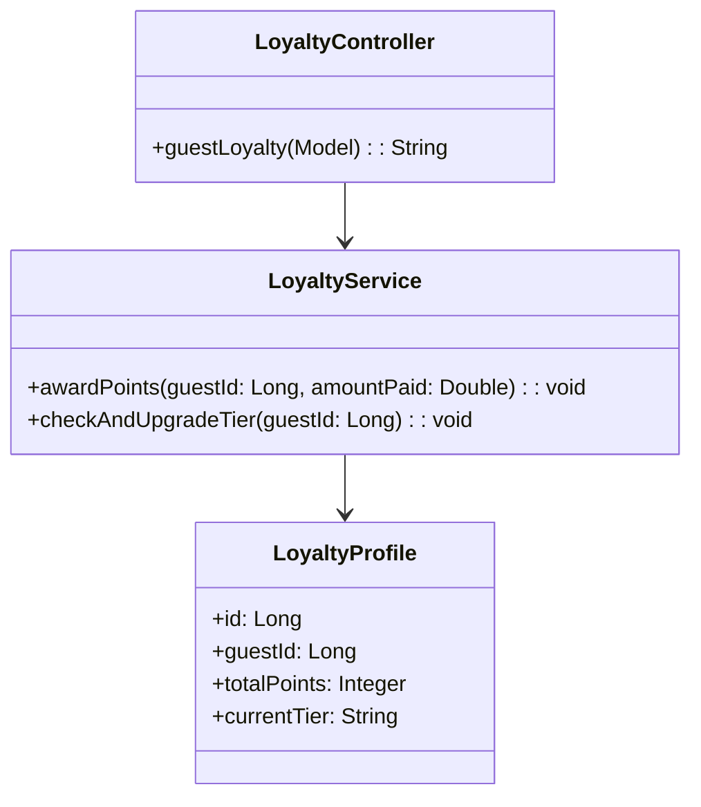
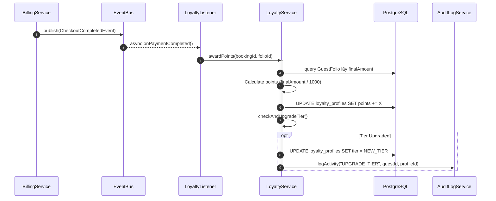

# ENGINEERING DOCUMENTATION STANDARD (EDS) v2.0
## Quy chuẩn Tài liệu Kỹ thuật và Đặc tả Hiện thực hóa

| Field | Value |
| :--- | :--- |
| **Document ID** | `AM-MOD5-IMP-032` |
| **Version** | 1.0 |
| **Date** | 2026-06-27 |
| **Status** | Draft |
| **Document Owner** | Tech Lead |
| **Author** | Phùng Giang Hải |
| **Reviewed by** | Tech Lead |
| **DPO Sign-off** | [x] N/A — Chỉ chứa điểm thưởng, không PII nhạy cảm |
| **Approved by** | Principal Architect |
| **Last Review** | 2026-06-27 |
| **Based on EDS** | v2.0 |

---

## CHANGELOG

> [!IMPORTANT]
> **Policy 4.4 — Immutable History**: Không bao giờ xóa thông tin cũ. Mọi thay đổi phải ghi vào bảng này.

| Ngày | Người thực hiện | Nội dung thay đổi |
| :--- | :--- | :--- |
| 2026-06-27 | Phùng Giang Hải | Tạo tài liệu lần đầu theo chuẩn EDS v2.0 cho UC32 (Loyalty & Tier) |
| 2026-06-27 | Phùng Giang Hải | Cập nhật tài liệu: Tái sử dụng `CheckoutCompletedEvent`, `GuestFolio`, `AuditLogService`, và `BaseEntity` |

---

## MỤC LỤC
1. [Tổng quan Module](#1-tổng-quan-module)
2. [Ma trận Truy vết (Traceability Matrix)](#2-ma-trận-truy-vết-traceability-matrix)
3. [Architecture Decision Records (ADR)](#3-architecture-decision-records-adr)
4. [Non-Functional Requirements & SLA](#4-non-functional-requirements--sla)
5. [Static Modeling (Mô hình Tĩnh)](#5-static-modeling-mô-hình-tĩnh)
6. [Dynamic Modeling (Mô hình Hướng Động)](#6-dynamic-modeling-mô-hình-hướng-động)
7. [Domain Event Catalog](#7-domain-event-catalog)
8. [Interface Specification (Đặc tả Giao diện)](#8-interface-specification-đặc-tả-giao-diện)
9. [API Specification](#9-api-specification)
10. [Bảng mã lỗi (Error Codes)](#10-bảng-mã-lỗi-error-codes)
11. [Quy trình Triển khai (Step-by-Step)](#11-quy-trình-triển-khai-step-by-step)
12. [Rollback & Incident Runbook](#12-rollback--incident-runbook)
13. [Kịch bản Kiểm thử Chi tiết](#13-kịch-bản-kiểm-thử-chi-tiết)
14. [Phương pháp Xác minh](#14-phương-pháp-xác-minh)
15. [Mẫu thử thực tế (API Verification Samples)](#15-mẫu-thử-thực-tế-api-verification-samples)
16. [Bảng tổng hợp phân quyền (Authorization Matrix)](#16-bảng-tổng-hợp-phân-quyền-authorization-matrix)

---

## 1. Tổng quan Module

> [!NOTE]
> Mô tả ngắn gọn mục đích của module, phạm vi nghiệp vụ và lý do tồn tại.

| Field | Value |
| :--- | :--- |
| **Module Name** | Loyalty & Tier Program (UC32) |
| **Bounded Context** | Guest Experience / Billing |
| **Data Classification** | Internal |
| **Compliance Scope** | N/A |
| **Upstream Dependencies** | Billing Module (Checkout) |
| **Downstream Consumers** | Guest Dashboard |

---

## 2. Ma trận Truy vết (Traceability Matrix)

> [!NOTE]
> Ánh xạ trực tiếp: `[Mã yêu cầu]` → `[Thành phần Code]` → `[Mục tiêu Tuân thủ]`.

| Requirement ID | Loại (BR/ADR/US) | Mô tả yêu cầu | Thành phần Code | Compliance Target | ADR liên quan |
| :--- | :--- | :--- | :--- | :--- | :--- |
| BR-28 | Business Rule | Cộng điểm Loyalty khi thanh toán 0 VND | `LoyaltyService.awardPoints()` | Billing Accuracy | ADR-032-1 |
| BR-15 | Business Rule | Audit Trail việc thăng hạng | `AuditLogService.log()` | System Auditing | — |
| UC32 | User Story | Giao diện xem điểm của khách hàng | `LoyaltyController.guestLoyalty()` | — | — |

---

## 3. Architecture Decision Records (ADR)

### `ADR-032-1` — Tính toán điểm độc lập thông qua Event-Driven

| Field | Value |
| :--- | :--- |
| **Status** | Accepted |
| **Deciders** | Phùng Giang Hải |
| **Date** | 2026-06-27 |

#### Bối cảnh (Context)
Cộng điểm thưởng chỉ xảy ra sau khi Checkout hoàn tất (khách thanh toán xong). Việc đặt logic cộng điểm trong transaction checkout có thể làm chậm quá trình xuất hóa đơn và gây lỗi không đáng có (ví dụ lỗi cộng điểm làm rollback luôn hóa đơn).

#### Quyết định (Decision)
> [!NOTE]
> Module Loyalty sẽ lắng nghe sự kiện `@Async TransactionalEventListener(phase = AFTER_COMMIT)` từ `CheckoutCompletedEvent` (được bắn ra từ `BillingServiceImpl`) để xử lý việc cộng điểm. Điều này đảm bảo tính eventual consistency và tái sử dụng Event đã có sẵn.

#### Hệ quả (Consequences)
**Tích cực**:
- Tốc độ xuất hóa đơn tại lễ tân nhanh hơn.
- Decoupling tốt.

**Tiêu cực / Trade-offs**:
- Khách hàng có thể thấy điểm cộng bị trễ khoảng 1-2 giây.

---

## 4. Non-Functional Requirements & SLA

### 4.1. Performance & Availability
| Category | Requirement | Target SLA | Measurement Method | Compliance Basis |
| :--- | :--- | :--- | :--- | :--- |
| Latency | Async processing | < 200ms | Async Executor config | — |

### 4.2. Data Integrity & Retention
| Category | Requirement | Target | Verification Method | Compliance Basis |
| :--- | :--- | :--- | :--- | :--- |
| Consistency | Điểm không bị mất | 100% | Retry mechanism | BR-28 |

---

## 5. Static Modeling (Mô hình Tĩnh)

### 5.1. Class Diagram (PlantUML)



### 5.2. Data Structure (Java Entity)

```java
@Entity
@Table(name = "loyalty_profiles")
public class LoyaltyProfile extends BaseEntity {
    @Id
    @GeneratedValue(strategy = GenerationType.IDENTITY)
    private Long id;

    @Column(nullable = false, unique = true)
    private Long guestId;

    @Column(nullable = false)
    private Integer totalPoints = 0;

    @Column(nullable = false)
    private String currentTier = "MEMBER"; // MEMBER, SILVER, GOLD, PLATINUM
}
```

---

## 6. Dynamic Modeling (Mô hình Hướng Động)

### 6.1. Sequence Diagram — Happy Path (PlantUML)



---

## 7. Domain Event Catalog

### 7.1. Events Published (Phát ra)
| Event Name | Trigger | Publisher | Subscriber(s) | Payload Schema | Async? |
| :--- | :--- | :--- | :--- | :--- | :--- |
| `TierUpgradedEvent` | Điểm vượt ngưỡng | `LoyaltyService` | `NotificationService` | `guestId, newTier` | Yes |

### 7.2. Events Consumed (Tiêu thụ)
| Event Name | Source | Handler | Action thực hiện |
| :--- | :--- | :--- | :--- |
| `CheckoutCompletedEvent` | Billing Module | `LoyaltyListener` | Lấy `GuestFolio.finalAmount` và cộng điểm |

---

## 8. Interface Specification (Đặc tả Giao diện)

### 8.1. Service Interface

```java
// ILoyaltyService.java
// @version 1.0

public interface ILoyaltyService {
    /**
     * Cộng điểm cho khách dựa trên số tiền chi tiêu
     */
    void awardPoints(Long guestId, Double amountPaid);

    /**
     * Kiểm tra tổng điểm và thăng hạng
     */
    void checkAndUpgradeTier(Long guestId);
    
    /**
     * Lấy thông tin điểm của khách
     */
    LoyaltyProfile getProfile(Long guestId);
}
```

---

## 9. API Specification

### 9.1. Endpoints Table

> [!IMPORTANT]
> **Tuân thủ Nguyên tắc 12**: Spring Boot MVC, trả về Thymeleaf Template.

| Method | Path | Auth Level | Required Roles | Target View |
| :--- | :--- | :--- | :--- | :--- |
| GET | `/guest/loyalty` | Session | `ROLE_GUEST` | `guest/loyalty-dashboard.html` |

---

## 10. Bảng mã lỗi (Error Codes)

| Code | HTTP Status | Message (EN) | Message (VI) | Trigger Condition |
| :--- | :--- | :--- | :--- | :--- |
| `LYL-001` | 404 | Profile Not Found | Không tìm thấy hồ sơ Loyalty | Guest chưa có profile |

---

## 11. Quy trình Triển khai (Step-by-Step)

### 11.1. Prerequisites
- [x] Áp dụng SQL migration cho bảng `loyalty_profiles`.

### 11.3. Implementation Steps
- Tạo script seed cấu hình Tier (Silver: 1000đ, Gold: 5000đ).

---

## 12. Rollback & Incident Runbook

### 12.1. Điều kiện kích hoạt Rollback (Trigger Conditions)
- Tính sai điểm cho khách hàng trên diện rộng (tăng vọt bất thường).

### 12.2. Rollback Procedure
- Sửa lại hệ số quy đổi điểm và chạy query truy hồi dựa trên `Folio` để tính lại điểm toàn hệ thống.

---

## 13. Kịch bản Kiểm thử Chi tiết

### 13.1. Unit Tests

#### `TC-LYL-001` — Award Points Success
- **Given** tỷ lệ quy đổi 1 điểm = 100,000 VND. Guest có 50 điểm.
- **When** `awardPoints(guestId, 200000)` được gọi.
- **Then** điểm mới là 52.

#### `TC-LYL-002` — Tier Upgrade
- **Given** ngưỡng Silver là 100 điểm. Guest có 98 điểm.
- **When** `awardPoints(guestId, 200000)` được gọi (+2 điểm = 100 điểm).
- **Then** `checkAndUpgradeTier()` thăng hạng Guest lên `SILVER`.

---

## 14. Phương pháp Xác minh

### 14.1. Database Inspection
```sql
SELECT guest_id, total_points, current_tier FROM loyalty_profiles WHERE current_tier = 'SILVER';
```

---

## 15. Mẫu thử thực tế (API Verification Samples)

Truy cập Dashboard:
```bash
curl -X GET http://localhost:8080/guest/loyalty \
  -H "Cookie: JSESSIONID=..."
# Mong đợi trả về HTML Document của trang hiển thị điểm tích lũy
```

---

## 16. Bảng tổng hợp phân quyền (Authorization Matrix)

| Endpoint | GUEST | RECEPTIONIST | MANAGER | THERAPIST |
| :--- | :---: | :---: | :---: | :---: |
| GET `/guest/loyalty` | ✅ (Own) | ❌ | ✅ (All) | ❌ |
