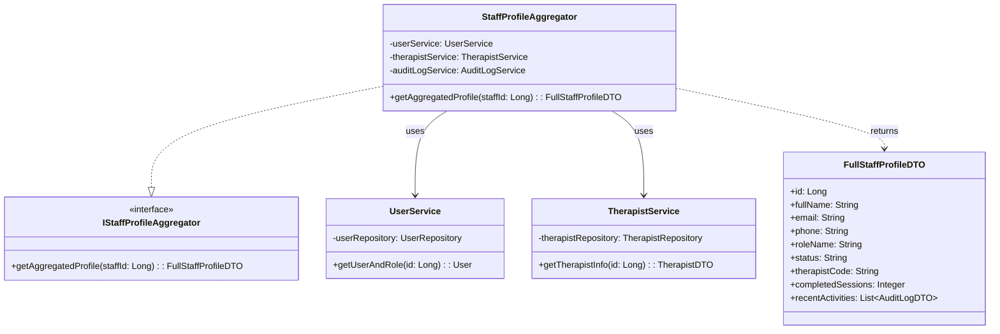
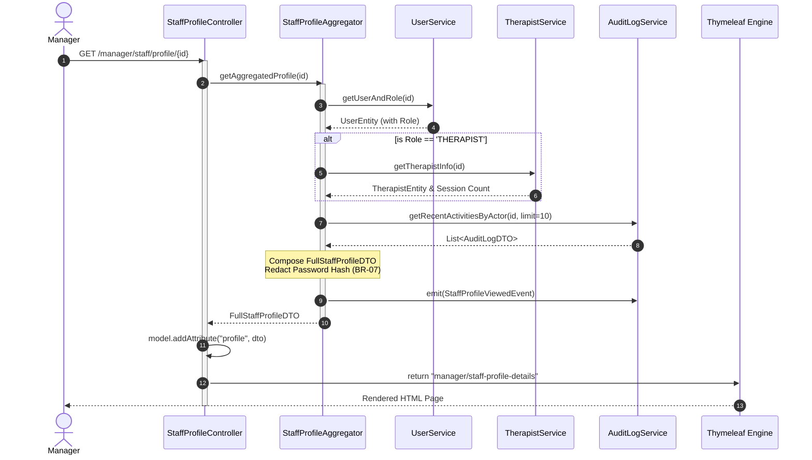
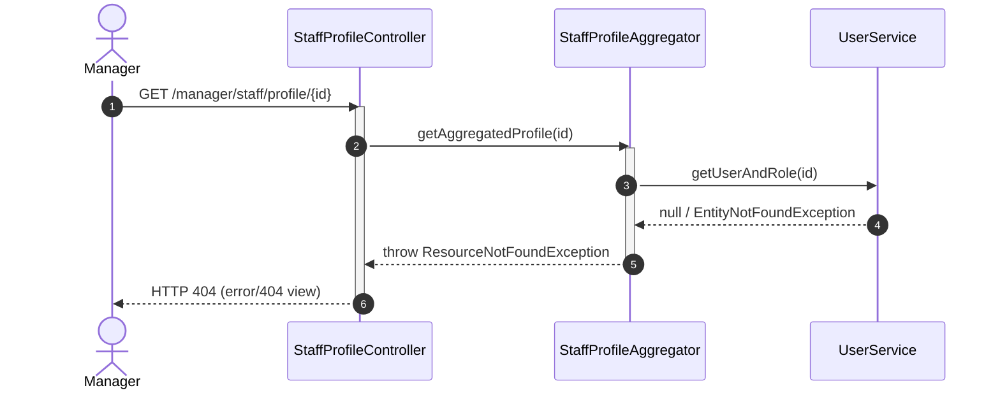

# ENGINEERING DOCUMENTATION STANDARD (EDS) v2.0
## Quy chuẩn Tài liệu Kỹ thuật và Đặc tả Hiện thực hóa

| Field | Value |
| :--- | :--- |
| **Document ID** | `SU26-MOD5-IMP-UC33` |
| **Version** | 2.0 |
| **Date** | 2026-06-26 |
| **Status** | Approved |
| **Document Owner** | HR Management Team |
| **Author** | Phùng Giang Hải - Backend Developer |
| **Reviewed by** | Tech Lead |
| **DPO Sign-off** | [x] Approved — 2026-06-26 — DPO *(bắt buộc với module PII)* |
| **Approved by** | Principal Architect |
| **Last Review** | 2026-06-26 |
| **Based on EDS** | v2.0 |

---

## CHANGELOG

> [!IMPORTANT]
> **Policy 4.4 — Immutable History**: Không bao giờ xóa thông tin cũ. Mọi thay đổi phải ghi vào bảng này.

| Ngày | Người thực hiện | Nội dung thay đổi |
| :--- | :--- | :--- |
| 2026-06-26 | Phùng Giang Hải - Backend Developer | Tạo tài liệu lần đầu theo chuẩn EDS V2.0 |

---

## MỤC LỤC
1. [Tổng quan Module](#1-tổng-quan-module)
2. [Ma trận Truy vết (Traceability Matrix)](#2-ma-trận-truy-vết-traceability-matrix)
3. [Architecture Decision Records (ADR)](#3-architecture-decision-records-adr)
4. [Non-Functional Requirements & SLA](#4-non-functional-requirements--sla)
5. [Static Modeling (Mô hình Tĩnh)](#5-static-modeling-mô-hình-tĩnh)
6. [Dynamic Modeling (Mô hình Hướng Động)](#6-dynamic-modeling-mô-hình-hướng-động)
7. [Domain Event Catalog](#7-domain-event-catalog)
8. [Interface Specification (Đặc tả Giao diện)](#8-interface-specification-đặc-tả-giao-diện)
9. [API Specification](#9-api-specification)
10. [Bảng mã lỗi (Error Codes)](#10-bảng-mã-lỗi-error-codes)
11. [Quy trình Triển khai (Step-by-Step)](#11-quy-trình-triển-khai-step-by-step)
12. [Rollback & Incident Runbook](#12-rollback--incident-runbook)
13. [Kịch bản Kiểm thử Chi tiết](#13-kịch-bản-kiểm-thử-chi-tiết)
14. [Phương pháp Xác minh](#14-phương-pháp-xác-minh)
15. [Mẫu thử thực tế (API Verification Samples)](#15-mẫu-thử-thực-tế-api-verification-samples)
16. [Bảng tổng hợp phân quyền (Authorization Matrix)](#16-bảng-tổng-hợp-phân-quyền-authorization-matrix)

---

## 1. Tổng quan Module

> [!NOTE]
> Mô tả ngắn gọn mục đích của module, phạm vi nghiệp vụ và lý do tồn tại.

| Field | Value |
| :--- | :--- |
| **Module Name** | HR Management - View Staff Profile Details (UC33) |
| **Bounded Context** | HR & Identity Management |
| **Data Classification** | Sensitive-PII (Chứa Email, SĐT, CCCD) |
| **Compliance Scope** | PDPA / GDPR |
| **Upstream Dependencies** | IdentityModule (Users, Roles) |
| **Downstream Consumers** | AuditLogModule (Ghi nhận hoạt động) |

---

## 2. Ma trận Truy vết (Traceability Matrix)

> [!NOTE]
> Ánh xạ trực tiếp: `[Mã yêu cầu]` → `[Thành phần Code]` → `[Mục tiêu Tuân thủ]`.
> **Policy**: Không viết code nếu không biết code đó phục vụ Rule nào.

| Requirement ID | Loại (BR/ADR/US) | Mô tả yêu cầu | Thành phần Code | Compliance Target | ADR liên quan |
| :--- | :--- | :--- | :--- | :--- | :--- |
| BR-07 | Business Rule | RBAC & Data Minimization | `StaffProfileAggregator` | PDPA (Data Minimization) | ADR-002 |
| UC33 | User Story | View Staff Profile Details | `StaffProfileController` | — | ADR-001 |
| ADR-001 | Decision | Aggregator Pattern | `StaffProfileAggregator` | Khả năng mở rộng / Coupling | ADR-001 |
| ADR-002 | Decision | PII Redaction Strategy | `FullStaffProfileDTO` | GDPR Art. 5.1(c) | ADR-002 |

---

## 3. Architecture Decision Records (ADR)

> [!NOTE]
> ⭐ **Section mới — EDS v2.0**
> Ghi lại lý do đằng sau mỗi quyết định kiến trúc quan trọng. DPO và Auditor cần section này để hiểu tại sao hệ thống được thiết kế như vậy.

### `ADR-001` — Áp dụng Aggregator / Facade Pattern cho Staff Profile

| Field | Value |
| :--- | :--- |
| **Status** | Accepted |
| **Deciders** | Phùng Giang Hải - Backend Developer |
| **Date** | 2026-06-26 |
| **Supersedes** | N/A |

#### Bối cảnh (Context)
> [!NOTE]
> Hồ sơ nhân viên được lưu rải rác trên nhiều bảng: `USER` (Core), `ROLE` (Phân quyền), `THERAPIST` (Mở rộng cho nhân viên Spa), `AUDIT_LOG` (Hoạt động). Việc thực hiện 1 câu query SQL JOIN khổng lồ tại Repository sẽ phá vỡ tính Bounded Context và gây khó khăn khi Maintain.

#### Các phương án đã xem xét (Options Considered)
| Phương án | Mô tả | Ưu điểm | Nhược điểm |
| :--- | :--- | :--- | :--- |
| A (SQL JOIN) | Truy vấn trực tiếp tại 1 Repository ôm đồm tất cả các bảng. | + Nhanh, ít request. | - Trái nguyên tắc SOLID, khó mở rộng nếu thêm Role mới (như Chef). |
| B (Aggregator Service) | Tạo 1 `StaffProfileAggregator` gọi các Service chuyên biệt (`UserService`, `TherapistService`) để thu thập dữ liệu. | + Phân tách trách nhiệm rõ ràng, dễ Test (Mocking). | - Độ trễ có thể cao hơn do gọi hàm nhiều lần. |

#### Quyết định (Decision)
> [!NOTE]
> Chọn Phương án `[B]` vì `hệ thống đang xây dựng theo Module-driven. Việc cô lập logic truy xuất dữ liệu giúp dễ dàng mở rộng khi có thêm Role mới`.

#### Hệ quả (Consequences)
**Tích cực**:
- Maintain code dễ dàng. Unit Test có thể Mock từng Service riêng rẽ.

**Tiêu cực / Trade-offs**:
- Hiệu suất có thể chậm hơn vài ms (Chấp nhận được).

**Compliance Impact**:
- Dễ dàng lọc bỏ dữ liệu nhạy cảm ở cấp độ Aggregator thay vì DB.

---

## 4. Non-Functional Requirements & SLA

> [!NOTE]
> ⭐ **Section mới — EDS v2.0**
> Với module xử lý PII, NFR không chỉ là yêu cầu kỹ thuật — đây là nghĩa vụ pháp lý (GDPR Art. 32).

### 4.1. Performance & Availability
| Category | Requirement | Target SLA | Measurement Method | Compliance Basis |
| :--- | :--- | :--- | :--- | :--- |
| Latency | API response (p99) | < 500ms | k6 load test | — |
| Availability | Uptime (monthly) | 99.9% | Uptime monitor | — |
| Throughput | Concurrent requests | 100 req/s | Load test | — |

### 4.2. Data Integrity & Retention
| Category | Requirement | Target | Verification Method | Compliance Basis |
| :--- | :--- | :--- | :--- | :--- |
| Access Logging| Ghi log mọi lần xem hồ sơ | 100% | Audit DB query | PDPA |

### 4.3. Security
| Category | Requirement | Target | Verification Method | Compliance Basis |
| :--- | :--- | :--- | :--- | :--- |
| Data Minimization | Password Hash never sent | 0% | DTO Inspection (Unit Test) | GDPR Art. 5.1(c) |
| Access control | Manager/Admin Only | Least privilege | Auth Matrix (§16) | GDPR Art. 25 |

---

## 5. Static Modeling (Mô hình Tĩnh)

### 5.1. Class Diagram (PlantUML)



### 5.2. Data Structure

```sql
-- Core Table (USER)
CREATE TABLE [USER] (
    user_id INT IDENTITY(1,1) PRIMARY KEY,
    role_id INT NOT NULL,
    email VARCHAR(50) NOT NULL UNIQUE,
    password_hash VARCHAR(255) NOT NULL, -- MUST BE REDACTED
    full_name NVARCHAR(50),
    phone VARCHAR(20),
    status VARCHAR(10) CHECK (status IN ('ACTIVE', 'INACTIVE', 'BANNED')),
    CONSTRAINT FK_USER_ROLE FOREIGN KEY (role_id) REFERENCES [ROLE](role_id)
);

-- Extension Table (THERAPIST)
CREATE TABLE THERAPIST (
    therapist_id INT PRIMARY KEY,
    therapist_code VARCHAR(6) NOT NULL UNIQUE,
    status VARCHAR(10) CHECK (status IN ('AVAILABLE', 'BUSY', 'OFF_DUTY')),
    CONSTRAINT FK_THERAPIST_USER FOREIGN KEY (therapist_id) REFERENCES [USER](user_id)
);
```

---

## 6. Dynamic Modeling (Mô hình Hướng Động)

### 6.1. Sequence Diagram — Happy Path (PlantUML)



### 6.2. Sequence Diagram — Error Path (PlantUML)



### 6.3. State Machine 
> Không áp dụng (Module chỉ hiển thị, không chuyển trạng thái thực thể).

---

## 7. Domain Event Catalog

> [!NOTE]
> ⭐ **Section mới — EDS v2.0**

### 7.1. Events Published (Phát ra)
| Event Name | Trigger | Publisher | Subscriber(s) | Payload Schema | Async? |
| :--- | :--- | :--- | :--- | :--- | :--- |
| `StaffProfileViewed` | Manager views a profile | `StaffProfileAggregator` | `AuditLogService` | `StaffProfileViewed.java` | Yes |

### 7.2. Events Consumed (Tiêu thụ)
*Feature này không tiêu thụ Domain Event từ bên ngoài.*

### 7.3. Payload Schema

```java
// StaffProfileViewed.java
public class StaffProfileViewedEvent {
    private UUID eventId;
    private Long actorId;       // Manager ID
    private Long targetStaffId; // Staff being viewed
    private LocalDateTime occurredAt;
}
```

---

## 8. Interface Specification (Đặc tả Giao diện)

> [!IMPORTANT]
> **Policy (EDS v2.0)**: Mỗi interface phải khai báo `@version`. Mọi breaking change phải tạo ADR mới.

### 8.1. Service Interface

```java
// IStaffProfileAggregator.java
// @version 1.0

public interface IStaffProfileAggregator {
    /**
     * Aggregates Staff Profile from multiple sources and applies PII redaction.
     * @throws ResourceNotFoundException if staffId is invalid.
     */
    FullStaffProfileDTO getAggregatedProfile(Long staffId) throws ResourceNotFoundException;
}
```

---

## 9. API Specification

### 9.1. Endpoints Table

| Method | Path | Auth Level | Required Roles | Rate Limit | Idempotent? |
| :--- | :--- | :--- | :--- | :--- | :--- |
| GET | `/manager/staff/profile/{id}` | Session / JWT | `MANAGER`, `ADMIN` | 100/min | Yes |

### 9.2. Request / Response Schemas

*Endpoint trả về file HTML (Thymeleaf Server-Side Rendering), không trả về JSON.* tuy nhiên đối tượng Model truyền xuống view sẽ tuân thủ cấu trúc DTO sau:

**Model Attribute (`profile`)**:
```json
{
  "id": 12,
  "fullName": "Nguyen Van A",
  "email": "nguyenvana@gmail.com",
  "phone": "0987654321",
  "roleName": "THERAPIST",
  "status": "ACTIVE",
  "therapistCode": "T-001",
  "completedSessions": 45,
  "recentActivities": [
    { "actionType": "COMPLETED_SESSION", "timestamp": "2026-06-25T14:30:00" }
  ]
}
```
*(Tuyệt đối không chứa `password_hash`)*

---

## 10. Bảng mã lỗi (Error Codes)

| Code | HTTP Status | Message (EN) | Message (VI) | Trigger Condition |
| :--- | :--- | :--- | :--- | :--- |
| `HR-404` | 404 | Staff Not Found | Không tìm thấy nhân viên | Truyền sai ID |
| `HR-403` | 403 | Forbidden Access | Không đủ quyền truy cập | Actor không phải là Manager/Admin |

---

## 11. Quy trình Triển khai (Step-by-Step)

### 11.1. Prerequisites
- [x] ADR đã được Accepted (xem §3)
- [x] DPO đã sign-off nếu module xử lý PII (xem header)
- [x] Môi trường staging đã sẵn sàng

### 11.2. Pre-Migration Checklist
- [x] Đã backup DB production
- [x] Không có DB Schema Migration nào (sử dụng schema hiện hữu)

### 11.3. Implementation Steps
- Deploy `harmony-resort.jar` mới nhất.
- Đặt các file UI vào `src/main/resources/templates/manager/staff-profile-details.html`.

### 11.4. Deployment Checklist
- [ ] Truy cập endpoint `/manager/staff/profile/1` với tài khoản Manager trả về HTTP 200.
- [ ] Đảm bảo UI hiển thị đúng thông tin rẽ nhánh cho Therapist.
- [ ] Audit log `StaffProfileViewed` xuất hiện trong DB.

---

## 12. Rollback & Incident Runbook

> [!NOTE]
> ⭐ **Section mới — EDS v2.0**

### 12.1. Điều kiện kích hoạt Rollback (Trigger Conditions)

| Điều kiện | Ngưỡng | Người quyết định |
| :--- | :--- | :--- |
| Error rate 500 tăng | > 2% | On-call Engineer |
| Rò rỉ thông tin (PII Leak) | Bất kỳ case nào | Tech Lead + DPO |

### 12.2. Rollback Procedure
Do tính năng này chỉ là View Data (Read-only), không làm thay đổi state DB, tiến trình Rollback rất đơn giản:
#### Bước 1: Revert mã nguồn JAR
Deploy lại phiên bản `harmony-resort.jar` trước đó qua CI/CD Pipeline.

---

## 13. Kịch bản Kiểm thử Chi tiết

| Test Case ID | Mục tiêu | Kịch bản (GIVEN - WHEN - THEN) | Kết quả mong đợi |
| :--- | :--- | :--- | :--- |
| `TC-HR-001` | Test Aggregation với Therapist | **Given** User ID=2 (Therapist)<br/>**When** Gọi `getAggregatedProfile(2)`<br/>**Then** Có `therapistCode` và `completedSessions`. | Passed |
| `TC-HR-002` | Test Aggregation với Receptionist | **Given** User ID=3 (Receptionist)<br/>**When** Gọi `getAggregatedProfile(3)`<br/>**Then** `therapistCode` là `null`. | Passed |
| `TC-HR-003` | Test PII Data Minimization (BR-07) | **Given** Profile lấy thành công<br/>**When** Inspect DTO<br/>**Then** Không tồn tại field `password_hash`. | Passed |

---

## 14. Phương pháp Xác minh

| Component | Công cụ/Cách thức | Tần suất |
| :--- | :--- | :--- |
| Unit Tests | JUnit 5 + Mockito (Coverage > 80%) | Mỗi lần Push Code (CI/CD) |
| Security Check | Spring Security `@WithMockUser` | Mỗi lần build |
| PII Scan | SonarQube | Tự động trên Pipeline |

---

## 15. Mẫu thử thực tế (API Verification Samples)

Vì kiến trúc là SSR (Thymeleaf), ta verify Controller bằng MockMvc:
```java
mockMvc.perform(get("/manager/staff/profile/1")
        .sessionAttr("USER_ROLE", "MANAGER"))
       .andExpect(status().isOk())
       .andExpect(view().name("manager/staff-profile-details"))
       .andExpect(model().attributeExists("profile"));
```

---

## 16. Bảng tổng hợp phân quyền (Authorization Matrix)

| Role | Xem Hồ sơ Cơ bản | Xem Lịch sử (Audit Log) | Xem Therapist KPI | Ghi Log Hệ thống |
| :--- | :--- | :--- | :--- | :--- |
| `ADMIN` | ✅ Cho phép | ✅ Cho phép | ✅ Cho phép | ✅ Tự động |
| `MANAGER` | ✅ Cho phép | ✅ Cho phép | ✅ Cho phép | ✅ Tự động |
| `RECEPTIONIST`| ❌ Từ chối | ❌ Từ chối | ❌ Từ chối | - |
| `GUEST` | ❌ Từ chối | ❌ Từ chối | ❌ Từ chối | - |
