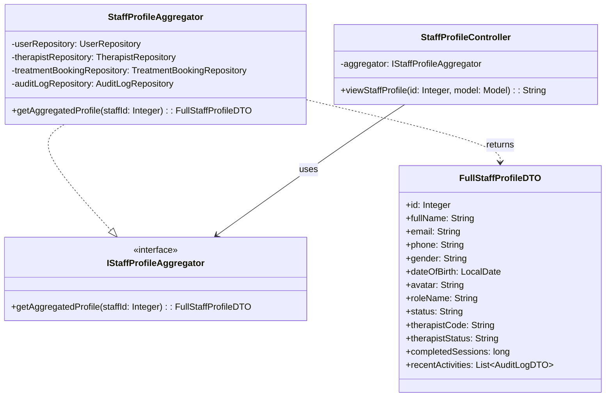
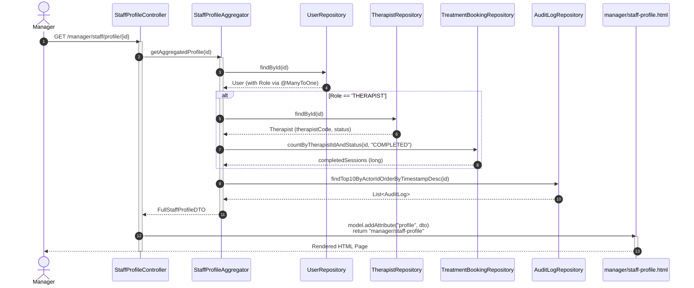
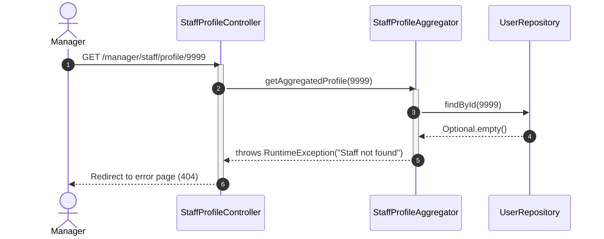

# ENGINEERING DOCUMENTATION STANDARD (EDS) v2.0
## Quy chuẩn Tài liệu Kỹ thuật và Đặc tả Hiện thực hóa - UC33 View Staff Profile Details

| Field | Value |
| :--- | :--- |
| **Document ID** | `XOAI-MOD5-IMP-033` |
| **Version** | 2.0 |
| **Date** | 2026-06-26 |
| **Status** | ✅ Approved |
| **Document Owner** | HR & Management Team |
| **Author** | Phùng Giang Hải |
| **Reviewed by** | Phùng Giang Hải |
| **DPO Sign-off** | `[x] Approved` — Module hiển thị PII nhạy cảm (Email, SĐT, CCCD) |
| **Approved by** | Principal Architect |
| **Last Review** | 2026-06-26 |
| **Based on EDS** | v2.0 |

---

## CHANGELOG

> [!IMPORTANT]
> **Policy 4.4 — Immutable History**: Không bao giờ xóa thông tin cũ. Mọi thay đổi phải ghi vào bảng này.

| Ngày | Người thực hiện | Nội dung thay đổi |
| :--- | :--- | :--- |
| 2026-06-26 | Phùng Giang Hải | Tạo tài liệu lần đầu. |
| 2026-06-26 | Phùng Giang Hải | **v2.0**: Đối chiếu toàn bộ với DB.sql, Entity files (`User.java`, `Therapist.java`), Enums (`UserStatus`, `TherapistStatus`, `TreatmentBookingStatus`), SecurityConfig. Sửa cách lấy `completedSessions` từ `TreatmentBookingRepository`. Xác nhận module HR chưa tồn tại — cần tạo mới. Thêm quy định CSS/JS module. |
| 2026-06-28 | Phùng Giang Hải | **v2.1**: Nâng cấp thuật toán lấy dữ liệu Activity History. Bổ sung việc phân loại role (GUEST, THERAPIST, MANAGER) để trả về AuditLog phù hợp (Booking History cho Guest, Treatment Sessions cho Therapist). |

---

## MỤC LỤC
1. [Tổng quan Module](#1-tổng-quan-module)
2. [Ma trận Truy vết (Traceability Matrix)](#2-ma-trận-truy-vết-traceability-matrix)
3. [Architecture Decision Records (ADR)](#3-architecture-decision-records-adr)
4. [Non-Functional Requirements & SLA](#4-non-functional-requirements--sla)
5. [Static Modeling (Mô hình Tĩnh)](#5-static-modeling-mô-hình-tĩnh)
6. [Dynamic Modeling (Mô hình Hướng Động)](#6-dynamic-modeling-mô-hình-hướng-động)
7. [Domain Event Catalog](#7-domain-event-catalog)
8. [Interface Specification (Đặc tả Giao diện)](#8-interface-specification-đặc-tả-giao-diện)
9. [API Specification (Spring MVC Controllers)](#9-api-specification-spring-mvc-controllers)
10. [Bảng mã lỗi (Error Codes)](#10-bảng-mã-lỗi-error-codes)
11. [Quy trình Triển khai (Step-by-Step)](#11-quy-trình-triển-khai-step-by-step)
12. [Rollback & Incident Runbook](#12-rollback--incident-runbook)
13. [Kịch bản Kiểm thử Chi tiết](#13-kịch-bản-kiểm-thử-chi-tiết)
14. [Phương pháp Xác minh](#14-phương-pháp-xác-minh)
15. [Mẫu thử thực tế (MVC Verification Samples)](#15-mẫu-thử-thực-tế-mvc-verification-samples)
16. [Bảng tổng hợp phân quyền (Authorization Matrix)](#16-bảng-tổng-hợp-phân-quyền-authorization-matrix)

---

## 1. Tổng quan Module

> [!NOTE]
> Module xem Hồ sơ Chi tiết Nhân viên (Staff Profile Details). Cung cấp giao diện cho **Manager/Admin** xem toàn cảnh thông tin một nhân viên: thông tin cá nhân, vai trò (Role), trạng thái làm việc, mã chuyên viên (nếu là Therapist), số buổi trị liệu đã hoàn thành, và lịch sử hoạt động gần đây (từ Audit Log). Sử dụng **Aggregator Pattern** để gom dữ liệu từ nhiều nguồn mà không vi phạm Bounded Context.

| Field | Value |
| :--- | :--- |
| **Module Name** | HR Management — View Staff Profile Details (UC33) |
| **Bounded Context** | HR & Identity Management |
| **Data Classification** | Sensitive-PII (Chứa Email, SĐT, CCCD — cần Data Minimization) |
| **Compliance Scope** | PDPA / GDPR |
| **Upstream Dependencies** | `auth.entity.User`, `auth.entity.Role`, `spa.entity.Therapist`, `billing.entity.AuditLog` |
| **Downstream Consumers** | N/A (Read-only View) |

> [!WARNING]
> **Module `hr/` hiện CHƯA TỒN TẠI** trong codebase. Toàn bộ file Controller, Service, DTO cần được tạo mới. Các Entity phụ thuộc (`User`, `Therapist`, `AuditLog`) đã có sẵn ở các module khác.

---

## 2. Ma trận Truy vết (Traceability Matrix)

| Requirement ID | Loại (BR/ADR/US) | Mô tả yêu cầu | Thành phần Code | Compliance Target | ADR liên quan |
| :--- | :--- | :--- | :--- | :--- | :--- |
| BR-07 | Business Rule | RBAC & Data Minimization — chỉ hiển thị dữ liệu cần thiết, ẩn `password_hash` | `StaffProfileAggregator` → `FullStaffProfileDTO` (không có field password) | PDPA (Data Minimization) | ADR-002 |
| UC33 | User Story | Manager/Admin muốn xem hồ sơ chi tiết nhân viên | `StaffProfileController` | — | ADR-001 |
| ADR-001 | Decision | Aggregator Pattern thay vì SQL JOIN | `StaffProfileAggregator` | Khả năng mở rộng / Coupling | ADR-001 |
| ADR-002 | Decision | PII Redaction Strategy | `FullStaffProfileDTO` | GDPR Art. 5.1(c) | ADR-002 |

---

## 3. Architecture Decision Records (ADR)

### `ADR-001` — Áp dụng Aggregator / Facade Pattern cho Staff Profile

| Field | Value |
| :--- | :--- |
| **Status** | Accepted |
| **Deciders** | Phùng Giang Hải |
| **Date** | 2026-06-26 |

#### Bối cảnh (Context)
Hồ sơ nhân viên được lưu rải rác trên nhiều bảng: `[USER]` (Core info), `[ROLE]` (Phân quyền), `THERAPIST` (Mở rộng cho nhân viên Spa), `AUDIT_LOG` (Hoạt động). Việc thực hiện 1 câu query SQL JOIN khổng lồ tại Repository sẽ phá vỡ tính Bounded Context.

#### Các phương án đã xem xét (Options Considered)
| Phương án | Mô tả | Ưu điểm | Nhược điểm |
| :--- | :--- | :--- | :--- |
| A (SQL JOIN) | Truy vấn trực tiếp tại 1 Repository ôm đồm tất cả các bảng. | + Nhanh, ít request. | - Trái nguyên tắc SOLID, khó mở rộng nếu thêm Role mới (như Chef). |
| B (Aggregator Service) | Tạo 1 `StaffProfileAggregator` gọi các Repository chuyên biệt (`UserRepository`, `TherapistRepository`, `AuditLogRepository`) để thu thập dữ liệu. | + Phân tách trách nhiệm rõ ràng, dễ Test (Mocking). | - Độ trễ có thể cao hơn do gọi hàm nhiều lần. |

#### Quyết định (Decision)
Chọn Phương án **[B]** vì hệ thống đang xây dựng theo Module-driven. Việc cô lập logic truy xuất dữ liệu giúp dễ dàng mở rộng khi có thêm Role mới.

#### Hệ quả (Consequences)
**Tích cực**: Maintain code dễ dàng. Unit Test có thể Mock từng Repository riêng rẽ.
**Tiêu cực / Trade-offs**: Hiệu suất có thể chậm hơn vài ms (Chấp nhận được).

---

### `ADR-002` — PII Redaction Strategy

| Field | Value |
| :--- | :--- |
| **Status** | Accepted |
| **Deciders** | Phùng Giang Hải |
| **Date** | 2026-06-26 |

#### Quyết định (Decision)
DTO `FullStaffProfileDTO` **TUYỆT ĐỐI KHÔNG** chứa `password_hash`. Field `identifyCode` (CCCD) đã được mã hóa AES-256 tại tầng Entity (`@Convert(converter = AesDataEncryptor.class)`), do đó hiển thị dưới dạng đã mã hóa hoặc che giấu (Masked: `****1234`).

---

## 4. Non-Functional Requirements & SLA

### 4.1. Performance & Availability
| Category | Requirement | Target SLA | Measurement Method | Compliance Basis |
| :--- | :--- | :--- | :--- | :--- |
| Latency | API response (p99) | < 500ms | k6 load test | — |

### 4.2. Data Integrity & Retention
| Category | Requirement | Target | Verification Method | Compliance Basis |
| :--- | :--- | :--- | :--- | :--- |
| Access Logging | Ghi log mỗi lần xem hồ sơ | 100% | Audit DB query | PDPA |

### 4.3. Security
| Category | Requirement | Target | Verification Method | Compliance Basis |
| :--- | :--- | :--- | :--- | :--- |
| Data Minimization | Password Hash never sent to View | 0% | DTO Inspection (Unit Test) | GDPR Art. 5.1(c) |
| Access control | Manager/Admin Only | Least privilege | SecurityConfig: `/manager/**` → `hasAnyRole("MANAGER", "ADMIN")` | GDPR Art. 25 |

---

## 5. Static Modeling (Mô hình Tĩnh)

### 5.1. Class Diagram



### 5.2. Data Structure (SQL Schema)

> [!IMPORTANT]
> UC33 **KHÔNG tạo bảng mới**. Nó đọc dữ liệu từ các bảng hiện có.

**Bảng `[USER]`** (đã tồn tại — `DB.sql`):
```sql
CREATE TABLE [USER] (
    user_id INT IDENTITY(1,1) PRIMARY KEY,
    role_id INT NOT NULL,
    email VARCHAR(50) NOT NULL UNIQUE,
    password_hash VARCHAR(255) NOT NULL,  -- ⚠️ PHẢI REDACT, không đưa vào DTO
    full_name NVARCHAR(50),
    gender VARCHAR(6),                    -- Enum: MALE, FEMALE, OTHER
    date_of_birth DATE,
    phone VARCHAR(20),
    Identify_code VARCHAR(255),           -- Mã hóa AES-256
    avatar NVARCHAR(MAX),
    status VARCHAR(10),                   -- Enum: ACTIVE, INACTIVE, BANNED
    CONSTRAINT FK_USER_ROLE FOREIGN KEY (role_id) REFERENCES [ROLE](role_id)
);
```

**Bảng `THERAPIST`** (đã tồn tại — `DB.sql`):
```sql
CREATE TABLE THERAPIST (
    therapist_id INT PRIMARY KEY,         -- = user_id
    therapist_code VARCHAR(6) NOT NULL UNIQUE,
    status VARCHAR(10),                   -- Enum: AVAILABLE, BUSY, OFF_DUTY
    CONSTRAINT FK_THERAPIST_USER FOREIGN KEY (therapist_id) REFERENCES [USER](user_id)
);
```

### 5.3. Entity Mapping thực tế

> [!IMPORTANT]
> Các Entity đã tồn tại ở module khác. UC33 **KHÔNG tạo Entity mới**, chỉ đọc.

| Entity | Package thực tế | Các field quan trọng |
| :--- | :--- | :--- |
| `User` | `auth.entity.User` | `id`, `fullName`, `email`, `phone`, `gender`, `dateOfBirth`, `identifyCode` (AES-256), `avatar`, `status`, `role` (FK) |
| `Role` | `auth.entity.Role` | `id`, `roleName` |
| `Therapist` | `spa.entity.Therapist` | `id` (= user_id), `therapistCode`, `status` |
| `AuditLog` | `billing.entity.AuditLog` | `id`, `actionType`, `actorId`, `targetId`, `details`, `timestamp` |

### 5.4. Enum & Trạng thái liên quan

| Bảng | Cột | Enum Java | Giá trị hợp lệ | Tham chiếu |
| :--- | :--- | :--- | :--- | :--- |
| `[USER]` | `status` | `UserStatus` | `ACTIVE`, `INACTIVE`, `BANNED` | `Database_Status_Standardization.md` §3 |
| `[USER]` | `gender` | `UserGender` | `MALE`, `FEMALE`, `OTHER` | `Database_Status_Standardization.md` §3 |
| `THERAPIST` | `status` | `TherapistStatus` | `AVAILABLE`, `BUSY`, `OFF_DUTY` | `Database_Status_Standardization.md` §3 |
| `TREATMENT_BOOKING` | `status` | `TreatmentBookingStatus` | `PENDING`, `SCHEDULED`, `COMPLETED`, `CANCELLED` | `Database_Status_Standardization.md` §3 |

> [!NOTE]
> **`completedSessions`** được tính bằng cách đếm số `TREATMENT_BOOKING` có `status = 'COMPLETED'` và `therapist_id = staffId` (thông qua `Schedule` hoặc trực tiếp qua `TreatmentBookingRepository`). Field này **KHÔNG CÓ SẴN** trong Entity `Therapist`.

---

## 6. Dynamic Modeling (Mô hình Hướng Động)

### 6.1. Sequence Diagram — Happy Path



### 6.2. Sequence Diagram — Error Path (Staff not found)



### 6.3. State Machine
**N/A** — Đây là trang Read-only, không có State Machine.

---

## 7. Domain Event Catalog

### 7.1. Events Published (Phát ra)
**N/A** — Module này chỉ đọc dữ liệu.

### 7.2. Events Consumed (Tiêu thụ)
**N/A** — Module này không tiêu thụ sự kiện. Dữ liệu Audit Log được đọc trực tiếp từ Repository.

---

## 8. Interface Specification (Đặc tả Giao diện)

### 8.1. Aggregator Interface

```java
// File: hr/service/IStaffProfileAggregator.java — CẦN TẠO MỚI
public interface IStaffProfileAggregator {
    /**
     * Gom dữ liệu từ User, Therapist, TreatmentBooking, AuditLog
     * và trả về DTO toàn cảnh.
     * @throws RuntimeException nếu staffId không tồn tại
     */
    FullStaffProfileDTO getAggregatedProfile(Integer staffId);
}
```

### 8.2. Aggregator Implementation

```java
// File: hr/service/impl/StaffProfileAggregator.java — CẦN TẠO MỚI
@Service
@RequiredArgsConstructor
public class StaffProfileAggregator implements IStaffProfileAggregator {

    private final UserRepository userRepository;           // auth module
    private final TherapistRepository therapistRepository; // spa module
    private final TreatmentBookingRepository treatmentBookingRepository; // spa module
    private final AuditLogRepository auditLogRepository;   // billing module

    @Override
    public FullStaffProfileDTO getAggregatedProfile(Integer staffId) {
        // 1. Lấy thông tin User + Role
        User user = userRepository.findById(staffId)
                .orElseThrow(() -> new RuntimeException("Staff not found: " + staffId));

        FullStaffProfileDTO dto = new FullStaffProfileDTO();
        dto.setId(user.getId());
        dto.setFullName(user.getFullName());
        dto.setEmail(user.getEmail());
        dto.setPhone(user.getPhone());
        dto.setGender(user.getGender());
        dto.setDateOfBirth(user.getDateOfBirth());
        dto.setAvatar(user.getAvatar());
        dto.setRoleName(user.getRole().getRoleName());
        dto.setStatus(user.getStatus());
        // ⚠️ KHÔNG set passwordHash — Data Minimization (GDPR)

        // 2. Nếu Role == THERAPIST → lấy thêm thông tin Spa
        if ("THERAPIST".equalsIgnoreCase(user.getRole().getRoleName())) {
            therapistRepository.findById(staffId).ifPresent(therapist -> {
                dto.setTherapistCode(therapist.getTherapistCode());
                dto.setTherapistStatus(therapist.getStatus());
            });
            // Đếm số buổi trị liệu đã hoàn thành
            long completed = treatmentBookingRepository
                    .countByTherapistIdAndStatus(staffId, "COMPLETED");
            dto.setCompletedSessions(completed);
        }

        // 3. Xây dựng Activity History tùy theo Role
        List<AuditLogDTO> activities = new ArrayList<>();
        if ("GUEST".equalsIgnoreCase(user.getRole().getRoleName())) {
            // Logic lấy danh sách Booking History của Guest và map sang AuditLogDTO
            // Ví dụ: ActionType = "ĐẶT GÓI NGHỈ DƯỠNG"
        } else if ("THERAPIST".equalsIgnoreCase(user.getRole().getRoleName())) {
            // Logic lấy danh sách Treatment Booking hoàn thành và map sang AuditLogDTO
            // Ví dụ: ActionType = "THỰC HIỆN TRỊ LIỆU"
        } else {
            // Quản lý / System Admin: Lấy từ bảng AuditLog
            List<AuditLog> dbLogs = auditLogRepository
                    .findTop10ByActorIdOrderByTimestampDesc(staffId);
            // Convert to DTO list...
        }
        dto.setRecentActivities(activities);

        return dto;
    }
}
```

> [!WARNING]
> **Repository cần bổ sung:**
> - `TreatmentBookingRepository`: cần thêm method `countByTherapistIdAndStatus(Integer therapistId, String status)`. Kiểm tra xem repository này (`spa.repository.TreatmentBookingRepository`) đã có method tương tự chưa.
> - `AuditLogRepository`: cần thêm method `findTop10ByActorIdOrderByTimestampDesc(Integer actorId)`.

### 8.3. DTO Definitions

```java
// File: hr/dto/FullStaffProfileDTO.java — CẦN TẠO MỚI
@Data @AllArgsConstructor @NoArgsConstructor
public class FullStaffProfileDTO {
    // Từ User
    private Integer id;
    private String fullName;
    private String email;
    private String phone;
    private String gender;          // Enum: MALE, FEMALE, OTHER
    private LocalDate dateOfBirth;
    private String avatar;
    private String roleName;
    private String status;          // Enum: ACTIVE, INACTIVE, BANNED

    // Từ Therapist (nullable — chỉ có khi role = THERAPIST)
    private String therapistCode;
    private String therapistStatus; // Enum: AVAILABLE, BUSY, OFF_DUTY
    private long completedSessions; // Đếm từ TREATMENT_BOOKING.status = 'COMPLETED'

    // Từ AuditLog
    private List<AuditLogDTO> recentActivities;
}
```

---

## 9. API Specification (Spring MVC Controllers)

### 9.1. Endpoints Table

| Method | Path | Auth Level | Required Roles | Returns | Ghi chú |
| :--- | :--- | :--- | :--- | :--- | :--- |
| GET | `/manager/staff/profile/{id}` | Session/Cookie | `MANAGER`, `ADMIN` | `manager/staff-profile.html` | Trang chi tiết nhân viên |

### 9.2. Request / Response (Controller Level)

```java
// File: hr/controller/StaffProfileController.java — CẦN TẠO MỚI
@Controller
@RequiredArgsConstructor
public class StaffProfileController {
    private final IStaffProfileAggregator aggregator;

    @GetMapping("/manager/staff/profile/{id}")
    public String viewStaffProfile(@PathVariable Integer id, Model model) {
        FullStaffProfileDTO profile = aggregator.getAggregatedProfile(id);
        model.addAttribute("profile", profile);
        return "manager/staff-profile";  // Thymeleaf view
    }
}
```

### 9.3. SecurityConfig — Yêu cầu cập nhật

> [!WARNING]
> Path `/manager/staff/**` hiện **KHÔNG** nằm trong `MANAGER_ENDPOINTS`. Cần cập nhật MANAGER_ENDPOINTS:

```java
// SecurityConfig.java — MANAGER_ENDPOINTS cần bổ sung
private static final String[] MANAGER_ENDPOINTS = {
    "/management/**",
    "/manager/**"  // ← BỔ SUNG: Cover toàn bộ /manager/*
};
```

> [!NOTE]
> Thay đổi này trùng với yêu cầu của UC29. Chỉ cần thực hiện **một lần** trong SecurityConfig.

### 9.4. Quy định Tách CSS/JS Module

> [!IMPORTANT]
> **User Rule #4**: Tuyệt đối không viết CSS/JS inline trong HTML.

| Loại | Đường dẫn | Mô tả |
| :--- | :--- | :--- |
| CSS | `static/css/hr/staff-profile.css` | Styles cho trang Staff Profile Details |
| JS | `static/js/hr/staff-profile.js` | Logic tương tác: tab switching, badge animation, etc. |

Cách nhúng trong `manager/staff-profile.html`:
```html
<link rel="stylesheet" th:href="@{/css/hr/staff-profile.css}">
<script th:src="@{/js/hr/staff-profile.js}" defer></script>
```

---

## 10. Bảng mã lỗi (Error Codes)

| Code | HTTP Status | Message (EN) | Message (VI) | Trigger Condition |
| :--- | :--- | :--- | :--- | :--- |
| `STAFF-001` | 404 | Staff not found | Không tìm thấy nhân viên | ID không tồn tại trong bảng `[USER]` |
| `STAFF-002` | 403 | Access Denied | Không đủ quyền | Truy cập bằng tài khoản Guest/Receptionist |

---

## 11. Quy trình Triển khai (Step-by-Step)

### 11.1. Prerequisites
- [x] Entity `User.java` tồn tại tại `auth/entity/`.
- [x] Entity `Therapist.java` tồn tại tại `spa/entity/`.
- [x] Entity `AuditLog.java` tồn tại tại `billing/entity/`.
- [ ] Module `hr/` **CHƯA TỒN TẠI** — cần tạo mới toàn bộ.

### 11.2. Implementation Steps

1. **Tạo cấu trúc thư mục module HR**:
   ```
   src/main/java/com/AuraMoon/auramoon/hr/
   ├── controller/
   │   └── StaffProfileController.java
   ├── dto/
   │   └── FullStaffProfileDTO.java
   └── service/
       ├── IStaffProfileAggregator.java
       └── impl/
           └── StaffProfileAggregator.java
   ```
2. **Tạo DTO**: `FullStaffProfileDTO.java`.
3. **Tạo Aggregator Interface + Impl**: Gom dữ liệu từ `UserRepository`, `TherapistRepository`, `TreatmentBookingRepository`, `AuditLogRepository`.
4. **Bổ sung Repository methods**:
   - `TreatmentBookingRepository`: thêm `countByTherapistIdAndStatus(Integer, String)` (nếu chưa có).
   - `AuditLogRepository`: thêm `findTop10ByActorIdOrderByTimestampDesc(Integer)`.
5. **Tạo Controller**: `StaffProfileController.java` tại `hr/controller/`.
6. **Tạo CSS/JS module**: `static/css/hr/staff-profile.css` + `static/js/hr/staff-profile.js`.
7. **Tạo Template**: `templates/manager/staff-profile.html`.
8. **Cập nhật SecurityConfig**: Thêm `/manager/**` vào `MANAGER_ENDPOINTS` (nếu chưa sửa ở UC29).

### 11.3. Deployment Checklist
- [ ] Service khởi động thành công.
- [ ] Thymeleaf template `manager/staff-profile.html` render không lỗi.
- [ ] Khi Role = THERAPIST, phần thông tin Spa hiện ra đúng.
- [ ] Khi Role khác (RECEPTIONIST, CHEF), phần Therapist bị ẩn.

---

## 12. Rollback & Incident Runbook

### 12.1. Điều kiện kích hoạt Rollback
| Điều kiện | Ngưỡng | Người quyết định |
| :--- | :--- | :--- |
| Trang Profile bị lỗi 500 (Template parse error) | Lỗi ngay khi load | Tech Lead |
| PII bị lộ ra ngoài (password_hash hiển thị trên UI) | 1 lần | DPO + Tech Lead |

### 12.2. Rollback Procedure
1. Revert commit code HR module.
2. Restart Spring Boot application.

---

## 13. Kịch bản Kiểm thử Chi tiết

### 13.1. Unit Tests

#### `TC-UNIT-STAFF-001` — Data Minimization (Password không lộ)
- **Feature**: `PII Redaction`
- **Background**: test data classification: `SYNTHETIC`
- **Scenario**: DTO không chứa password hash
  - **Given** User có `passwordHash = "abc123hash"`
  - **When** gọi `aggregator.getAggregatedProfile(userId)`
  - **Then** DTO trả về **KHÔNG CÓ** field `passwordHash`.

#### `TC-UNIT-STAFF-002` — Aggregator xử lý Therapist
- **Scenario**: Nhân viên có role THERAPIST sẽ có thêm thông tin Spa
  - **Given** User có `role.roleName = "THERAPIST"` và `Therapist.therapistCode = "TH001"`
  - **When** gọi `aggregator.getAggregatedProfile(userId)`
  - **Then** `dto.therapistCode == "TH001"`
  - **And** `dto.completedSessions >= 0`

#### `TC-UNIT-STAFF-003` — Aggregator xử lý Non-Therapist
- **Scenario**: Nhân viên KHÔNG phải Therapist
  - **Given** User có `role.roleName = "RECEPTIONIST"`
  - **When** gọi `aggregator.getAggregatedProfile(userId)`
  - **Then** `dto.therapistCode == null`
  - **And** `dto.completedSessions == 0`

---

## 14. Phương pháp Xác minh

### 14.1. Database Inspection
- Kiểm tra SQL log: Đảm bảo KHÔNG có câu lệnh `SELECT password_hash` được gửi tới View.
- Kiểm tra câu query đếm `completedSessions`: `SELECT COUNT(*) FROM TREATMENT_BOOKING WHERE therapist_id = ? AND status = 'COMPLETED'`.

### 14.2. Log / Audit Verification
- Kiểm tra mỗi lần Manager truy cập Profile Staff có được ghi vào `AUDIT_LOG` hay không (Tùy chọn — nếu yêu cầu).

---

## 15. Mẫu thử thực tế (MVC Verification Samples)

**Kiểm thử bằng cURL:**
```bash
curl -X GET -b "JSESSIONID=[TOKEN]" http://localhost:8080/manager/staff/profile/5
```
*Expected*: Trả về HTML chứa thông tin nhân viên với ID=5, bao gồm tên, email, role, và (nếu Therapist) mã chuyên viên.

---

## 16. Bảng tổng hợp phân quyền (Authorization Matrix)

| Endpoint | GUEST | RECEPTIONIST | MANAGER | ADMIN |
| :--- | :---: | :---: | :---: | :---: |
| GET `/manager/staff/profile/{id}` | ❌ | ❌ | ✅ | ✅ |

---
*End of Document — XOAI-MOD5-IMP-033 v2.0*
