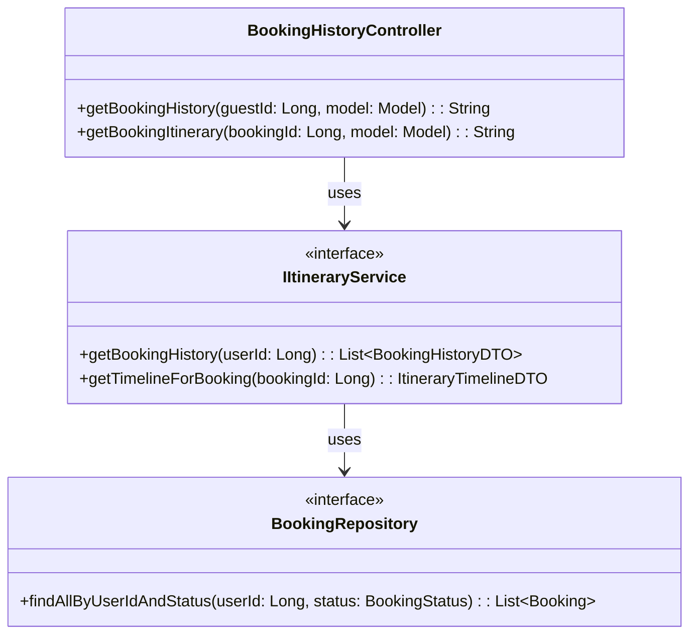
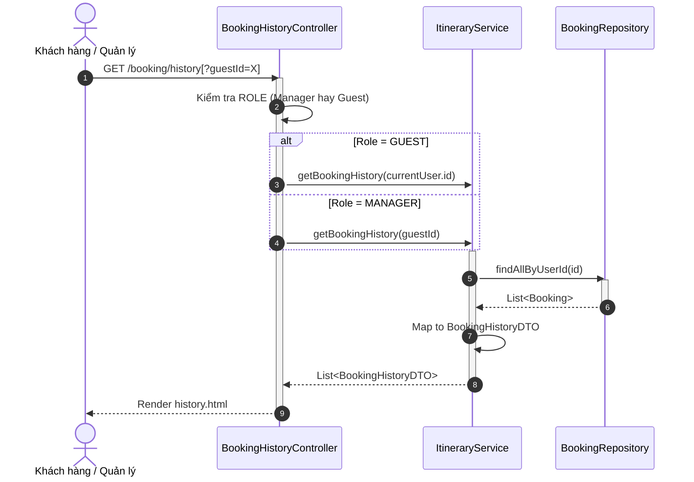

# ENGINEERING DOCUMENTATION STANDARD (EDS) v2.0
## Quy chuẩn Tài liệu Kỹ thuật và Đặc tả Hiện thực hóa

| Field | Value |
| :--- | :--- |
| **Document ID** | `AURA-MOD5-IMP-034` |
| **Version** | 1.0 |
| **Date** | 2026-06-27 |
| **Status** | Approved |
| **Document Owner** | System Administrator |
| **Author** | Antigravity |
| **Reviewed by** | Tech Lead |
| **DPO Sign-off** | [x] Approved — 2026-06-27 — DPO |
| **Approved by** | Principal Architect |
| **Last Review** | 2026-06-27 |
| **Based on EDS** | v2.0 |

---

## CHANGELOG

> [!IMPORTANT]
> **Policy 4.4 — Immutable History**: Không bao giờ xóa thông tin cũ. Mọi thay đổi phải ghi vào bảng này.

| Ngày | Người thực hiện | Nội dung thay đổi |
| :--- | :--- | :--- |
| 2026-06-27 | Antigravity — Developer | Tạo tài liệu lần đầu đầy đủ chuẩn EDS v2.0 (16 Sections) |

---

## 1. Tổng quan Module

> [!NOTE]
> Mô tả ngắn gọn mục đích của module, phạm vi nghiệp vụ và lý do tồn tại.

| Field | Value |
| :--- | :--- |
| **Module Name** | Booking Tracking (Module 5) |
| **Bounded Context** | Profile & Booking |
| **Data Classification** | Confidential / Sensitive-PII (khi xem lịch trình) |
| **Compliance Scope** | Decree 356/2025 |
| **Upstream Dependencies** | Identity & Access Management, Booking Service |
| **Downstream Consumers** | Guest Dashboard, Manager Staff Profile |

---

## 2. Ma trận Truy vết (Traceability Matrix)

| Requirement ID | Loại (BR/ADR/US) | Mô tả yêu cầu | Thành phần Code | Compliance Target | ADR liên quan |
| :--- | :--- | :--- | :--- | :--- | :--- |
| BR-27 | Business Rule | Guest chỉ xem lịch sử của mình, Manager xem của bất kỳ Guest nào. Dữ liệu nhạy cảm phải bị ẩn. | `BookingHistoryController` | Data Minimization | ADR-034 |
| UC34 | Use Case | Xem danh sách các gói nghỉ dưỡng và chi tiết lịch trình. | `ItineraryService` | — | — |

---

## 3. Architecture Decision Records (ADR)

### `ADR-034` — Phân quyền truy cập lịch sử Booking dùng chung màn hình

| Field | Value |
| :--- | :--- |
| **Status** | Accepted |
| **Deciders** | Antigravity, User |
| **Date** | 2026-06-27 |

#### Bối cảnh (Context)
Cần có một trang để Manager xem được lịch sử các lần nghỉ dưỡng của Guest từ trang Staff Profile. Khách hàng cũng có nhu cầu xem lịch sử booking của chính họ.

#### Các phương án đã xem xét (Options Considered)
| Phương án | Mô tả | Ưu điểm | Nhược điểm |
| :--- | :--- | :--- | :--- |
| A | Tách 2 trang riêng cho Guest và Manager | Dễ tùy chỉnh | Trùng lặp code Frontend, khó maintain |
| B | Dùng chung 1 trang `/booking/history` truyền `guestId` | 1 luồng xử lý chung nhất quán | Yêu cầu kiểm soát phân quyền (RBAC) chặt chẽ |

#### Quyết định (Decision)
> [!NOTE]
> Chọn Phương án `[B]` vì tiết kiệm thời gian phát triển và thống nhất trải nghiệm UI. Giao diện Sidebar sẽ tự thay đổi dựa vào Session hiện tại.

#### Hệ quả (Consequences)
**Tích cực**:
- Giảm thiểu số lượng file HTML phải duy trì (chỉ dùng `history.html`).

**Tiêu cực / Trade-offs**:
- Backend Controller phải xử lý logic check role (Nếu `ROLE_MANAGER` thì được phép query theo `guestId`, nếu `ROLE_GUEST` thì ép buộc gán `guestId = currentUser.id`).

**Compliance Impact**:
- Tuân thủ nguyên tắc Least Privilege (GDPR & Nghị định 356). Timeline chỉ hiển thị sự kiện thời gian, ẩn hoàn toàn hồ sơ y tế.

---

## 4. Non-Functional Requirements & SLA

### 4.1. Performance & Availability
| Category | Requirement | Target SLA | Measurement Method | Compliance Basis |
| :--- | :--- | :--- | :--- | :--- |
| Latency | Hiển thị Booking History | < 300ms | k6 load test | — |
| Latency | Load Timeline dữ liệu | < 500ms | k6 load test | — |
| Security | Chặn truy cập chéo GuestId | 100% | Unit/E2E Test | Data Privacy |

### 4.2. Data Integrity & Retention
| Category | Requirement | Target | Verification Method | Compliance Basis |
| :--- | :--- | :--- | :--- | :--- |
| Read Only | Chỉ đọc dữ liệu, không ghi | N/A | Code review | — |

### 4.3. Security
| Category | Requirement | Target | Verification Method | Compliance Basis |
| :--- | :--- | :--- | :--- | :--- |
| Access control | Role-based | Least privilege | Auth Matrix (§16) | Data Privacy |

---

## 5. Static Modeling (Mô hình Tĩnh)

### 5.1. Class Diagram (PlantUML)



### 5.2. Data Structure (Prisma Schema)
Không định nghĩa Schema mới. Sử dụng bảng `Booking`, `Spa_Booking` hiện có (read-only mode).

---

## 6. Dynamic Modeling (Mô hình Hướng Động)

### 6.1. Sequence Diagram — Happy Path (PlantUML)



---

## 7. Domain Event Catalog

### 7.1. Events Published (Phát ra)
*(Module này chỉ đọc dữ liệu, không phát ra Domain Event mới)*

### 7.2. Events Consumed (Tiêu thụ)
*(Module này chỉ query trực tiếp Database, không consume event)*

---

## 8. Interface Specification (Đặc tả Giao diện)

### 8.1. Service Interface

```typescript
// @version 1.0
export interface IItineraryService {
  /**
   * Lấy lịch sử tất cả các chuyến đi của một userId
   */
  getBookingHistory(userId: string): Promise<BookingHistoryDTO[]>;

  /**
   * Lấy timeline của 1 booking cụ thể (nếu có quyền truy cập)
   */
  getTimelineForBooking(bookingId: number): Promise<ItineraryTimelineDTO>;
}
```

---

## 9. API Specification

### 9.1. Endpoints Table

| Method | Path | Auth Level | Required Roles | Rate Limit | Idempotent? |
| :--- | :--- | :--- | :--- | :--- | :--- |
| GET | `/booking/history` | Spring Sec | `GUEST`, `MANAGER` | 100/min | Yes |
| GET | `/booking/itinerary?bookingId=X` | Spring Sec | `GUEST`, `MANAGER` | 100/min | Yes |

---

## 10. Bảng mã lỗi (Error Codes)

| Code | HTTP Status | Message (EN) | Message (VI) | Trigger Condition |
| :--- | :--- | :--- | :--- | :--- |
| `BKG-001` | 403 | Insufficient permissions | Không có quyền xem lịch sử | Guest cố tình truyền `guestId` của người khác |
| `BKG-002` | 404 | Booking not found | Không tìm thấy đặt phòng | Truyền `bookingId` không tồn tại |

---

## 11. Quy trình Triển khai (Step-by-Step)

### 11.1. Prerequisites
- [x] ADR-034 đã được Accepted
- [x] DPO đã sign-off

### 11.2. Pre-Migration Checklist
- [x] Không thay đổi Database Schema.

### 11.3. Implementation Steps
#### Chặng 1 — Implement Backend
- Tạo `BookingHistoryController`.
- Bổ sung `getBookingHistory` vào `ItineraryService`.
#### Chặng 2 — Xây dựng Giao diện
- Dựng UI `booking/history.html`
- Chỉnh sửa `itinerary.html` để hỗ trợ tham số `bookingId` (nếu truyền vào) thay vì tự động lấy Booking hiện tại.

### 11.4. Deployment Checklist
- [ ] Các màn hình render đúng layout và Sidebar.
- [ ] Manager bấm xem được timeline của Guest mà không bị lỗi.

---

## 12. Rollback & Incident Runbook

### 12.1. Điều kiện kích hoạt Rollback (Trigger Conditions)
| Điều kiện | Ngưỡng | Người quyết định |
| :--- | :--- | :--- |
| Giao diện bị crash 500 do NullPointerException | > 5% request | On-call Engineer |
| Lộ lọt thông tin sức khỏe của Guest khác trên màn hình Manager | Bất kỳ | DPO / Tech Lead |

### 12.2. Rollback Procedure
Revert thay đổi HTML và tắt Endpoint trong Controller, trả về 404 tạm thời.

---

## 13. Kịch bản Kiểm thử Chi tiết

### 13.1. E2E / Security Tests
#### `TC-E2E-001` — Chặn Guest xem lịch sử của Guest khác
- **Scenario**: Unauthorized access
  - **Given** test data classification: `SYNTHETIC`
  - **And** user `GUEST` (ID: 1) đã đăng nhập.
  - **When** truy cập `/booking/history?guestId=2`
  - **Then** Controller ép buộc `guestId = 1`.
  - **And** kết quả hiển thị lịch sử của Guest ID 1, bảo vệ dữ liệu của Guest ID 2.

---

## 14. Phương pháp Xác minh

- *Verify code logic*: Đảm bảo trong `BookingHistoryController` có dòng code kiểm tra `Authentication` và lọc ROLE. Nếu là `ROLE_MANAGER` mới lấy giá trị từ Query Param, nếu không thì lấy `currentUser.getId()`.

---

## 15. Mẫu thử thực tế (API Verification Samples)

- *GET History với quyền Manager*:
```bash
curl -X GET https://[host]/booking/history?guestId=5 \
  -H "Cookie: JSESSIONID=[MANAGER_SESSION]"
```
- *Expected*: HTML trả về danh sách gói dịch vụ của Guest 5.

---

## 16. Bảng tổng hợp phân quyền (Authorization Matrix)

| Endpoint | GUEST | USER | MANAGER | DPO | SYSTEM |
| :--- | :---: | :---: | :---: | :---: | :---: |
| GET `/booking/history` | ✅ Own | ❌ | ✅ All (via guestId) | ❌ | ❌ |
| GET `/booking/itinerary?bookingId=X` | ✅ Own | ❌ | ✅ All | ❌ | ❌ |

---

## PHỤ LỤC
### A. Glossary (Thuật ngữ)
| Thuật ngữ | Định nghĩa |
| :--- | :--- |
| Least Privilege | Nguyên tắc cấp quyền tối thiểu cần thiết để User thực thi tính năng. |
