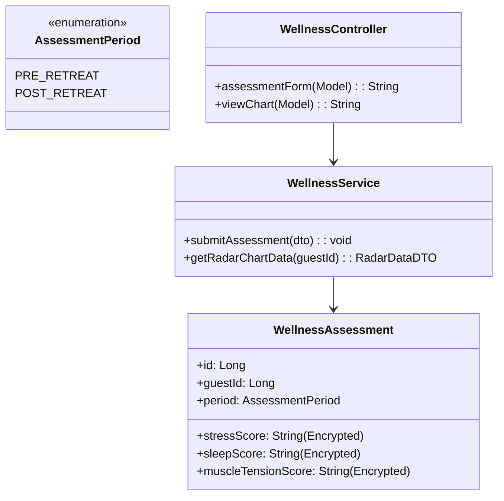
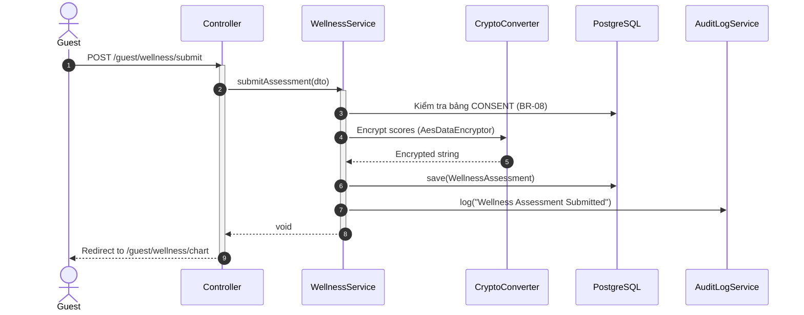

# ENGINEERING DOCUMENTATION STANDARD (EDS) v2.0
## Quy chuẩn Tài liệu Kỹ thuật và Đặc tả Hiện thực hóa

| Field | Value |
| :--- | :--- |
| **Document ID** | `AM-MOD5-IMP-035` |
| **Version** | 1.0 |
| **Date** | 2026-06-27 |
| **Status** | Draft |
| **Document Owner** | Tech Lead |
| **Author** | Phùng Giang Hải |
| **Reviewed by** | Tech Lead |
| **DPO Sign-off** | [ ] Pending — CẦN DUYỆT (Chứa thông tin Sức khỏe / Sensitive PII) |
| **Approved by** | Principal Architect |
| **Last Review** | 2026-06-27 |
| **Based on EDS** | v2.0 |

---

## CHANGELOG

> [!IMPORTANT]
> **Policy 4.4 — Immutable History**: Không bao giờ xóa thông tin cũ. Mọi thay đổi phải ghi vào bảng này.

| Ngày | Người thực hiện | Nội dung thay đổi |
| :--- | :--- | :--- |
| 2026-06-27 | Phùng Giang Hải | Tạo tài liệu lần đầu theo chuẩn EDS v2.0 cho UC35 (Wellness Assessment) |
| 2026-06-27 | Phùng Giang Hải | Cập nhật tài liệu: Tái sử dụng `AesDataEncryptor`, bảng `Consent`, và `BaseEntity` |

---

## MỤC LỤC
1. [Tổng quan Module](#1-tổng-quan-module)
2. [Ma trận Truy vết (Traceability Matrix)](#2-ma-trận-truy-vết-traceability-matrix)
3. [Architecture Decision Records (ADR)](#3-architecture-decision-records-adr)
4. [Non-Functional Requirements & SLA](#4-non-functional-requirements--sla)
5. [Static Modeling (Mô hình Tĩnh)](#5-static-modeling-mô-hình-tĩnh)
6. [Dynamic Modeling (Mô hình Hướng Động)](#6-dynamic-modeling-mô-hình-hướng-động)
7. [Domain Event Catalog](#7-domain-event-catalog)
8. [Interface Specification (Đặc tả Giao diện)](#8-interface-specification-đặc-tả-giao-diện)
9. [API Specification](#9-api-specification)
10. [Bảng mã lỗi (Error Codes)](#10-bảng-mã-lỗi-error-codes)
11. [Quy trình Triển khai (Step-by-Step)](#11-quy-trình-triển-khai-step-by-step)
12. [Rollback & Incident Runbook](#12-rollback--incident-runbook)
13. [Kịch bản Kiểm thử Chi tiết](#13-kịch-bản-kiểm-thử-chi-tiết)
14. [Phương pháp Xác minh](#14-phương-pháp-xác-minh)
15. [Mẫu thử thực tế (API Verification Samples)](#15-mẫu-thử-thực-tế-api-verification-samples)
16. [Bảng tổng hợp phân quyền (Authorization Matrix)](#16-bảng-tổng-hợp-phân-quyền-authorization-matrix)

---

## 1. Tổng quan Module

> [!NOTE]
> Mô tả ngắn gọn mục đích của module, phạm vi nghiệp vụ và lý do tồn tại.

| Field | Value |
| :--- | :--- |
| **Module Name** | Post-Retreat Wellness Assessment (UC35) |
| **Bounded Context** | Health & Wellness |
| **Data Classification** | Sensitive-PII |
| **Compliance Scope** | PDPA / GDPR (Health Data) |
| **Upstream Dependencies** | Identity Module (Auth) |
| **Downstream Consumers** | Guest Dashboard |

---

## 2. Ma trận Truy vết (Traceability Matrix)

> [!NOTE]
> Ánh xạ trực tiếp: `[Mã yêu cầu]` → `[Thành phần Code]` → `[Mục tiêu Tuân thủ]`.

| Requirement ID | Loại (BR/ADR/US) | Mô tả yêu cầu | Thành phần Code | Compliance Target | ADR liên quan |
| :--- | :--- | :--- | :--- | :--- | :--- |
| BR-08 | Business Rule | Yêu cầu Consent cho dữ liệu Sức khỏe | Kiểm tra bảng `auth.entity.Consent` | GDPR Art. 9 | — |
| BR-09 | Business Rule | Mã hóa dữ liệu sức khỏe (Encryption) | `com.AuraMoon.auramoon.auth.config.AesDataEncryptor` | GDPR Art. 32 | ADR-035-1 |
| UC35 | User Story | Giao diện Radar Chart đánh giá sức khỏe | `WellnessController.viewChart()` | — | — |

---

## 3. Architecture Decision Records (ADR)

### `ADR-035-1` — Attribute-Level Encryption cho Dữ liệu Sức khỏe

| Field | Value |
| :--- | :--- |
| **Status** | Accepted |
| **Deciders** | Phùng Giang Hải, DPO |
| **Date** | 2026-06-27 |

#### Bối cảnh (Context)
Các chỉ số sức khỏe của khách hàng (stress, sleep, muscle_tension) được xem là Sensitive PII. Nếu database bị rò rỉ, thông tin này không được phép lộ dưới dạng plain text.

#### Quyết định (Decision)
> [!NOTE]
> Sử dụng `AttributeConverter` trong JPA để mã hóa AES-256 các điểm số sức khỏe trước khi lưu xuống DB, và giải mã khi đọc lên bộ nhớ.

#### Hệ quả (Consequences)
**Tích cực**:
- Tuân thủ quy định bảo vệ dữ liệu (BR-09, Rule 5).

**Tiêu cực / Trade-offs**:
- Không thể query trực tiếp bằng SQL (ví dụ: `WHERE stress_score > 5`), tuy nhiên hệ thống chỉ lấy dữ liệu theo `guestId` nên tradeoff này có thể chấp nhận.

---

## 4. Non-Functional Requirements & SLA

### 4.1. Security
| Category | Requirement | Target | Verification Method | Compliance Basis |
| :--- | :--- | :--- | :--- | :--- |
| Encryption at rest | Field-level encryption | AES-256 | SQL query ra string vô nghĩa | BR-09, GDPR |
| Logging | No PII Leak | Tuyệt đối không log scores | Kibana/Log scan | Rule 5 |

---

## 5. Static Modeling (Mô hình Tĩnh)

### 5.1. Class Diagram (PlantUML)



### 5.2. Data Structure (Java Entity)

```java
@Entity
@Table(name = "wellness_assessments")
public class WellnessAssessment extends BaseEntity {
    @Id
    @GeneratedValue(strategy = GenerationType.IDENTITY)
    private Long id;

    @Column(nullable = false)
    private Long guestId;

    @Enumerated(EnumType.STRING)
    @Column(nullable = false)
    private AssessmentPeriod period;

    @Convert(converter = com.AuraMoon.auramoon.auth.config.AesDataEncryptor.class)
    @Column(nullable = false)
    private String stressScore; // Lưu dạng mã hóa

    @Convert(converter = com.AuraMoon.auramoon.auth.config.AesDataEncryptor.class)
    @Column(nullable = false)
    private String sleepScore; // Lưu dạng mã hóa

    @Convert(converter = com.AuraMoon.auramoon.auth.config.AesDataEncryptor.class)
    @Column(nullable = false)
    private String muscleTensionScore; // Lưu dạng mã hóa
}
```

---

## 6. Dynamic Modeling (Mô hình Hướng Động)

### 6.1. Sequence Diagram — Submit & View



---

## 8. Interface Specification (Đặc tả Giao diện)

### 8.1. Service Interface

```java
// IWellnessService.java
// @version 1.0

public interface IWellnessService {
    void submitAssessment(AssessmentDTO dto);
    RadarDataDTO getRadarChartData(Long guestId);
}
```

---

## 9. API Specification

### 9.1. Endpoints Table

> [!IMPORTANT]
> **Tuân thủ Nguyên tắc 12**: Spring Boot MVC, trả về Thymeleaf Template. Giao diện chứa script thư viện Chart.js để render biểu đồ.

| Method | Path | Auth Level | Required Roles | Target View |
| :--- | :--- | :--- | :--- | :--- |
| GET | `/guest/wellness/form` | Session | `ROLE_GUEST` | `guest/wellness-form.html` |
| POST | `/guest/wellness/submit` | Session | `ROLE_GUEST` | `redirect:/guest/wellness/chart` |
| GET | `/guest/wellness/chart` | Session | `ROLE_GUEST` | `guest/wellness-chart.html` |

---

## 10. Bảng mã lỗi (Error Codes)

| Code | HTTP Status | Message (EN) | Message (VI) | Trigger Condition |
| :--- | :--- | :--- | :--- | :--- |
| `WEL-001` | 400 | Missing Consent | Cần cấp quyền xử lý | Khách hàng không tick ô đồng ý |

---

## 11. Quy trình Triển khai (Step-by-Step)

### 11.1. Prerequisites
- [ ] DPO đã sign-off phương pháp mã hóa AES-256.
- [x] Áp dụng SQL migration cho bảng `wellness_assessments`.

---

## 12. Rollback & Incident Runbook

### 12.1. Điều kiện kích hoạt Rollback (Trigger Conditions)
- Mất Key giải mã (`AES_SECRET_KEY`) trên môi trường Production gây lỗi toàn bộ hiển thị Radar Chart.

### 12.2. Rollback Procedure
- Khôi phục biến môi trường `AES_SECRET_KEY` từ backup bảo mật (Vault).

---

## 13. Kịch bản Kiểm thử Chi tiết

### 13.1. Unit Tests

#### `TC-WEL-001` — Encrypt DB Check
- **Given** điểm stress = 8.
- **When** lưu xuống DB bằng JPA Repo.
- **Then** query Native SQL trả về chuỗi Base64 dài (không phải "8").

#### `TC-WEL-002` — Missing Consent Check
- **Given** bảng `CONSENT` ghi nhận user chưa đồng ý (`consentStatus = false`).
- **When** gọi `submitAssessment()`.
- **Then** ném `ConsentRequiredException`.

---

## 14. Phương pháp Xác minh

### 14.1. Database Inspection
```sql
SELECT stress_score FROM wellness_assessments WHERE id = 1;
-- Kết quả PHẢI LÀ chuỗi mã hóa (vd: pQ+v3A==), tuyệt đối không hiển thị plaintext.
```

---

## 15. Mẫu thử thực tế (API Verification Samples)

Truy cập trang biểu đồ Radar:
```bash
curl -X GET http://localhost:8080/guest/wellness/chart \
  -H "Cookie: JSESSIONID=..."
# Mong đợi trả về HTML View chứa dataset của Radar Chart (đã giải mã)
```

---

## 16. Bảng tổng hợp phân quyền (Authorization Matrix)

| Endpoint | GUEST | RECEPTIONIST | MANAGER | THERAPIST |
| :--- | :---: | :---: | :---: | :---: |
| GET `/guest/wellness/*` | ✅ (Own) | ❌ | ❌ (Sensitive) | ✅ (Assigned) |
| POST `/guest/wellness/submit`| ✅ (Own) | ❌ | ❌ | ❌ |
