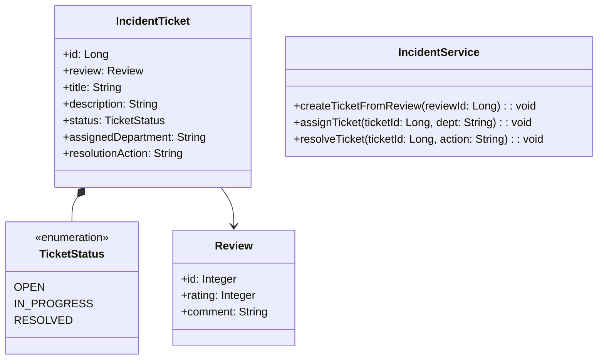
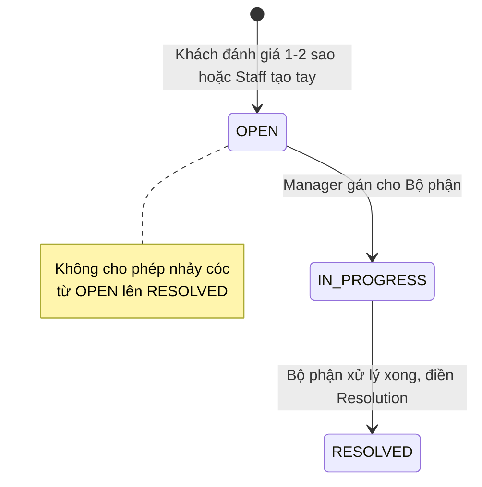
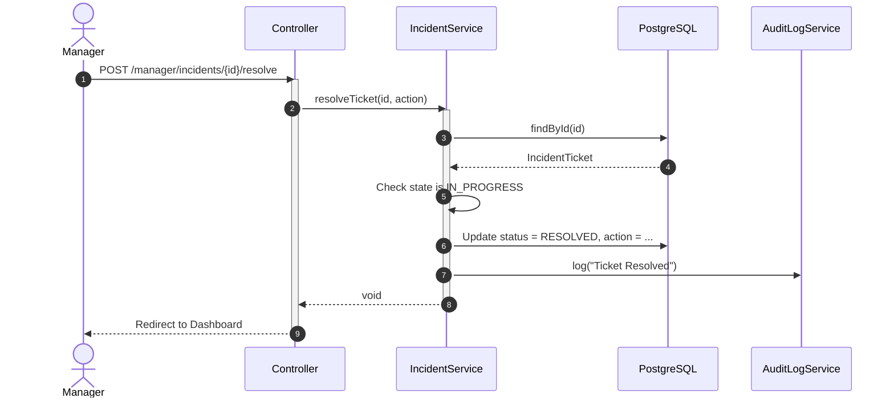

# ENGINEERING DOCUMENTATION STANDARD (EDS) v2.0
## Quy chuẩn Tài liệu Kỹ thuật và Đặc tả Hiện thực hóa

| Field | Value |
| :--- | :--- |
| **Document ID** | `AM-MOD5-IMP-036` |
| **Version** | 1.0 |
| **Date** | 2026-06-27 |
| **Status** | Draft |
| **Document Owner** | Tech Lead |
| **Author** | Phùng Giang Hải |
| **Reviewed by** | Tech Lead |
| **DPO Sign-off** | [x] N/A — Chỉ chứa thông tin dịch vụ, không chứa PII nhạy cảm |
| **Approved by** | Principal Architect |
| **Last Review** | 2026-06-27 |
| **Based on EDS** | v2.0 |

---

## CHANGELOG

> [!IMPORTANT]
> **Policy 4.4 — Immutable History**: Không bao giờ xóa thông tin cũ. Mọi thay đổi phải ghi vào bảng này.

| Ngày | Người thực hiện | Nội dung thay đổi |
| :--- | :--- | :--- |
| 2026-06-27 | Phùng Giang Hải | Tạo tài liệu lần đầu theo chuẩn EDS v2.0 cho UC36 (Incident Management) |
| 2026-06-27 | Phùng Giang Hải | Cập nhật tài liệu: Tái sử dụng Entity `Review` và `BaseEntity` |

---

## MỤC LỤC
1. [Tổng quan Module](#1-tổng-quan-module)
2. [Ma trận Truy vết (Traceability Matrix)](#2-ma-trận-truy-vết-traceability-matrix)
3. [Architecture Decision Records (ADR)](#3-architecture-decision-records-adr)
4. [Non-Functional Requirements & SLA](#4-non-functional-requirements--sla)
5. [Static Modeling (Mô hình Tĩnh)](#5-static-modeling-mô-hình-tĩnh)
6. [Dynamic Modeling (Mô hình Hướng Động)](#6-dynamic-modeling-mô-hình-hướng-động)
7. [Domain Event Catalog](#7-domain-event-catalog)
8. [Interface Specification (Đặc tả Giao diện)](#8-interface-specification-đặc-tả-giao-diện)
9. [API Specification](#9-api-specification)
10. [Bảng mã lỗi (Error Codes)](#10-bảng-mã-lỗi-error-codes)
11. [Quy trình Triển khai (Step-by-Step)](#11-quy-trình-triển-khai-step-by-step)
12. [Rollback & Incident Runbook](#12-rollback--incident-runbook)
13. [Kịch bản Kiểm thử Chi tiết](#13-kịch-bản-kiểm-thử-chi-tiết)
14. [Phương pháp Xác minh](#14-phương-pháp-xác-minh)
15. [Mẫu thử thực tế (API Verification Samples)](#15-mẫu-thử-thực-tế-api-verification-samples)
16. [Bảng tổng hợp phân quyền (Authorization Matrix)](#16-bảng-tổng-hợp-phân-quyền-authorization-matrix)

---

## 1. Tổng quan Module

> [!NOTE]
> Mô tả ngắn gọn mục đích của module, phạm vi nghiệp vụ và lý do tồn tại.

| Field | Value |
| :--- | :--- |
| **Module Name** | Incident & Service Recovery Management (UC36) |
| **Bounded Context** | Operations Management |
| **Data Classification** | Internal |
| **Compliance Scope** | N/A |
| **Upstream Dependencies** | Review Module |
| **Downstream Consumers** | Manager Dashboard |

---

## 2. Ma trận Truy vết (Traceability Matrix)

> [!NOTE]
> Ánh xạ trực tiếp: `[Mã yêu cầu]` → `[Thành phần Code]` → `[Mục tiêu Tuân thủ]`.

| Requirement ID | Loại (BR/ADR/US) | Mô tả yêu cầu | Thành phần Code | Compliance Target | ADR liên quan |
| :--- | :--- | :--- | :--- | :--- | :--- |
| BR-15 | Business Rule | Audit Trail mọi thao tác đổi trạng thái Ticket | `AuditLogService.log()` | System Auditing | — |
| UC36 | User Story | Quản lý vòng đời Incident Ticket | `IncidentService` | Service Recovery | ADR-036-1 |

---

## 3. Architecture Decision Records (ADR)

### `ADR-036-1` — Quản lý State Machine cho Ticket

| Field | Value |
| :--- | :--- |
| **Status** | Accepted |
| **Deciders** | Phùng Giang Hải |
| **Date** | 2026-06-27 |

#### Bối cảnh (Context)
Sự cố phát sinh có một chu trình sống (Lifecycle) nhất định: Khởi tạo, Đang xử lý, Đã giải quyết. Để tránh tình trạng dữ liệu "nhảy cóc" trạng thái (ví dụ từ OPEN nhảy vọt qua RESOLVED mà không được assign), hệ thống cần một cơ chế kiểm soát trạng thái.

#### Quyết định (Decision)
> [!NOTE]
> Sử dụng Pattern State Machine đơn giản bằng Java `enum` kết hợp với validation logic ở tầng Service để chặn các thay đổi trạng thái không hợp lệ.

#### Hệ quả (Consequences)
**Tích cực**:
- Logic rõ ràng, chặt chẽ, dễ viết Unit Test.

**Tiêu cực / Trade-offs**:
- Mỗi khi thêm state mới sẽ phải update code ở tầng Service.

---

## 4. Non-Functional Requirements & SLA

### 4.1. Performance & Availability
| Category | Requirement | Target SLA | Measurement Method | Compliance Basis |
| :--- | :--- | :--- | :--- | :--- |
| Availability | Dashboard uptime | 99.9% | Uptime monitor | — |

### 4.2. Data Integrity & Retention
| Category | Requirement | Target | Verification Method | Compliance Basis |
| :--- | :--- | :--- | :--- | :--- |
| Retention | Lưu trữ ticket đã close | 3 năm | Backup policy | — |

---

## 5. Static Modeling (Mô hình Tĩnh)

### 5.1. Class Diagram (PlantUML)



### 5.2. Data Structure (Java Entity)

```java
@Entity
@Table(name = "incident_tickets")
public class IncidentTicket extends BaseEntity {
    @Id
    @GeneratedValue(strategy = GenerationType.IDENTITY)
    private Long id;

    @ManyToOne(fetch = FetchType.LAZY)
    @JoinColumn(name = "review_id")
    private com.AuraMoon.auramoon.booking.entity.Review review; // Liên kết tới đánh giá nếu có

    @Column(nullable = false)
    private String title;

    @Column(columnDefinition = "TEXT")
    private String description;

    @Enumerated(EnumType.STRING)
    @Column(nullable = false)
    private TicketStatus status = TicketStatus.OPEN;

    private String assignedDepartment;

    private String resolutionAction;
}
```

---

## 6. Dynamic Modeling (Mô hình Hướng Động)

### 6.1. State Machine (Lifecycle)



### 6.2. Sequence Diagram — Update Status



---

## 7. Domain Event Catalog

### 7.1. Events Consumed (Tiêu thụ)
| Event Name | Source | Handler | Action thực hiện |
| :--- | :--- | :--- | :--- |
| `NegativeReviewSubmittedEvent` | Review Module | `IncidentListener` | Tự động tạo `IncidentTicket` với trạng thái `OPEN` |

---

## 8. Interface Specification (Đặc tả Giao diện)

### 8.1. Service Interface

```java
// IIncidentService.java
// @version 1.0

public interface IIncidentService {
    void assignTicket(Long ticketId, String department);
    void resolveTicket(Long ticketId, String resolutionAction);
    List<IncidentTicket> findAllOpenTickets();
}
```

---

## 9. API Specification

### 9.1. Endpoints Table

> [!IMPORTANT]
> **Tuân thủ Nguyên tắc 12**: Spring Boot MVC, trả về Thymeleaf Template.

| Method | Path | Auth Level | Required Roles | Target View |
| :--- | :--- | :--- | :--- | :--- |
| GET | `/manager/incidents` | Session | `ROLE_MANAGER` | `manager/incident-dashboard.html` |
| POST | `/manager/incidents/{id}/assign` | Session | `ROLE_MANAGER` | `redirect:/manager/incidents` |
| POST | `/manager/incidents/{id}/resolve` | Session | `ROLE_MANAGER` | `redirect:/manager/incidents` |

---

## 10. Bảng mã lỗi (Error Codes)

| Code | HTTP Status | Message (EN) | Message (VI) | Trigger Condition |
| :--- | :--- | :--- | :--- | :--- |
| `INC-001` | 400 | Invalid State Transition | Trạng thái không hợp lệ | Cố gắng RESOLVE một ticket đang OPEN |
| `INC-002` | 404 | Ticket Not Found | Không tìm thấy Ticket | Truy cập id không tồn tại |

---

## 11. Quy trình Triển khai (Step-by-Step)

### 11.1. Prerequisites
- [x] Áp dụng SQL migration cho bảng `incident_tickets`.

### 11.3. Implementation Steps
- Chạy app Spring Boot.

---

## 12. Rollback & Incident Runbook

### 12.1. Điều kiện kích hoạt Rollback (Trigger Conditions)
- Ticket không thể tạo được do lỗi liên kết Khóa ngoại với `Review`.

### 12.2. Rollback Procedure
- Xóa khóa ngoại và chỉ dùng logic cấp ứng dụng (soft reference).

---

## 13. Kịch bản Kiểm thử Chi tiết

### 13.1. Unit Tests

#### `TC-INC-001` — State Transition Check
- **Given** Ticket đang ở state `OPEN`.
- **When** gọi hàm `resolveTicket()`.
- **Then** ném exception `InvalidStateTransitionException`.

#### `TC-INC-002` — Valid Assignment
- **Given** Ticket đang `OPEN`.
- **When** gọi hàm `assignTicket(dept="Spa")`.
- **Then** Ticket đổi sang `IN_PROGRESS` và lưu `assignedDepartment` là "Spa".

---

## 14. Phương pháp Xác minh

### 14.1. Database Inspection
```sql
SELECT status, assigned_department FROM incident_tickets WHERE id = 1;
```

---

## 15. Mẫu thử thực tế (API Verification Samples)

Submit form Assign:
```bash
curl -X POST http://localhost:8080/manager/incidents/1/assign \
  -H "Cookie: JSESSIONID=..." \
  -d "department=Maintenance"
# Mong đợi 302 Redirect về /manager/incidents
```

---

## 16. Bảng tổng hợp phân quyền (Authorization Matrix)

| Endpoint | GUEST | RECEPTIONIST | MANAGER | THERAPIST |
| :--- | :---: | :---: | :---: | :---: |
| GET `/manager/incidents` | ❌ | ❌ | ✅ | ❌ |
| POST `/manager/incidents/*/assign`| ❌ | ❌ | ✅ | ❌ |
| POST `/manager/incidents/*/resolve`| ❌ | ❌ | ✅ | ❌ |
