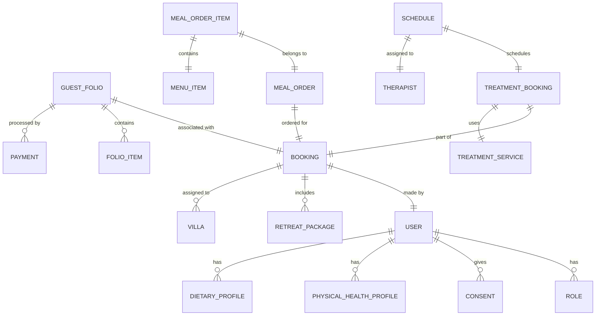

# Software Design Specification (SDS) - AuraMoon Resort Management System

## 1. System Architecture
Hệ thống được thiết kế theo kiến trúc Layered Architecture (Kiến trúc phân tầng) kết hợp với Domain-Driven Design (DDD) cơ bản:
- **Presentation Layer:** Sử dụng Thymeleaf để hiển thị giao diện người dùng.
- **Service Layer:** Xử lý logic nghiệp vụ.
- **Data Access Layer:** Sử dụng Spring Data JPA để tương tác với SQL Server.

## 2. Database Design
Dựa trên `DB.sql`, hệ thống sử dụng cơ sở dữ liệu quan hệ với cấu trúc chính:

### 2.1 Entity Relationship Diagram (ERD) - Phân nhóm chính

### 2.2 Key Data Structures
- **BaseEntity:** Chứa các trường chung như `createdAt`, `updatedAt`, `isDeleted`.
- **User/Role:** Quản lý định danh và quyền hạn.
- **Booking:** Trái tim của hệ thống, kết nối khách hàng với các dịch vụ (Villa, Spa, F&B).

## 3. Module Design

### 3.1 Auth Module
- **Entities:** `User`, `Role`, `Consent`.
- **Logic:** Xử lý đăng nhập, lưu vết đồng ý (consent) của khách hàng về bảo mật thông tin.

### 3.2 Booking Module
- **Entities:** `Booking`, `Villa`, `VillaType`, `RetreatPackage`.
- **Logic:** Tính toán ngày lưu trú, kiểm tra tính khả dụng của Villa.

### 3.3 Spa Module
- **Entities:** `TreatmentService`, `Therapist`, `TreatmentBooking`, `Schedule`.
- **Logic:** Quản lý lịch trình (scheduling) để tránh trùng lặp giữa kỹ thuật viên và phòng.

### 3.4 F&B Module
- **Entities:** `MenuItem`, `MealOrder`, `MealOrderItem`.
- **Logic:** Xử lý gọi món và cộng dồn vào hóa đơn tổng.

### 3.5 Billing Module
- **Entities:** `GuestFolio`, `FolioItem`, `Payment`.
- **Logic:** Tổng hợp tất cả chi phí từ các dịch vụ khác (Spa, F&B, Room) vào một Folio duy nhất để khách hàng thanh toán lúc check-out.

## 4. Technical Stack
- **Java Version:** 21
- **Framework:** Spring Boot 4.0.6-SNAPSHOT
- **ORM:** Hibernate / Spring Data JPA
- **Database:** SQL Server (mssql-jdbc)
- **Utilities:** Lombok, DevTools
