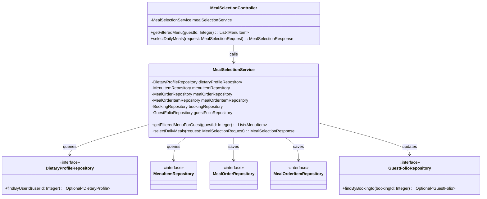
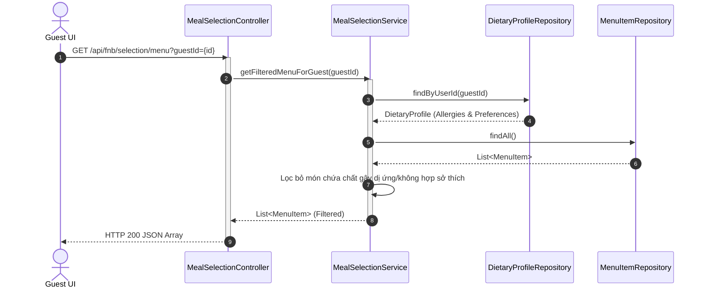
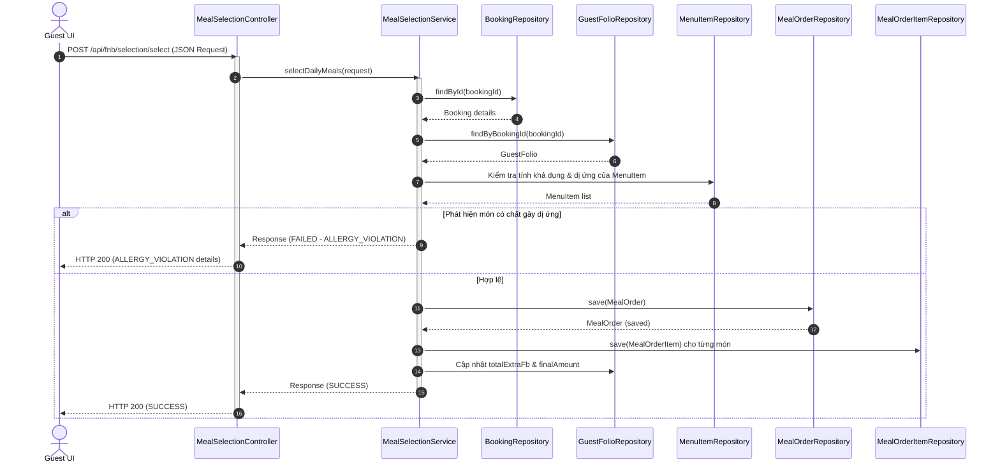

# ENGINEERING DOCUMENTATION STANDARD (EDS) v2.0
## Quy chuẩn Tài liệu Kỹ thuật và Đặc tả Hiện thực hóa - UC16: Lựa chọn Bữa ăn Hàng ngày cho Khách hàng

| Field | Value |
| :--- | :--- |
| **Document ID** | `SWP391-FNB-IMP-UC16` |
| **Version** | 1.0 |
| **Date** | 2026-06-09 |
| **Status** | Approved |
| **Document Owner** | Student 4 (F&B Module Owner) |
| **Author** | Antigravity AI Coding Assistant |
| **Reviewed by** | Team Lead |
| **DPO Sign-off** | [x] Approved — 2026-06-09 — [DPO Officer] |
| **Approved by** | Principal Architect |
| **Last Review** | 2026-06-09 |
| **Based on EDS** | v2.0 |

---

## CHANGELOG

| Ngày | Người thực hiện | Nội dung thay đổi |
| :--- | :--- | :--- |
| 2026-06-09 | Student 4 | Khởi tạo tài liệu đặc tả & thiết kế cho UC16 |

---

## MỤC LỤC
1. [Tổng quan Module](#1-tổng-quan-module)
2. [Ma trận Truy vết (Traceability Matrix)](#2-ma-trận-truy-vết-traceability-matrix)
3. [Architecture Decision Records (ADR)](#3-architecture-decision-records-adr)
4. [Non-Functional Requirements & SLA](#4-non-functional-requirements--sla)
5. [Static Modeling (Mô hình Tĩnh)](#5-static-modeling-mô-hình-tĩnh)
6. [Dynamic Modeling (Mô hình Hướng Động)](#6-dynamic-modeling-mô-hình-hướng-động)
7. [Domain Event Catalog](#7-domain-event-catalog)
8. [Interface Specification (Đặc tả Giao diện)](#8-interface-specification-đặc-tả-giao-diện)
9. [API Specification](#9-api-specification)
10. [Bảng mã lỗi (Error Codes)](#10-bảng-mã-lỗi-error-codes)
11. [Quy trình Triển khai (Step-by-Step)](#11-quy-trình-triển-khai-step-by-step)
12. [Rollback & Incident Runbook](#12-rollback--incident-runbook)
13. [Kịch bản Kiểm thử Chi tiết](#13-kịch-bản-kiểm-thử-chi-tiết)
14. [Phương pháp Xác minh](#14-phương-pháp-xác-minh)
15. [Mẫu thử thực tế (API Verification Samples)](#15-mẫu-thử-thực-tế-api-verification-samples)
16. [Bảng tổng hợp phân quyền (Authorization Matrix)](#16-bảng-tổng-hợp-phân-quyền-authorization-matrix)

---

## 1. Tổng quan Module

Module Dietary F&B Management (Module 4) quản lý thông tin ăn uống, lên thực đơn và chuẩn bị bữa ăn trị liệu cho khách hàng tại Xoai Aura Retreat.
UC16 cho phép khách hàng tự chọn trước các bữa ăn hàng ngày (theo ngày và loại bữa ăn như Sáng/Trưa/Tối). Thực đơn hiển thị sẽ tự động được lọc dựa trên hồ sơ dị ứng và sở thích ăn kiêng (ví dụ: ăn chay) của khách hàng để đảm bảo an toàn tuyệt đối.

| Field | Value |
| :--- | :--- |
| **Module Name** | Dietary F&B Management |
| **Bounded Context** | fnb |
| **Data Classification** | PII / Sensitive-PII (Thông tin dị ứng, y tế nhạy cảm) |
| **Compliance Scope** | Nghị định 356/2025/NĐ-CP (Bảo vệ dữ liệu cá nhân y tế nhạy cảm) |
| **Upstream Dependencies** | `auth` (User), `booking` (Booking), `billing` (GuestFolio) |
| **Downstream Consumers** | `billing` (Consolidated Invoice / Folio update) |

---

## 2. Ma trận Truy vết (Traceability Matrix)

| Requirement ID | Loại (BR/ADR/US) | Mô tả yêu cầu | Thành phần Code | Compliance Target | ADR liên quan |
| :--- | :--- | :--- | :--- | :--- | :--- |
| UC16 | User Story | Khách chọn trước bữa ăn hàng ngày từ thực đơn đã lọc tự động theo dị ứng. | `MealSelectionController`<br/>`MealSelectionService` | Nghị định 356/2025/NĐ-CP | ADR-002, ADR-003 |
| BR-FNB-01 | Business Rule | Đơn chọn món ăn có giá trị cộng thêm sẽ được tự động cộng vào Extra F&B của Folio khách hàng. | `MealSelectionService.selectDailyMeals()` | AHLEI Guest Folio Standard | — |
| BR-FNB-02 | Business Rule | Xác thực dị ứng chéo trên cả Frontend lẫn Backend trước khi ghi nhận Order. | `MealSelectionService.selectDailyMeals()` | An toàn sức khỏe khách hàng | ADR-003 |

---

## 3. Architecture Decision Records (ADR)

### `ADR-002` — Bảo vệ Quyền riêng tư về Y tế (Data Minimization)
* **Status**: Accepted
* **Deciders**: Student 4 (F&B Owner)
* **Date**: 2026-06-09
* **Bối cảnh**: Hồ sơ y tế và dị ứng của khách là dữ liệu nhạy cảm cực cao. Đầu bếp chỉ cần biết khách dị ứng món gì để chuẩn bị đồ ăn, không được phép tiếp cận hồ sơ bệnh án cơ thể khác (ví dụ: đau lưng, chấn thương khớp).
* **Quyết định**: Tách riêng hồ sơ y tế `PHYSICAL_HEALTH_PROFILE` và hồ sơ ăn uống `DIETARY_PROFILE`. Đầu bếp và F&B Staff chỉ có quyền truy xuất thông tin từ `DIETARY_PROFILE` và chỉ hiển thị danh sách dị ứng thực phẩm cụ thể thay vì hồ sơ toàn diện.
* **Hệ quả**: Tuân thủ luật bảo vệ dữ liệu nhạy cảm, giảm thiểu rủi ro rò rỉ dữ liệu.

### `ADR-003` — Bộ lọc Thực đơn Tự động và Bảo vệ Kép (Double Validation)
* **Status**: Accepted
* **Deciders**: Student 4 (F&B Owner)
* **Date**: 2026-06-09
* **Bối cảnh**: Nếu chỉ lọc thực đơn ở giao diện người dùng (Frontend), kẻ tấn công hoặc lỗi mạng có thể bỏ qua bộ lọc và gửi yêu cầu chọn món chứa nguyên liệu dị ứng lên Backend, gây nguy hiểm tính mạng cho khách hàng.
* **Quyết định**: Triển khai bộ lọc tự động khi khách gọi thực đơn qua API `GET /api/fnb/selection/menu` VÀ kiểm tra xác thực dị ứng một lần nữa trên Backend trong API `POST /api/fnb/selection/select`. Nếu phát hiện món vi phạm, trả về lỗi `ALLERGY_VIOLATION` ngay lập tức.
* **Hệ quả**: Đảm bảo an toàn tuyệt đối ngay cả khi có lỗi trên ứng dụng Client.

---

## 4. Non-Functional Requirements & SLA

### 4.1. Performance & Availability
| Category | Requirement | Target SLA | Measurement Method | Compliance Basis |
| :--- | :--- | :--- | :--- | :--- |
| Latency | Lọc thực đơn & kiểm tra dị ứng | < 150ms | k6 load test | Trải nghiệm mượt mà |
| Availability | Hệ thống F&B hoạt động liên tục | 99.9% | Uptime monitor | Hoạt động resort |

### 4.2. Data Integrity & Security
| Category | Requirement | Target | Verification Method | Compliance Basis |
| :--- | :--- | :--- | :--- | :--- |
| Security | Mã hóa thông tin dị ứng | AES-256 | SQL Audit | Nghị định 356/2025 |
| Integrity | Ghi nhận doanh thu F&B vào Folio | 100% đúng | JUnit/Integration Test | AHLEI Standards |

---

## 5. Static Modeling (Mô hình Tĩnh)

### 5.1. Class Diagram



### 5.2. Data Structure (Database Schema)

Được cấu trúc thông qua các bảng chính trong cơ sở dữ liệu `HoS`:
- `DIETARY_PROFILE`: Chứa dị ứng (`food_allergies`) và sở thích (`diatary_preference`) liên kết với `user_id`.
- `MENU_ITEM`: Danh sách món ăn với các thành phần nguyên liệu (`ingredient`).
- `MEAL_ORDER`: Thông tin đặt bữa ăn (liên kết với `booking_id`, `folio_id`, `guest_id`).
- `MEAL_ORDER_ITEM`: Món ăn chi tiết trong đơn đặt bữa ăn.

---

## 6. Dynamic Modeling (Mô hình Hướng Động)

### 6.1. Sequence Diagram — Khách lấy Thực đơn đã Lọc (Happy Path)



### 6.2. Sequence Diagram — Khách chọn Bữa ăn (Xác thực chéo trên Backend)



---

## 7. Domain Event Catalog

### 7.1. Events Published
| Event Name | Trigger | Publisher | Subscriber(s) | Payload Schema | Async? |
| :--- | :--- | :--- | :--- | :--- | :--- |
| `MealSelected` | Khách chọn món thành công | `MealSelectionService` | `FolioSyncHandler` | `MealSelectedEvent.ts` | Yes |

---

## 8. Interface Specification (Đặc tả Giao diện)

### 8.1. Meal Selection Service Signature

```java
package com.AuraMoon.auramoon.fnb.service;

import com.AuraMoon.auramoon.fnb.dto.MealSelectionRequest;
import com.AuraMoon.auramoon.fnb.dto.MealSelectionResponse;
import com.AuraMoon.auramoon.fnb.entity.MenuItem;
import java.util.List;

public interface IMealSelectionService {
    List<MenuItem> getFilteredMenuForGuest(Integer guestId);
    MealSelectionResponse selectDailyMeals(MealSelectionRequest request);
}
```

---

## 9. API Specification

### 9.1. Endpoints Table

| Method | Path | Auth Level | Required Roles | Rate Limit | Idempotent? |
| :--- | :--- | :--- | :--- | :--- | :--- |
| GET | `/api/fnb/selection/menu` | JWT Bearer | `GUEST`, `ADMIN` | 120/min | Yes |
| POST | `/api/fnb/selection/select` | JWT Bearer | `GUEST` | 30/min | No |

### 9.2. Request / Response Schemas

#### POST `/api/fnb/selection/select`

**Request Body**:
```json
{
  "guestId": 1,
  "bookingId": 2,
  "mealDate": "2026-06-10",
  "mealType": "Lunch",
  "menuItemIds": [3, 4],
  "note": "Xin thêm nước sốt không cay"
}
```

**Response — 200 Success**:
```json
{
  "message": "Daily meals selected successfully.",
  "status": "SUCCESS",
  "details": null
}
```

**Response — 200 Allergy Violation**:
```json
{
  "message": "Allergy validation failed. Selected items violate guest's allergy profile.",
  "status": "ALLERGY_VIOLATION",
  "details": [
    "Menu item 'Bánh mì Đậu phộng' contains ingredient violating allergy: peanut"
  ]
}
```

---

## 10. Bảng mã lỗi (Error Codes)

| Code | HTTP Status | Message (EN) | Message (VI) | Trigger Condition |
| :--- | :--- | :--- | :--- | :--- |
| `FNB-001` | 400 | Guest ID is required | Mã khách hàng là bắt buộc | Gửi request thiếu `guestId` |
| `FNB-002` | 400 | Allergy validation failed | Phát hiện dị ứng thực phẩm | Món ăn chọn vi phạm hồ sơ dị ứng |
| `FNB-003` | 404 | Booking or Folio not found | Không tìm thấy booking/folio | Sai bookingId hoặc chưa tạo folio |

---

## 11. Quy trình Triển khai (Step-by-Step)

### 11.1. Prerequisites
- [x] Sơ đồ DB đã cập nhật các bảng F&B
- [x] Build code thành công không gặp lỗi biên dịch
- [x] Đã thiết lập các repository liên kết.

### 11.2. Deploy Steps
1. Chạy lệnh đóng gói và deploy:
```bash
mvn clean package
```
2. Deploy file `.jar` lên máy chủ ứng dụng hoặc container Kubernetes.
3. Kiểm tra API `/api/fnb/selection/menu?guestId=1`.

---

## 12. Rollback & Incident Runbook

### 12.1. Trigger Conditions
- Lỗi NullPointerException liên tục khi gọi API lọc thực đơn.
- Ghi nhận sai lệch hóa đơn F&B vào folio.

### 12.2. Rollback Procedure
1. Re-deploy version stable trước đó:
```bash
kubectl rollout undo deployment/auramoon-fnb
```
2. Chạy smoke tests kiểm tra tính đúng đắn của API.

---

## 13. Kịch bản Kiểm thử Chi tiết

### 13.1. Unit Tests

#### `TC-FNB-01` — Lọc thực đơn theo dị ứng
* **Given**: Khách hàng `guestId = 1` có dị ứng `foodAllergies = "peanut"`.
* **And**: Thực đơn gồm:
  - Món 3: `Bánh mì bơ` (nguyên liệu: bột mì, bơ)
  - Món 4: `Sốt đậu phộng` (nguyên liệu: đậu phộng, dầu)
* **When**: Gọi hàm `getFilteredMenuForGuest(1)`.
* **Then**: Kết quả trả về chỉ chứa Món 3 (`Bánh mì bơ`). Món 4 (`Sốt đậu phộng`) bị loại bỏ hoàn toàn.

### 13.2. Integration Tests

#### `TC-FNB-02` — Chọn món vi phạm dị ứng qua Backend
* **Given**: Khách hàng `guestId = 1` có dị ứng `foodAllergies = "peanut"`.
* **When**: Gửi yêu cầu chọn món chứa ID món ăn 4 (Đậu phộng).
* **Then**: Trả về trạng thái `ALLERGY_VIOLATION` và danh sách chi tiết lỗi dị ứng, đơn hàng không được lưu vào DB.

---

## 14. Phương pháp Xác minh

### 14.1. Database Inspection
- Kiểm tra các bản ghi MealOrder được tạo mới:
```sql
SELECT * FROM MEAL_ORDER WHERE guest_id = 1;
```

- Kiểm tra tiền trong Folio được cập nhật chính xác:
```sql
SELECT total_extra_fb, final_amount FROM GUEST_FOLIO WHERE booking_id = 2;
```
