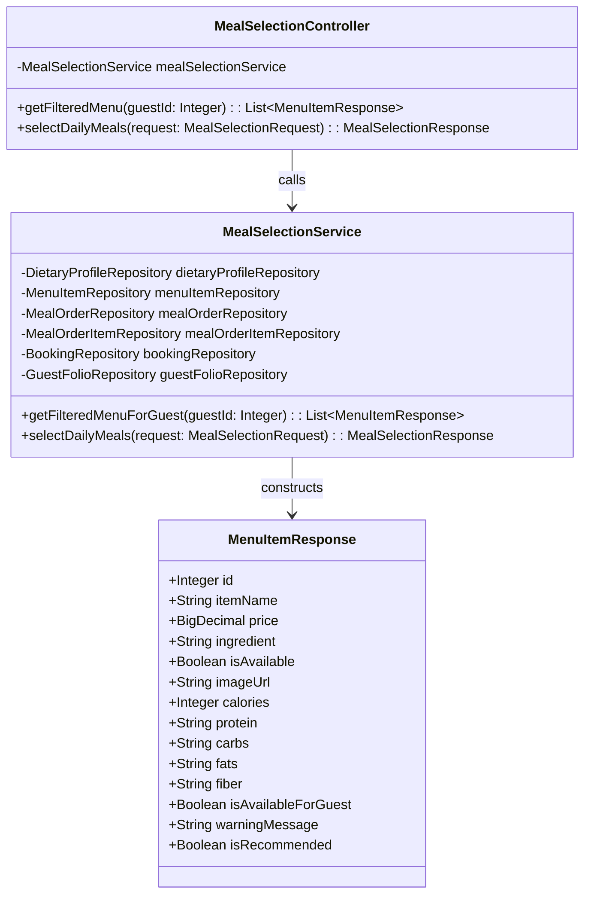
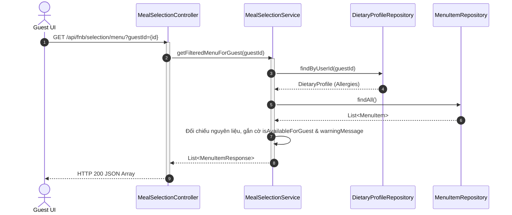

# ENGINEERING DOCUMENTATION STANDARD (EDS) v2.0
## Quy chuẩn Tài liệu Kỹ thuật và Đặc tả Hiện thực hóa - UC16 & UC19: Thực đơn Dinh dưỡng & Gọi món ngoài F&B

| Field | Value |
| :--- | :--- |
| **Document ID** | `SWP391-FNB-IMP-UC16` |
| **Version** | 1.1 |
| **Date** | 2026-06-10 |
| **Status** | Approved |
| **Document Owner** | Student 4 (F&B Module Owner) |
| **Author** | Antigravity AI Coding Assistant |
| **Reviewed by** | Team Lead |
| **DPO Sign-off** | [x] Approved — 2026-06-10 — [DPO Officer] |
| **Approved by** | Principal Architect |
| **Last Review** | 2026-06-10 |
| **Based on EDS** | v2.0 |

---

## CHANGELOG

| Ngày | Người thực hiện | Nội dung thay đổi |
| :--- | :--- | :--- |
| 2026-06-09 | Student 4 | Khởi tạo tài liệu đặc tả & thiết kế cho UC16 |
| 2026-06-10 | Student 4 | Cập nhật bộ lọc dị ứng trả về toàn bộ thực đơn kèm cảnh báo dị ứng & bổ sung UC19 (Gọi món ngoài + 5% Phí phục vụ) |

---

## MỤC LỤC
1. [Tổng quan Module](#1-tổng-quan-module)
2. [Ma trận Truy vết (Traceability Matrix)](#2-ma-trận-truy-vết-traceability-matrix)
3. [Architecture Decision Records (ADR)](#3-architecture-decision-records-adr)
4. [Non-Functional Requirements & SLA](#4-non-functional-requirements--sla)
5. [Static Modeling (Mô hình Tĩnh)](#5-static-modeling-mô-hình-tĩnh)
6. [Dynamic Modeling (Mô hình Hướng Động)](#6-dynamic-modeling-mô-hình-hướng-động)
7. [Domain Event Catalog](#7-domain-event-catalog)
8. [Interface Specification (Đặc tả Giao diện)](#8-interface-specification-đặc-tả-giao-diện)
9. [API Specification](#9-api-specification)
10. [Bảng mã lỗi (Error Codes)](#10-bảng-mã-lỗi-error-codes)
11. [Quy trình Triển khai (Step-by-Step)](#11-quy-trình-triển-khai-step-by-step)
12. [Rollback & Incident Runbook](#12-rollback--incident-runbook)
13. [Kịch bản Kiểm thử Chi tiết](#13-kịch-bản-kiểm-thử-chi-tiết)
14. [Phương pháp Xác minh](#14-phương-pháp-xác-minh)
15. [Mẫu thử thực tế (API Verification Samples)](#15-mẫu-thử-thực-tế-api-verification-samples)
16. [Bảng tổng hợp phân quyền (Authorization Matrix)](#16-bảng-tổng-hợp-phân-quyền-authorization-matrix)

---

## 1. Tổng quan Module

Phân hệ Dietary F&B Management (Module 4) chịu trách nhiệm về thông tin ăn uống lành mạnh của khách tại Xoai Aura Retreat.
- **UC16 (Thực đơn của bạn)**: Hiển thị thực đơn hàng ngày. Hệ thống đối chiếu thành phần món ăn với hồ sơ dị ứng thực phẩm và sở thích ăn chay của khách, gắn cờ cảnh báo dị ứng cho các món không khả dụng và gợi ý món chay phù hợp.
- **UC19 (Gọi món ngoài)**: Cho phép khách hàng gọi thêm các món ăn a-la-carte nằm ngoài chương trình liệu trình và ghi nợ trực tiếp vào tài khoản phòng (`GuestFolio`), kèm theo 5% phí phục vụ.

| Field | Value |
| :--- | :--- |
| **Module Name** | Dietary F&B Management |
| **Bounded Context** | fnb |
| **Data Classification** | PII / Sensitive-PII (Thông tin dị ứng y tế nhạy cảm) |
| **Compliance Scope** | Nghị định 356/2025/NĐ-CP (Bảo vệ dữ liệu cá nhân y tế nhạy cảm) |
| **Upstream Dependencies** | `auth` (User), `booking` (Booking), `billing` (GuestFolio) |
| **Downstream Consumers** | `billing` (Consolidated Invoice / Folio update) |

---

## 2. Ma trận Truy vết (Traceability Matrix)

| Requirement ID | Loại (BR/ADR/US) | Mô tả yêu cầu | Thành phần Code | Compliance Target | ADR liên quan |
| :--- | :--- | :--- | :--- | :--- | :--- |
| UC16 | User Story | Khách chọn món ăn từ thực đơn được cảnh báo dị ứng tự động theo nguyên liệu và gợi ý món phù hợp sở thích. | `MealSelectionController`<br/>`MealSelectionService` | Nghị định 356/2025/NĐ-CP | ADR-002, ADR-003 |
| UC19 | User Story | Khách gọi món a-la-carte ngoài liệu trình, cộng thêm 5% phí phục vụ và ghi nợ vào folio phòng. | `MealSelectionService.selectDailyMeals()` | AHLEI Folio Standard | — |
| BR-FNB-01 | Business Rule | Chặn đứng yêu cầu chọn món chứa nguyên liệu dị ứng từ Backend (Allergy Double Validation). | `MealSelectionService.selectDailyMeals()` | An toàn sức khỏe khách hàng | ADR-003 |

---

## 3. Architecture Decision Records (ADR)

### `ADR-002` — Bảo vệ Quyền riêng tư về Y tế (Data Minimization)
* **Status**: Accepted
* **Deciders**: Student 4 (F&B Owner)
* **Date**: 2026-06-09
* **Quyết định**: Tách riêng hồ sơ y tế `PHYSICAL_HEALTH_PROFILE` và hồ sơ ăn uống `DIETARY_PROFILE`. F&B Staff chỉ có quyền truy xuất thông tin dị ứng thực phẩm cụ thể thay vì hồ sơ sức khỏe cơ thể của khách hàng.

### `ADR-003` — Cơ chế Cảnh báo Dị ứng Thay vì Lọc ẩn (Allergy Alert Representation)
* **Status**: Accepted
* **Deciders**: Student 4 (F&B Owner)
* **Date**: 2026-06-10
* **Bối cảnh**: Ban đầu hệ thống ẩn hoàn toàn các món dị ứng khỏi màn hình thực đơn. Tuy nhiên, việc ẩn này khiến khách hàng không biết nhà hàng có món đó hay không, hoặc lo lắng bộ lọc hoạt động không đúng. Khách hàng muốn nhìn thấy toàn bộ thực đơn nhưng được cảnh báo rõ ràng.
* **Quyết định**: API trả về toàn bộ danh sách món ăn, gán cờ `isAvailableForGuest = false` và bổ sung chuỗi cảnh báo nguyên liệu cụ thể (`warningMessage`) cho các món vi phạm để giao diện hiển thị trạng thái mờ và nút "Không khả dụng".
* **Hệ quả**: Cải thiện trải nghiệm minh bạch và mức độ an tâm cho khách nghỉ dưỡng.

---

## 4. Non-Functional Requirements & SLA

### 4.1. Performance & Availability
- Latency: Lọc thực đơn & phân tích dị ứng chéo < 150ms.
- Phí phục vụ a-la-carte: Tự động tính 5% chính xác làm tròn 2 chữ số thập phân (`RoundingMode.HALF_UP`).

---

## 5. Static Modeling (Mô hình Tĩnh)

### 5.1. Class Diagram



---

## 6. Dynamic Modeling (Mô hình Hướng Động)

### 6.1. Sequence Diagram — Khách lấy Thực đơn đã Cảnh báo (Happy Path)



---

## 7. Domain Event Catalog

### 7.1. Events Published
- `MealSelected` (Khách chọn món thành công)
- `ALaCarteOrdered` (Khách đặt món ngoài, phát đi thông tin hóa đơn gồm phí dịch vụ 5%).

---

## 8. Interface Specification (Đặc tả Giao diện)

### 8.1. Meal Selection Service Signature

```java
package com.AuraMoon.auramoon.fnb.service;

import com.AuraMoon.auramoon.fnb.dto.MealSelectionRequest;
import com.AuraMoon.auramoon.fnb.dto.MealSelectionResponse;
import com.AuraMoon.auramoon.fnb.dto.MenuItemResponse;
import java.util.List;

public interface IMealSelectionService {
    List<MenuItemResponse> getFilteredMenuForGuest(Integer guestId);
    MealSelectionResponse selectDailyMeals(MealSelectionRequest request);
}
```

---

## 9. API Specification

### 9.1. Endpoints Table

| Method | Path | Auth Level | Required Roles | Rate Limit | Idempotent? |
| :--- | :--- | :--- | :--- | :--- | :--- |
| GET | `/api/fnb/selection/menu` | JWT Bearer | `GUEST` | 120/min | Yes |
| POST | `/api/fnb/selection/select` | JWT Bearer | `GUEST` | 30/min | No |

### 9.2. Response Schema — GET `/api/fnb/selection/menu`

```json
[
  {
    "id": 4,
    "itemName": "Mì xào tôm đặc biệt",
    "price": 22.00,
    "ingredient": "mì sợi, tôm tươi, mực, tỏi, mỡ heo",
    "isAvailable": true,
    "imageUrl": "/images/shrimp.jpg",
    "calories": 280,
    "protein": "22g",
    "carbs": "15g",
    "fats": "12g",
    "fiber": "3g",
    "isAvailableForGuest": false,
    "warningMessage": "Món ăn này có chứa hải sản/tôm, nằm trong danh sách dị ứng của bạn.",
    "isRecommended": false
  }
]
```

---

## 10. Bảng mã lỗi (Error Codes)

| Code | HTTP Status | Message (EN) | Message (VI) | Trigger Condition |
| :--- | :--- | :--- | :--- | :--- |
| `FNB-002` | 400 | Allergy validation failed | Phát hiện dị ứng thực phẩm | Đơn chọn chứa món ăn bị gắn cờ dị ứng |

---

## 11. Kịch bản Kiểm thử Chi tiết

### 11.1. Unit Tests

#### `TC-FNB-01` — Cảnh báo dị ứng thực phẩm
* **Given**: Khách hàng `guestId = 1` dị ứng `peanut`.
* **When**: Gọi hàm `getFilteredMenuForGuest(1)`.
* **Then**: Nhận được danh sách món ăn, trong đó món chứa đậu phộng có `isAvailableForGuest = false` và `warningMessage` chứa nội dung dị ứng đậu phộng.

#### `TC-FNB-02` — Tính hóa đơn gọi món ngoài UC19
* **Given**: Khách chọn món giá $10.00 loại `A-La-Carte`.
* **When**: Gọi hàm `selectDailyMeals()`.
* **Then**: Lưu thành công, folio tăng thêm $10.50 (gồm 5% phí phục vụ).
