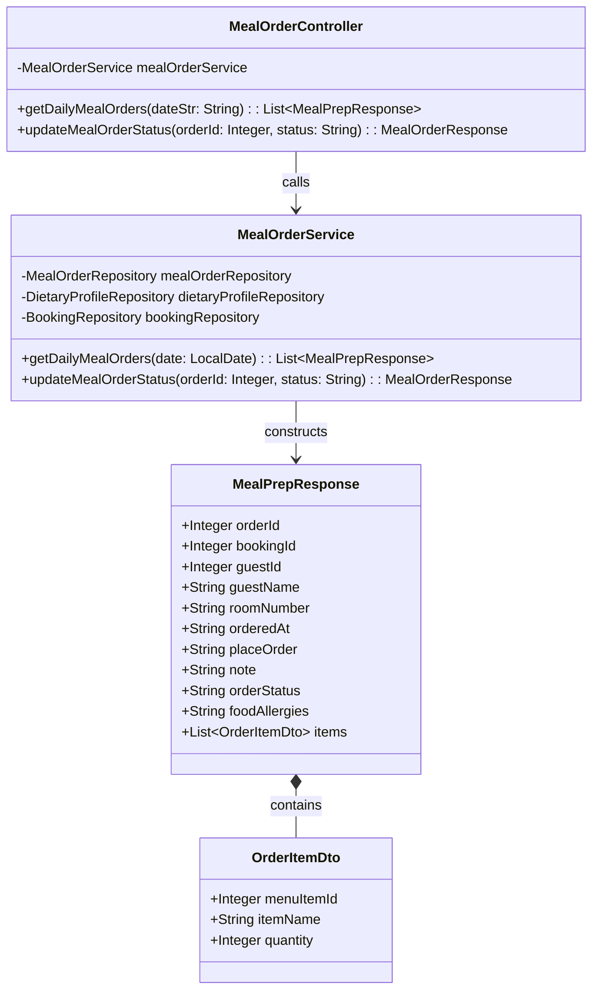
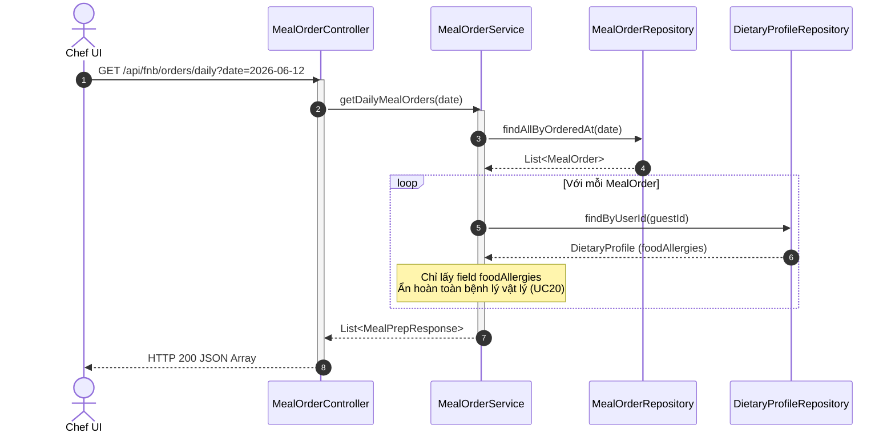
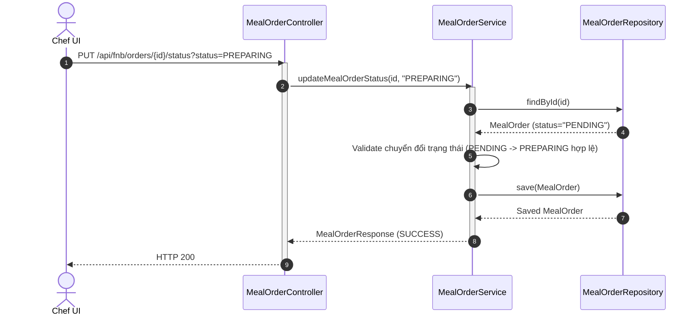

# ENGINEERING DOCUMENTATION STANDARD (EDS) v2.0
## Quy chuẩn Tài liệu Kỹ thuật và Đặc tả Hiện thực hóa - UC17 & UC18 & UC20: Bảng điều phối bếp & Cập nhật Trạng thái đơn & Giảm thiểu Dữ liệu F&B

| Field | Value |
| :--- | :--- |
| **Document ID** | `SWP391-FNB-IMP-UC17` |
| **Version** | 1.0 |
| **Date** | 2026-06-12 |
| **Status** | Draft / In Review |
| **Document Owner** | Student 4 (F&B Module Owner) |
| **Author** | Antigravity AI Coding Assistant |
| **Reviewed by** | Team Lead |
| **DPO Sign-off** | [ ] Pending |
| **Approved by** | Principal Architect |
| **Last Review** | 2026-06-12 |
| **Based on EDS** | v2.0 |

---

## CHANGELOG

| Ngày | Người thực hiện | Nội dung thay đổi |
| :--- | :--- | :--- |
| 2026-06-12 | Student 4 | Khởi tạo tài liệu đặc tả & thiết kế cho UC17, UC18, UC20 |

---

## MỤC LỤC
1. [Tổng quan Module](#1-tổng-quan-module)
2. [Ma trận Truy vết (Traceability Matrix)](#2-ma-trận-truy-vết-traceability-matrix)
3. [Architecture Decision Records (ADR)](#3-architecture-decision-records-adr)
4. [Non-Functional Requirements & SLA](#4-non-functional-requirements--sla)
5. [Static Modeling (Mô hình Tĩnh)](#5-static-modeling-mô-hình-tĩnh)
6. [Dynamic Modeling (Mô hình Hướng Động)](#6-dynamic-modeling-mô-hình-hướng-động)
7. [Domain Event Catalog](#7-domain-event-catalog)
8. [Interface Specification (Đặc tả Giao diện)](#8-interface-specification-đặc-tả-giao-diện)
9. [API Specification](#9-api-specification)
10. [Bảng mã lỗi (Error Codes)](#10-bảng-mã-lỗi-error-codes)
11. [Quy trình Triển khai (Step-by-Step)](#11-quy-trình-triển-khai-step-by-step)
12. [Rollback & Incident Runbook](#12-rollback--incident-runbook)
13. [Kịch bản Kiểm thử Chi tiết](#13-kịch-bản-kiểm-thử-chi-tiết)
14. [Phương pháp Xác minh](#14-phương-pháp-xác-minh)
15. [Mẫu thử thực tế (API Verification Samples)](#15-mẫu-thử-thực-tế-api-verification-samples)
16. [Bảng tổng hợp phân quyền (Authorization Matrix)](#16-bảng-tổng-hợp-phân-quyền-authorization-matrix)

---

## 1. Tổng quan Module

Phân hệ Dietary F&B Management (Module 4) - Phía nhà bếp và vận hành:
- **UC17 (Bảng điều phối bếp)**: Hiển thị danh sách các đơn đặt ăn của ngày hiện tại, phân loại theo trạng thái (Pending, Preparing, Ready). Đối chiếu hồ sơ dị ứng của khách hàng để hiển thị cảnh báo dị ứng nổi bật trên phiếu đơn.
- **UC18 (Cập nhật trạng thái đơn)**: Cho phép Chef/F&B Staff cập nhật trạng thái đơn hàng theo luồng một chiều hợp lệ.
- **UC20 (Giảm thiểu dữ liệu)**: Đảm bảo nhân viên bếp chỉ xem thấy thông tin dị ứng ẩm thực (`Food Allergies`), tuyệt đối không được xem thấy hồ sơ bệnh lý vật lý (`Physical Health Profile`) của khách hàng để tuân thủ Nghị định 356/2025/NĐ-CP.

| Field | Value |
| :--- | :--- |
| **Module Name** | Dietary F&B Management |
| **Bounded Context** | fnb |
| **Data Classification** | PII / Sensitive-PII (Thông tin dị ứng y tế nhạy cảm) |
| **Compliance Scope** | Nghị định 356/2025/NĐ-CP (Bảo vệ dữ liệu cá nhân y tế nhạy cảm) |
| **Upstream Dependencies** | `auth` (User), `booking` (Booking), `fnb` (MealOrder, DietaryProfile) |
| **Downstream Consumers** | `fnb` (KDS Dashboard View) |

---

## 2. Ma trận Truy vết (Traceability Matrix)

| Requirement ID | Loại (BR/ADR/US) | Mô tả yêu cầu | Thành phần Code | Compliance Target | ADR liên quan |
| :--- | :--- | :--- | :--- | :--- | :--- |
| UC17 | User Story | Chef xem bảng điều phối đơn hàng trong ngày kèm cảnh báo dị ứng của từng khách hàng. | `MealOrderController.getDailyMealOrders()` | An toàn sức khỏe khách hàng | ADR-004 |
| UC18 | User Story | Chef cập nhật trạng thái đơn hàng tiến theo một chiều: PENDING -> PREPARING -> READY. | `MealOrderService.updateMealOrderStatus()` | Quy trình vận hành bếp | ADR-005 |
| UC20 | User Story | Đảm bảo Chef chỉ thấy dị ứng thực phẩm, hồ sơ bệnh lý vật lý bị ẩn hoàn toàn ở Backend API. | `MealOrderService.getDailyMealOrders()` | Nghị định 356/2025/NĐ-CP | ADR-004 |
| BR-07 | Business Rule | F&B Staff chỉ truy cập dị ứng và sở thích ăn uống. Hồ sơ bệnh lý phải ẩn hoàn toàn ở Backend. | `MealOrderService.getDailyMealOrders()` | Nghị định 356/2025/NĐ-CP | ADR-004 |
| BR-16 | Business Rule | Trạng thái đơn hàng chỉ được tiến theo một chiều: Pending -> Preparing -> Ready for Delivery. | `MealOrderService.updateMealOrderStatus()` | Quy trình vận hành bếp | ADR-005 |

---

## 3. Architecture Decision Records (ADR)

### `ADR-004` — Giảm thiểu Dữ liệu cho Nhân viên Bếp (Kitchen Data Minimization)
* **Status**: Accepted
* **Deciders**: Student 4 (F&B Owner)
* **Date**: 2026-06-12
* **Bối cảnh**: Theo Nghị định 356/2025/NĐ-CP, thông tin y tế là dữ liệu cá nhân nhạy cảm cần được bảo vệ nghiêm ngặt theo nguyên tắc "Cần biết" (Need-to-know). Đầu bếp chỉ cần biết dị ứng thực phẩm để chuẩn bị món ăn an toàn, không được phép tiếp cận hồ sơ bệnh lý vật lý (ví dụ: đau lưng, thoái hóa khớp, tăng huyết áp).
* **Quyết định**: API trả về dữ liệu cho KDS Dashboard (`MealOrderResponse` hoặc DTO chuyên biệt) sẽ chỉ thực hiện SELECT/JOIN lấy trường dị ứng thực phẩm (`foodAllergies`) từ bảng `DIETARY_PROFILE`. Không bao gồm bất kỳ trường thông tin bệnh lý nào từ phân hệ y tế.
* **Hệ quả**: Tuân thủ luật bảo vệ dữ liệu cá nhân nhạy cảm, hạn chế rủi ro rò rỉ dữ liệu y tế.

### `ADR-005` — Bất biến Trạng thái đơn hàng một chiều (One-Way Status Pipeline)
* **Status**: Accepted
* **Deciders**: Student 4 (F&B Owner)
* **Date**: 2026-06-12
* **Bối cảnh**: Để đảm bảo tính đồng bộ của quy trình chuẩn bị và giao món, trạng thái phiếu gọi món phải đi theo đúng luồng tuyến tính. Nếu đầu bếp vô tình hoặc cố ý chuyển trạng thái ngược lại (ví dụ từ READY quay về PREPARING), sẽ gây hỗn loạn cho bộ phận phục vụ phòng và giao món.
* **Quyết định**: Backend sẽ kiểm tra trạng thái hiện tại của đơn hàng trước khi cập nhật. Chỉ cho phép các bước chuyển tiếp:
  - `PENDING` -> `PREPARING`
  - `PREPARING` -> `READY`
  Mọi trạng thái chuyển ngược (ví dụ `PREPARING` -> `PENDING` hoặc `READY` -> `PREPARING`) hoặc cập nhật khi đã ở trạng thái `READY` sẽ bị Backend chặn lại và ném ra lỗi `FNB-003` (Xung đột quy trình trạng thái).
* **Hệ quả**: Đảm bảo tính nhất quán của hệ thống Kanban nhà bếp.

---

## 4. Non-Functional Requirements & SLA

### 4.1. Performance & Availability
- SLA Thời gian phản hồi API tải Dashboard KDS: < 200ms cho 100 đơn hàng đồng thời.
- Uptime của API cập nhật trạng thái đơn hàng: 99.9%.

### 4.2. Security & Compliance
- Role-based Access Control (RBAC): Chỉ người dùng có role `CHEF` hoặc `STAFF` được gọi API KDS Dashboard và cập nhật trạng thái đơn. `GUEST` bị chặn và trả về HTTP 403.
- Audit Trail: Mọi thao tác thay đổi trạng thái từ Chef phải được ghi nhận lịch sử (Log) kèm userId thực hiện.

---

## 5. Static Modeling (Mô hình Tĩnh)

### 5.1. Class Diagram



---

## 6. Dynamic Modeling (Mô hình Hướng Động)

### 6.1. Sequence Diagram — Chef Xem Bảng Điều Phối KDS (UC17 & UC20)



### 6.2. Sequence Diagram — Cập Nhật Trạng Thái Đơn Hàng (UC18)



---

## 7. Domain Event Catalog

### 7.1. Events Published
- `MealOrderPreparing`: Phát ra khi trạng thái đơn hàng đổi từ `PENDING` sang `PREPARING`.
- `MealOrderReady`: Phát ra khi trạng thái đơn hàng đổi từ `PREPARING` sang `READY` (Thông báo cho phục vụ phòng đi giao món).

---

## 8. Interface Specification (Đặc tả Giao diện)

### 8.1. Meal Order Service Signature

```java
package com.AuraMoon.auramoon.fnb.service;

import com.AuraMoon.auramoon.fnb.dto.MealOrderRequest;
import com.AuraMoon.auramoon.fnb.dto.MealOrderResponse;
import com.AuraMoon.auramoon.fnb.dto.MealPrepResponse;
import java.time.LocalDate;
import java.util.List;

public interface IMealOrderService {
    MealOrderResponse createMealOrder(MealOrderRequest request);
    MealOrderResponse updateMealOrderStatus(Integer orderId, String status);
    List<MealPrepResponse> getDailyMealOrders(LocalDate date);
}
```

---

## 9. API Specification

### 9.1. Endpoints Table

| Method | Path | Auth Level | Required Roles | Rate Limit | Idempotent? |
| :--- | :--- | :--- | :--- | :--- | :--- |
| GET | `/api/fnb/orders/daily` | JWT Bearer | `CHEF`, `STAFF` | 100/min | Yes |
| PUT | `/api/fnb/orders/:id/status` | JWT Bearer | `CHEF`, `STAFF` | 100/min | No |

---

## 10. Bảng mã lỗi (Error Codes)

| Code | HTTP Status | Message (EN) | Message (VI) | Trigger Condition |
| :--- | :--- | :--- | :--- | :--- |
| `FNB-003` | 400 | Invalid state transition | Trạng thái chuyển đổi không hợp lệ | Khi đầu bếp cố ý chuyển ngược trạng thái (ví dụ READY -> PREPARING) |
| `FNB-004` | 404 | Meal order not found | Đơn hàng ăn uống không tồn tại | Khi truyền sai orderId |

---

## 11. Quy trình Triển khai (Step-by-Step)

### 11.1. Steps
1. Thực hiện viết code unit tests và business logic cho `MealOrderService`.
2. Chạy thử nghiệm và kiểm tra bộ unit test đạt 100% tỷ lệ pass.

---

## 12. Rollback & Incident Runbook

### 12.1. Rollback Procedure
Revert code thay đổi qua git:
```bash
git checkout -- auramoon/src/main/java/com/AuraMoon/auramoon/fnb/service/MealOrderService.java
git checkout -- auramoon/src/main/java/com/AuraMoon/auramoon/fnb/controller/MealOrderController.java
```

---

## 13. Kịch bản Kiểm thử Chi tiết

### 13.1. Unit Tests (Mô tả chi tiết trong file TDD)
- `FNB-TC-001`: Đảm bảo KDS Dashboard tải đúng thông tin orders trong ngày và ẩn hoàn toàn hồ sơ bệnh lý, chỉ trả về trường foodAllergies.
- `FNB-TC-002`: Chuyển trạng thái từ PENDING sang PREPARING thành công.
- `FNB-TC-003`: Chuyển trạng thái từ PREPARING sang READY thành công.
- `FNB-TC-004`: Chặn chuyển trạng thái ngược từ READY sang PREPARING.
- `FNB-TC-005`: Chặn chuyển trạng thái ngược từ PREPARING sang PENDING.

---

## 14. Phương pháp Xác minh

### 14.1. Chạy bộ kiểm thử tự động
```bash
mvn clean compile test
```

---

## 15. Mẫu thử thực tế (API Verification Samples)

### 15.1. PUT `/api/fnb/orders/1/status?status=PREPARING`
- **Expected Response (200)**:
```json
{
  "message": "Meal order status has been updated successfully.",
  "status": "PREPARING"
}
```

---

## 16. Bảng tổng hợp phân quyền (Authorization Matrix)

| Endpoint | GUEST | CHEF | STAFF | ADMIN |
| :--- | :---: | :---: | :---: | :---: |
| GET `/api/fnb/orders/daily` | ❌ | ✅ | ✅ | ✅ |
| PUT `/api/fnb/orders/:id/status` | ❌ | ✅ | ✅ | ✅ |
