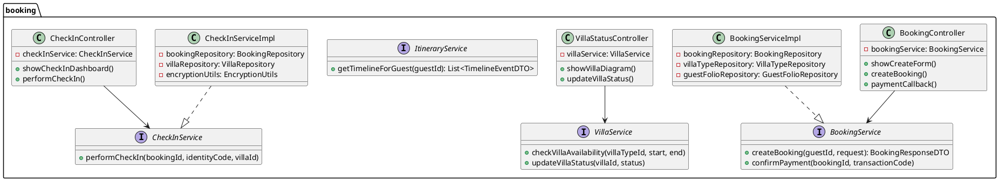
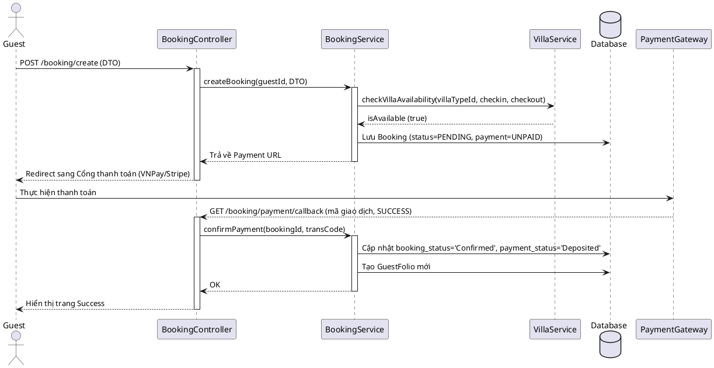

# ENGINEERING DOCUMENTATION STANDARD (EDS) v2.0
# Tài liệu Đặc tả Thiết kế Kỹ thuật - Module 2: Đặt Gói Trị Liệu & Phòng Ở

| Field              | Value                                |
| --------------------| --------------------------------------|
| **Document ID**    | `AURAMOON-BOOKING-IMP-002`           |
| **Version**        | 2.0                                  |
| **Date**           | 2026-06-11                           |
| **Status**         | Approved                             |
| **Document Owner** | Lê Trà My (Module 2 Owner)           |
| **Author**         | Antigravity AI Assistant             |
| **Reviewed by**    | Tech Lead / Principal Architect      |
| **DPO Sign-off**   | [x] Approved - 2026-06-11 - DPO Lead |
| **Approved by**    | Phùng Giang Hải                      |
| **Last Review**    | 2026-06-11                           |
| **Based on EDS**   | v2.0                                 |

---

# CHANGELOG
> **Policy 4.4 — Immutable History:** Không bao giờ xóa thông tin cũ. Mọi thay đổi phải ghi vào bảng này.

| Ngày | Người thực hiện | Nội dung thay đổi |
| --- | --- | --- |
| 2026-06-11 | Antigravity | Khởi tạo tài liệu EDS cho Module 2 lần đầu theo mẫu v2.0 |

---

# MỤC LỤC
1. Tổng quan Module
2. Ma trận Truy vết (Traceability Matrix)
3. Architecture Decision Records (ADR)
4. Non-Functional Requirements & SLA
5. Static Modeling (Mô hình Tĩnh)
6. Dynamic Modeling (Mô hình Động)
7. Domain Event Catalog
8. Interface Specification (Đặc tả Giao diện)
9. API Specification
10. Bảng mã lỗi (Error Codes)
11. Quy trình Triển khai (Step-by-Step)
12. Rollback & Incident Runbook
13. Kịch bản Kiểm thử Chi tiết
14. Phương pháp Xác minh
15. Mẫu thử thực tế (API Verification Samples)
16. Bảng tổng hợp phân quyền (Authorization Matrix)

---

# 1. Tổng quan Module

Module 2 (Đặt Gói Trị Liệu & Phòng Ở) chịu trách nhiệm quản lý toàn bộ chu trình từ lúc khách hàng duyệt và lọc các gói chăm sóc sức khỏe, tiến hành đặt phòng (Villa) kèm dịch vụ, thanh toán đặt cọc qua cổng thanh toán, cho đến khi Lễ tân thực hiện thủ tục Check-in nhận phòng vật lý, thu thập và bảo mật thông tin cư trú cá nhân (CCCD/Passport), quản lý sơ đồ phòng Villa và hiển thị dòng thời gian hành trình trải nghiệm tổng hợp của chuyến đi.

| Field | Value |
| --- | --- |
| **Module Name** | Đặt Gói Trị Liệu & Phòng Ở (Booking & Stay Management) |
| **Bounded Context** | BookingContext |
| **Data Classification** | `Confidential` (Doanh thu, thông tin đặt phòng) & `Sensitive-PII` (CCCD/Passport của khách) |
| **Compliance Scope** | Luật Cư trú 2020, Nghị định 13/2023/NĐ-CP về bảo vệ dữ liệu cá nhân |
| **Upstream Dependencies** | `AuthContext` (Quản lý User & Role) |
| **Downstream Consumers** | `SpaContext` (Đặt lịch trị liệu), `FnbContext` (Gói dinh dưỡng), `BillingContext` (Folio thanh toán) |

---

# 2. Ma trận Truy vết (Traceability Matrix)

| Requirement ID | Loại | Mô tả yêu cầu | Thành phần Code | Compliance Target | ADR liên quan |
| --- | --- | --- | --- | --- | --- |
| **UC06** | Functional | Duyệt và lọc gói trị liệu theo mục tiêu sức khỏe | `RetreatPackageController`, `RetreatPackageService`, `RetreatPackageRepository` | GWI Standards | — |
| **UC07** | Functional | Đặt gói & Villa, thanh toán cọc và khởi tạo Folio | `BookingController`, `BookingService`, `BookingRepository`, `GuestFolioRepository` | AHLEI Folio Standards | ADR-002 |
| **UC08** | Functional | Check-in, gán Villa vật lý và mã hóa thông tin định danh cư trú | `CheckInController`, `CheckInService`, `VillaRepository`, `EncryptionUtils` | Luật Cư trú 2020, NĐ 13/2023 | ADR-001, ADR-003 |
| **UC09** | Functional | Cập nhật trạng thái vật lý của Villa (Dọn dẹp, Bảo trì) | `VillaStatusController`, `VillaService`, `VillaRepository` | Operational Efficiency | — |
| **UC10** | Functional | Xem lịch trình trải nghiệm tổng hợp (Itinerary Timeline) | `ItineraryController`, `ItineraryService` | Guest Satisfaction | — |

---

# 3. Architecture Decision Records (ADR)

## ADR-001 — Mã hóa thông tin định danh tại chỗ (Encryption at rest)

| Field | Value |
| --- | --- |
| **Status** | Accepted |
| **Deciders** | Tech Lead, DPO Owner, Principal Architect |
| **Date** | 2026-06-11 |

**Bối cảnh (Context)**
Để tuân thủ Nghị định 13/2023/NĐ-CP và Luật Cư trú 2020, số định danh cá nhân (CCCD/Passport) của khách hàng không được lưu trữ dưới dạng văn bản thuần (plaintext) trong cơ sở dữ liệu để phòng ngừa rủi ro rò rỉ dữ liệu.

**Các phương án đã xem xét (Options Considered)**
- *Phương án A:* Lưu plaintext (Không an toàn).
- *Phương án B:* Mã hóa đối xứng AES-256 với khóa mã hóa được quản lý thông qua biến môi trường của ứng dụng.

**Quyết định (Decision)**
Chọn **Phương án B** để bảo vệ dữ liệu PII tại chỗ.

**Hệ quả (Consequences)**
- *Tích cực:* Đảm bảo tính tuân thủ pháp lý tối đa.
- *Tiêu cực:* Không thể truy vấn `LIKE` trên trường đã mã hóa; chỉ hỗ trợ tìm kiếm khớp chính xác (exact match) bằng cách mã hóa giá trị tìm kiếm trước khi so khớp.

---

## ADR-002 — Khởi tạo tài khoản nợ trung tâm (Guest Folio) ngay sau khi đặt cọc thành công

| Field | Value |
| --- | --- |
| **Status** | Accepted |
| **Deciders** | Tech Lead, Principal Architect |
| **Date** | 2026-06-11 |

**Bối cảnh (Context)**
Dịch vụ tại resort gồm gói lưu trú chính kèm theo các chi phí phát sinh tự do (mua thêm Spa, gọi món ăn ngoài gói). Cần một nơi duy nhất để tích lũy nợ và tính tổng tiền khi checkout.

**Quyết định (Decision)**
Tự động tạo một bản ghi `GuestFolio` liên kết với `booking_id` ngay khi nhận được callback thanh toán đặt cọc thành công từ cổng thanh toán.

---

## ADR-003 — Khóa bi quan (Pessimistic Locking) khi gán phòng vật lý lúc Check-in

| Field | Value |
| --- | --- |
| **Status** | Accepted |
| **Deciders** | Tech Lead, Principal Architect |
| **Date** | 2026-06-11 |

**Bối cảnh (Context)**
Tránh xung đột gán phòng vật lý khi nhiều Lễ tân gán cùng một số phòng Villa tại cùng một thời điểm.

**Quyết định (Decision)**
Sử dụng `@Lock(LockModeType.PESSIMISTIC_WRITE)` của JPA trên `VillaRepository` khi kiểm tra và gán phòng vật lý trong quá trình Check-in.

---

# 4. Non-Functional Requirements & SLA

## 4.1. Performance & Availability

| Category | Requirement | Target SLA | Measurement Method | Compliance Basis |
| --- | --- | --- | --- | --- |
| Latency | API Response (Browse/Itinerary) | `< 250ms` | k6 Load Test | Guest UX |
| Latency | API Response (Check-in / Assign Room) | `< 500ms` | k6 Load Test | Frontdesk Efficiency |
| Availability| Uptime của luồng đặt phòng | `99.9%` | Uptime Monitor | Revenue Protection |

## 4.2. Security

| Category | Requirement | Target | Verification Method | Compliance Basis |
| --- | --- | --- | --- | --- |
| Encryption at rest | PII field (CCCD/Passport) | AES-256 | Code inspection & DB check | Nghị định 13/2023/NĐ-CP |
| Access Control | Role-based (RBAC) | Chỉ Lễ tân/Admin được check-in | Spring Security integration test| Quyền riêng tư của khách |

---

# 5. Static Modeling (Mô hình Tĩnh)

## 5.1. Class Diagram (PlantUML)



## 5.2. Data Structure (SQL Server Entities mapping)

### Bảng VILLA_TYPE
```sql
CREATE TABLE VILLA_TYPE (
    type_id INT PRIMARY KEY IDENTITY(1,1),
    type_name VARCHAR(100) NOT NULL,
    image VARCHAR(255),
    price_per_day DECIMAL(18,2) NOT NULL,
    is_delete BIT DEFAULT 0
);
```

### Bảng VILLA
```sql
CREATE TABLE VILLA (
    villa_id INT PRIMARY KEY IDENTITY(1,1),
    type_id INT FOREIGN KEY REFERENCES VILLA_TYPE(type_id),
    villa_code VARCHAR(20) UNIQUE NOT NULL,
    limit_person INT NOT NULL,
    villa_status VARCHAR(30) NOT NULL, -- Available, Occupied, Maintenance
    cleaning_status VARCHAR(30) NOT NULL, -- Cleaned, Dirty
    is_delete BIT DEFAULT 0
);
```

### Bảng BOOKING
```sql
CREATE TABLE BOOKING (
    booking_id INT PRIMARY KEY IDENTITY(1,1),
    guest_id INT NOT NULL, -- FK -> USER
    package_id INT NOT NULL, -- FK -> RETREAT_PACKAGE
    assigned_villa_id INT FOREIGN KEY REFERENCES VILLA(villa_id) NULL,
    checkin_date DATE NOT NULL,
    checkout_date DATE NOT NULL,
    total_guests INT NOT NULL,
    booking_status VARCHAR(30) NOT NULL, -- Pending, Confirmed, Checked-In, Checked-Out, Cancelled
    payment_status VARCHAR(30) NOT NULL, -- Unpaid, Deposited, Fully-Paid
    is_delete BIT DEFAULT 0
);
```

---

# 6. Dynamic Modeling (Mô hình Động)

## 6.1. Sequence Diagram — Đặt phòng & Đặt cọc thành công (UC07)



## 6.2. Sơ đồ trạng thái đặt phòng (Booking State Machine)
```
[Khởi tạo] -> PENDING -> (Thanh toán cọc) -> CONFIRMED -> (Check-in & Gán phòng) -> CHECKED-IN -> (Check-out & Thanh toán hết) -> CHECKED-OUT
PENDING -> (Hết 15 phút không trả tiền) -> CANCELLED
CONFIRMED -> (Hủy phòng trước giờ check-in) -> CANCELLED
```

---

# 7. Domain Event Catalog

## 7.1. Events Published
- `BookingConfirmed`: Phát ra khi khách hoàn tất đặt cọc.
- `CheckedIn`: Phát ra khi khách đã gán phòng vật lý và bắt đầu lưu trú.
- `CheckedOut`: Phát ra khi khách hoàn tất thanh toán hóa đơn Folio.

---

# 8. Interface Specification (Đặc tả Giao diện)

## 8.1. Service Interface

```java
// BookingService.java
package com.AuraMoon.auramoon.booking.service;

import com.AuraMoon.auramoon.booking.dto.BookingRequestDTO;
import com.AuraMoon.auramoon.booking.dto.BookingResponseDTO;

public interface BookingService {
    /**
     * Tạo mới booking ở trạng thái tạm thời PENDING
     * @throws BusinessException (BOOK-002) nếu hết Villa phù hợp
     */
    BookingResponseDTO createBooking(Integer guestId, BookingRequestDTO request);

    /**
     * Xác nhận thanh toán đặt cọc từ callback gateway
     */
    void confirmPayment(Integer bookingId, String transactionCode);
}
```

```java
// CheckInService.java
package com.AuraMoon.auramoon.booking.service;

public interface CheckInService {
    /**
     * Lễ tân thực hiện gán phòng vật lý và lưu mã hóa CCCD/Passport
     * @throws BusinessException (BOOK-004) nếu lỗi mã hóa
     */
    void performCheckIn(Integer bookingId, String identityCode, Integer villaId);
}
```

---

# 9. API Specification

## 9.1. Endpoints Table (Thymeleaf MVC)

| Method | URL Path | Role | Mục đích |
| --- | --- | --- | --- |
| GET | `/booking/create` | `GUEST` | Hiển thị form điền thông tin đặt gói & biệt thự |
| POST | `/booking/create` | `GUEST` | Tiếp nhận form và chuyển hướng sang cổng thanh toán |
| GET | `/booking/payment/callback` | `GUEST`, `SYSTEM` | Nhận phản hồi thanh toán từ cổng giao dịch |
| GET | `/reception/bookings` | `RECEPTIONIST`, `ADMIN` | Trang chủ lễ tân, quản lý danh sách check-in trong ngày |
| POST | `/reception/checkin/{id}` | `RECEPTIONIST` | Xác nhận check-in, lưu CCCD mã hóa và gán phòng vật lý |
| GET | `/reception/villas` | `RECEPTIONIST`, `ADMIN` | Quản lý trạng thái các phòng Villa vật lý |
| GET | `/itinerary` | `GUEST` | Xem dòng thời gian lịch trình của chuyến đi |

---

# 10. Bảng mã lỗi (Error Codes)

| Code | HTTP Status | Message (VI) | Trigger Condition |
| --- | --- | --- | --- |
| `BOOK-001` | 400 | Ngày check-in phải lớn hơn hoặc bằng ngày hiện tại | Điền ngày trong quá khứ |
| `BOOK-002` | 409 | Loại biệt thự đã chọn không còn phòng trống trong thời gian này | Hết phòng |
| `BOOK-003` | 404 | Không tìm thấy mã đơn đặt phòng yêu cầu | ID booking không hợp lệ |
| `BOOK-004` | 500 | Lỗi bảo mật: Không thể mã hóa dữ liệu định danh cư trú | Trục trặc lớp mã hóa AES |
| `BOOK-005` | 400 | Giao dịch đặt cọc không hợp lệ hoặc bị hủy từ cổng thanh toán | Thanh toán lỗi |
| `BOOK-006` | 409 | Phòng hiện đang có khách lưu trú, không thể chuyển đổi trạng thái | Thay đổi trạng thái sai quy trình |

---

# 11. Quy trình Triển khai (Step-by-Step)

## 11.1. Pre-Migration Checklist
- [x] Schema database gồm các bảng `VILLA`, `VILLA_TYPE`, `BOOKING` đã được khởi tạo trong SQL Server.
- [x] Data seed về phòng và loại phòng đã được nạp thành công.

## 11.2. Implementation Steps
1. **Tạo EncryptionUtils:** Viết class utils mã hóa thông tin định danh bằng khóa bí mật lưu ở biến môi trường.
2. **Implement Repositories:** Booking, Villa, VillaType, GuestFolio.
3. **Implement Services & Logic nghiệp vụ:** BookingServiceImpl, CheckInServiceImpl, VillaServiceImpl, ItineraryServiceImpl.
4. **Implement Controllers & MVC mapping.**
5. **Dựng giao diện Thymeleaf:** Giao diện đặt phòng, sơ đồ phòng lễ tân, lịch trình cuộn dọc (Timeline) cao cấp.

---

# 12. Rollback & Incident Runbook

## 12.1. Rollback Procedure
1. Sử dụng Git để khôi phục (revert) các tệp tin đã chỉnh sửa thuộc package `com.AuraMoon.auramoon.booking`.
2. Khôi phục lại trạng thái CSDL nếu có chạy các script chỉnh sửa cấu trúc bảng.

---

# 13. Kịch bản Kiểm thử Chi tiết

Xem chi tiết trong tài liệu thiết kế kiểm thử [TDD1.md](file:///d:/su26-swp391-se2023-g6/Template/TDD1.md).

---

# 14. Phương pháp Xác minh

## 14.1. Database Inspection
```sql
-- Kiểm tra xem số định danh lưu trữ đã được mã hóa chưa (Không được hiển thị dạng thô)
SELECT guest_id, identify_code FROM users WHERE guest_id = 5;

-- Kiểm tra trạng thái villa đã chuyển sang 'Occupied' chưa sau khi Check-in
SELECT villa_id, villa_code, villa_status FROM villa WHERE villa_id = 101;
```

---

# 15. Authorization Matrix

| Endpoint | GUEST | RECEPTIONIST | ADMIN |
| --- | --- | --- | --- |
| `GET /booking/create` | ✅ | ❌ | ❌ |
| `POST /booking/create` | ✅ | ❌ | ❌ |
| `GET /reception/bookings`| ❌ | ✅ | ✅ |
| `POST /reception/checkin/*`| ❌ | ✅ | ❌ |
| `GET /reception/villas` | ❌ | ✅ | ✅ |
| `GET /itinerary` | ✅ Own | ❌ | ❌ |
